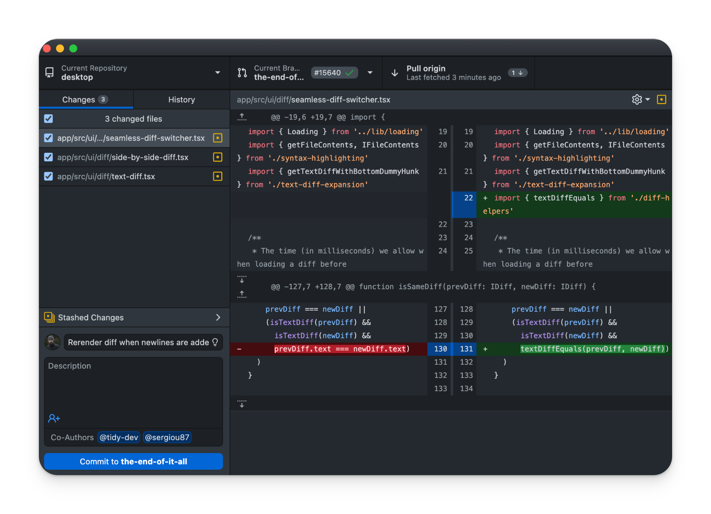
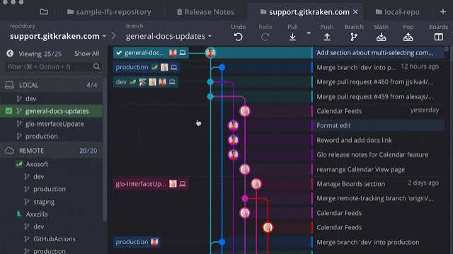
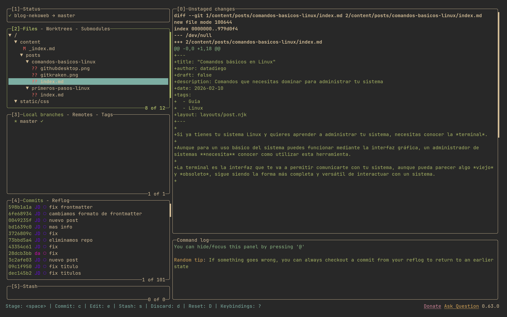
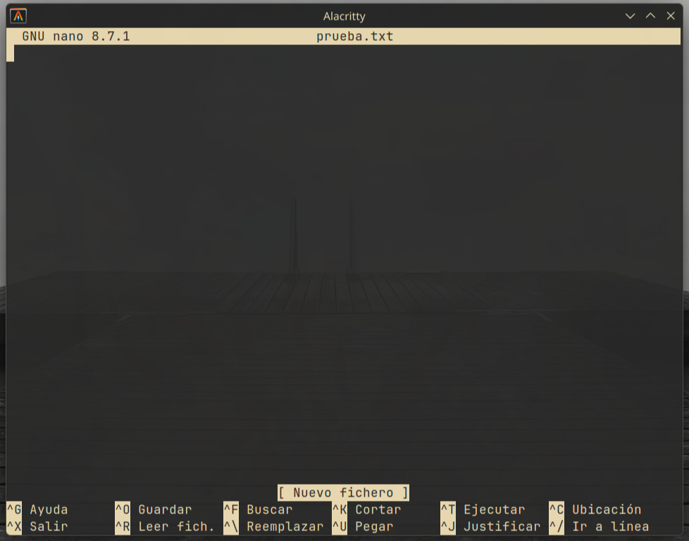
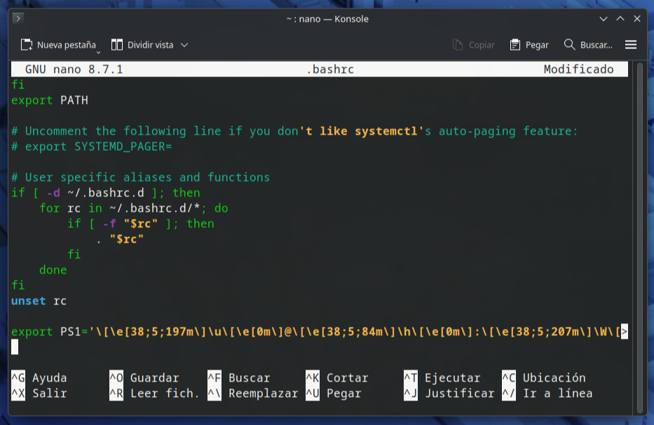
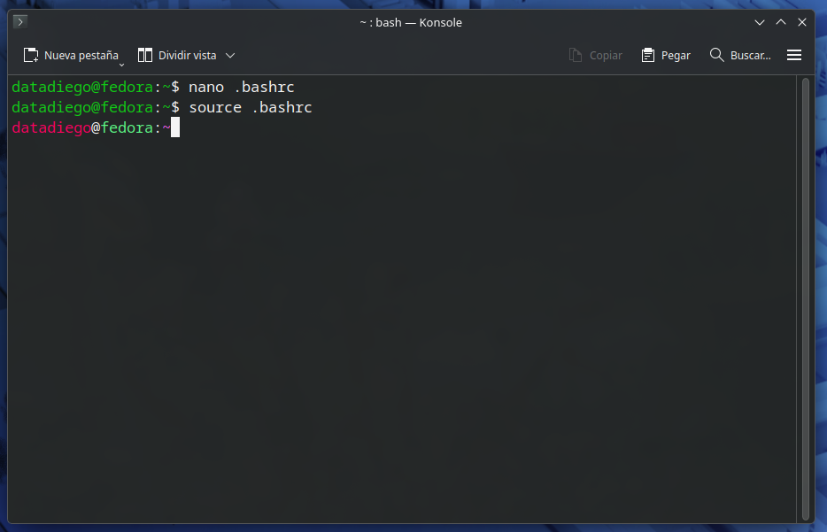

Si ya tienes tu sistema Linux y quieres aprender a administrar tu sistema, necesitas conocer la *terminal*.

Aunque para un uso básico del sistema puedes funcionar mediante la interfaz gráfica, un administrador de sistemas **necesita** conocer como utilizar esta herramienta.

## Por que usar la terminal

La terminal es la interfaz que te va a permitir comunicarte con tu sistema, aunque pueda parecer algo *viejo* y *obsoleto*, sigue siendo la forma más completa y versátil de interactuar con un sistema. 

Muchos programas con interfaz gráfica no son más que un programa de terminal con otra parte de código que renderiza una GUI con la que interactuar.

Por ejemplo, `Github Desktop`:



`Gitkraken`:



Y `Lazygit`:



Solo son `wrappers` que ejecutan comandos de `git` interactuando con sus menus y botones.

Todos son programas **muy completos**, pero en muchas ocasiones, en lugar de escribir un comando, debemos de pasar múltiples menus y opciones, que pueden cambiar con el tiempo, y que deben actualizar cuando la herramienta principal sobre la que se basan se actualiza.

Algunos programas **muy comunes** que has podido usar sin saberlo son [Imagemagick](https://imagemagick.org/#gsc.tab=0) para editar y convertir imágenes, [yt-dlp](https://github.com/yt-dlp/yt-dlp) para descargar videos de youtube o [ffmpeg](https://www.ffmpeg.org/) que está presente en prácticamente cualquier software de edición de video.

Además, aprender a usar comandos te servirá para crear **scripts y automatizaciones**, que simplificarán mucho tus tareas diarias.

Finalmente, hay herramientas **exclusivas de terminal**, que no encontrarás con interfaz gráfica, si no sabes usarla, te pierdes muchísimo software moderno y experimental que puede solucionarte muchísimos problemas.

## Lo que ves al abrir la terminal

Cuando abres la terminal, verás tu `bash prompt`, el texto que aparece cuando la terminal espera que introduzcas un comando.

Este bash prompt contiene información útil, como la *ruta* en la que te encuentras, tu *usuario* o el *hostname* de tu equipo.

Por ejemplo, en un fedora por defecto veras tu usuario, hostname y la ruta en la que te encuentras:

```
datadiego@fedora:~$ 
```

En mi arch, simplemente tengo:

```
~ ❯
```

Puedes crear un `bash prompt` personalizado. Para el final de esta guia, deberías ser capaz de modificarlo a tu gusto.

## Tus primeros comandos

Vamos a ver nuestros primeros comandos, empezando por algunos muy sencillos

### whoami

Te devuelve el nombre de tu usuario, no hace nada más!

```bash
~ ❯ whoami
datadiego
```

Puede parecer un comando bastante tonto, pero ten en cuenta que Linux es un sistema **multiusuario**, y que en algunas ocasiones donde estés administrando un sistema quizá te mueves de un usuario a otro con frecuencia.

### pwd

Este si es muy util, devuelve **donde estas situado** ahora mismo, con la terminal puedes moverte de directorio, igual que lo harias en un gestor de archivos, con esto puedes asegurarte de donde te encuentras ahora mismo.

Una terminal nueva suele abrirse en nuestro `home`:

```bash
~ ❯ pwd
/home/datadiego
```

Es la carpeta que cada usuario tiene donde puede crear sus archivos e instalar programas a los que solo ese usuario en principio tendrá acceso.

Por ejemplo:

```bash
blog-nekoweb master  ? ❯ pwd
/home/datadiego/Projects/blog-nekoweb
```

Aqui puedes ver donde estoy situado mientras escribo este post, dentro de mi `home` tengo un directorio llamado `Projects` donde tengo múltiples proyectos, el directorio donde trabajo en mi blog se llama `blog-nekoweb`.

### ls

Devuelve los archivos y directorios donde estas situado ahora mismo:

```bash
datadiego@fedora:~$ ls
Descargas   Escritorio  Música      Público
Documentos  Imágenes    Plantillas  Vídeos
```

En este Fedora tenemos varios directorios a los que podemos movernos.

Los comandos disponen de diferentes `flags`, opciones que podemos mandar despues de escribir el comando y que modifican o añaden como actua ese comando en concreto.

`ls --all` devuelve **todos** los archivos del directorio en el que nos encontramos, incluyendo archivos y directorios ocultos:

```bash
malware@fedora:~$ ls --all
.             .bash_profile  .config     Escritorio  Música      Vídeos
..            .bashrc        Descargas   Imágenes    Plantillas
.bash_logout  .cache         Documentos  .local      Público
```

Ahora han aparecido nuevos archivos y directorios que antes no salían.

> Los `flags` pueden tener una version corta, por ejemplo, puedes utilizar `--all` ` -a`, ambos hacen lo mismo.

Aún asi, no podemos distinguir que es un directorio y que es un archivo, para eso, podemos hacer `ls -la`, que devuelve más información y la organiza en formato lista:

```bash
datadiego@fedora:~$ ls -la
total 12
drwx------. 1 datadiego datadiego 242 jul 12 10:38 .
drwxr-xr-x. 1 root    root     14 jul 12 10:38 ..
-rw-r--r--. 1 datadiego datadiego  18 ene 16  2026 .bash_logout
-rw-r--r--. 1 datadiego datadiego 144 ene 16  2026 .bash_profile
-rw-r--r--. 1 datadiego datadiego 522 ene 16  2026 .bashrc
drwx------. 1 datadiego datadiego 402 jul 19 19:24 .cache
drwxr-xr-x. 1 datadiego datadiego 270 jul 19 19:24 .config
drwxr-xr-x. 1 datadiego datadiego   0 jul 12 10:38 Descargas
drwxr-xr-x. 1 datadiego datadiego   0 jul 12 10:38 Documentos
drwxr-xr-x. 1 datadiego datadiego   0 jul 12 10:38 Escritorio
drwxr-xr-x. 1 datadiego datadiego   0 jul 12 10:38 Imágenes
drwxr-xr-x. 1 datadiego datadiego  20 jul 12 10:38 .local
drwxr-xr-x. 1 datadiego datadiego   0 jul 12 10:38 Música
drwxr-xr-x. 1 datadiego datadiego   0 jul 12 10:38 Plantillas
drwxr-xr-x. 1 datadiego datadiego   0 jul 12 10:38 Público
drwxr-xr-x. 1 datadiego datadiego   0 jul 12 10:38 Vídeos
```

La primera columna nos muestra los **permisos** del archivo, aunque por ahora solo tienes que fijar en el primer caracter que aparece:

- `d` es un directorio.
- `-` es un archivo.

Hablaremos de permisos más adelante. Por ahora solo necesitas recordar que con `-l` puedes puedes ver cuales tienen.

> Recuerda que hemos usado `-al` para mezclar dos flags, `--all` y `--list`, el orden da igual, `-la` hace lo mismo.

### El flag `--help` o `-h`

Todos los comandos tienen una flag de ayuda que te ayudarán a recordar que flags tienen disponibles y como usarlos. Consulta esta flag siempre que tengas dudas sobre que hace o como usar un comando.

### cd

El comando `cd` de `change directory` nos permite movernos a otros directorios:

```bash
datadiego@fedora:~$ pwd
/home/datadiego
datadiego@fedora:~$ ls
Descargas   Escritorio  Música      Público
Documentos  Imágenes    Plantillas  Vídeos
datadiego@fedora:~$ cd Documentos/
datadiego@fedora:~/Documentos$ ls
web-server
datadiego@fedora:~/Documentos$ cd web-server/
datadiego@fedora:~/Documentos/web-server$ ls
guia-servidor.md  install.sh  launch.sh
datadiego@fedora:~/Documentos/web-server$ cd ..
datadiego@fedora:~/Documentos$ pwd
/home/datadiego/Documentos
datadiego@fedora:~/Documentos$ cd ..
datadiego@fedora:~$ pwd
/home/datadiego
```

`cd ..` nos envia ir al directorio *superior*:

```bash
datadiego@fedora:~/Documentos/web-server$ cd ..
datadiego@fedora:~/Documentos$ pwd
/home/datadiego/Documentos
datadiego@fedora:~/Documentos$ cd ..
datadiego@fedora:~$ pwd
/home/datadiego
```

`cd` sin argumentos nos cambia a nuestro `home`:

```bash
blog-nekoweb master  ❯ pwd
/home/datadiego/Projects/blog-nekoweb

blog-nekoweb master  ❯ cd

~ ❯ pwd
/home/datadiego
```

`cd -` nos envia al último directorio distinto del actual:

```bash
blog-nekoweb master  ❯ pwd
/home/datadiego/Projects/blog-nekoweb

blog-nekoweb master  ❯ cd

~ ❯ pwd
/home/datadiego

~ ❯ cd /tmp/

/tmp ❯ cd /home/datadiego/Projects/blog-nekoweb/

blog-nekoweb master  ❯ cd -
󱞩 /tmp

/tmp ❯ pwd
/tmp
```

Ten en cuenta que no tienes por que recordar rutas completas, cuando estas haciendo cd puedes explorar en directo los directorios pulsando `tabulador`, por ejemplo, aqui hemos escrito `cd` y luego hemos pulsado `tab`, mostrandonos donde podemos movernos.

```bash
~ ❯ cd
analisis/  go/        Pictures/  rockyou/   Videos/
Documents/ Music/     Projects/  screens/   VMs/
Downloads/ Notes/     prueba/    test/      Work/

~ ❯ cd
```

No tienes por que escribir todo el nombre de un directorio para moverte, el tabulador tambien los autocompleta, imagina este caso:

```bash
/tmp/test ❯ ls
Permissions Size User      Date Modified Name
drwxr-xr-x     - datadiego 19 Jul 20:21   dirA
drwxr-xr-x     - datadiego 19 Jul 20:21   dirB
drwxr-xr-x     - datadiego 19 Jul 20:21   dirC
drwxr-xr-x     - datadiego 19 Jul 20:21   resultados

/tmp/test ❯ cd res
```

Si cuando escribes `cd res` tabulas, autocompleta a resultados.

Si escribes `cd di` y tabulas:

```bash
/tmp/test ❯ cd di
dirA/ dirB/ dirC/

/tmp/test ❯ cd dir
```

Autocompleta a `cd dir` y como hay `A`, `B` o `C`, te pide que elijas a cual de ellos quieres moverte.

> La funcion de autocompletado no es solo para el comando `cd`, vale para cualquier ruta que escribas en la terminal.

### mkdir

Ahora que sabes moverte entre directorios, puedes empezar a usar `mkdir`, de *make directory* para crear nuevas carpetas:

```bash
~ ❯ cd /tmp/

/tmp ❯ mkdir test

/tmp ❯ cd test/

/tmp/test ❯ mkdir dirA

/tmp/test ❯ mkdir dirB

/tmp/test ❯ mkdir dirC/otro_directorio
mkdir: cannot create directory ‘dirC/otro_directorio’: No such file or directory

/tmp/test ✗ mkdir -p dirC/otro_directorio

/tmp/test ❯ ls
Permissions Size User      Date Modified Name
drwxr-xr-x     - datadiego 20 Jul 09:34   dirA
drwxr-xr-x     - datadiego 20 Jul 09:34   dirB
drwxr-xr-x     - datadiego 20 Jul 09:34   dirC

/tmp/test ❯ tree .
.
├── dirA
├── dirB
└── dirC
    └── otro_directorio

5 directories, 0 files
```

Como ves, podemos crear cualquier directorio donde estamos situados ahora mismo.

Si queremos crear directamente una estructura con múltiples directorios como `dirC/otro_directorio`.

Recuerda que **no tienes por que estar situado en el directorio** para crearlos:

```bash
~ ❯ mkdir -p /tmp/test/dirA

~ ❯ mkdir -p /tmp/test/dirB

~ ❯ mkdir -p /tmp/test/dirC/otro_directorio

~ ❯ mkdir -p /tmp/test/dirC/otro_directorio_mas

~ ❯ tree /tmp/test/
/tmp/test/
├── dirA
├── dirB
└── dirC
    ├── otro_directorio
    └── otro_directorio_mas

6 directories, 0 files
```

### nano

`nano` es un editor de texto en terminal que nos permite crear y modificar archivos rápidamente, suele estar en cualquier distro, asi que deberías saberlo usar minimamente, porque muy posiblemente lo uses bastante a la hora de configurar un *VPS* en el que no tienes disponibles editores de texto gráficos:

```bash
~ ❯ cd /tmp/

/tmp ❯ nano prueba.txt
```

Cuando lances `nano prueba.txt` verás el editor:



Escribe el texto que quieras, y usa `Ctrl + o` para guardar el archivo, te preguntará confirmación de que nombre quieres que tenga el archivo, puedes pulsar `enter` para guardarlo en `prueba.txt`. Luego, sal con `Ctrl + x` y volverás a estar en el directorio de `/tmp`.

> Hay mejores editores, y los atajos de `nano` pueden ser un poco contraintuitivos, `micro` es un buen editor por el que puedes sustituirlo, pero **debes** aprender nano minimamente, lo usarás mucho.
> `vi` y `vim` son aún mejores opciones, y suelen estar también por defecto en la instalación de cualquier distro, pero su uso es más complejo.

### cat

Ya tenemos un archivo, con `cat` podemos leerlo:

```bash
/tmp ❯ cat prueba.txt
hola mundo
```

>Te animo a leer el archivo que hay en tu `home` con el nombre `.bashrc`, esa es la configuración de tu terminal, cada vez que abres una, se ejecuta ese archivo :)

Puedes leer múltiples archivos:

```bash
/tmp/test ❯ ls
Permissions Size User      Date Modified Name
.rw-r--r--    66 datadiego 20 Jul 09:57  󰡯 final
.rw-r--r--     9 datadiego 20 Jul 09:57   otro.txt
.rw-r--r--    11 datadiego 20 Jul 09:56   prueba.txt

/tmp/test ❯ cat prueba.txt
hola mundo

/tmp/test ❯ cat otro.txt
que tal?

/tmp/test ❯ cat final
Añadir .txt al final no hace nada especial, no hace falta usarlo

/tmp/test ❯ cat prueba.txt otro.txt final
hola mundo
que tal?
Añadir .txt al final no hace nada especial, no hace falta usarlo

```

Además, puedes usar la *wildcard* `*`, que significa *todos los archivos*:

```bash
/tmp/test ❯ cat *
Añadir .txt al final no hace nada especial, no hace falta usarlo
que tal?
hola mundo
```

La wildcard también puede usarse para apuntar a diferentes formatos, `*.txt` significa *todos los archivos que terminan en .txt*:

```bash
/tmp/test ❯ cat *.txt
que tal?
hola mundo

/tmp/test ❯ cat *
Añadir .txt al final no hace nada especial, no hace falta usarlo
que tal?
hola mundo
```

### echo

Devuelve el string que escribas:

```bash
/tmp/test ❯ echo "hola mundo"
hola mundo
```

No suena muy útil, pero en algunos comandos más avanzados se usa bastante.

Nos puede servir para crear archivos con texto rápidamente si usamos un operador de redirección `>`:

```bash
/tmp/test ❯ echo "hola mundo" > prueba.txt

/tmp/test ❯ cat prueba.txt
hola mundo
```

La redirección `>` le dice a la terminal *en lugar de devolver la salida del comando, redirigelo a un archivo y crealo si no existe*.

### rm

Ya sabes crear directorios y archivos, para borrarlos usamos `rm` si es un archivo:

```bash
/tmp/test ❯ echo "hola mundo" > prueba.txt

/tmp/test ❯ cat prueba.txt
hola mundo

/tmp/test ❯ rm prueba.txt

/tmp/test ❯ ls

/tmp/test ❯
```

Y `rm -fr` para un directorio:

```bash
/tmp/test ❯ mkdir dirA

/tmp/test ❯ mkdir dirB

/tmp/test ❯ rm dirA
rm: cannot remove 'dirA': Is a directory

/tmp/test ✗ rm -fr dirA

/tmp/test ❯ ls
Permissions Size User      Date Modified Name
drwxr-xr-x     - datadiego 20 Jul 10:09   dirB

/tmp/test ❯ rm -rf dirB

/tmp/test ❯ ls

/tmp/test ❯
```

Con `rm` también podemos usar la wildcard `*`, por ejemplo, podemos borrar todos los archivos de un formato determinado:

```bash

/tmp/test ❯ echo "hola" > prueba.txt

/tmp/test ❯ echo "adios" > prueba2.txt

/tmp/test ❯ echo "otro mas" > prueba3.txt

/tmp/test ❯ echo "este archivo no tiene .txt" > sin_formato

/tmp/test ❯ rm *.txt

/tmp/test ❯ ls
Permissions Size User      Date Modified Name
.rw-r--r--    27 datadiego 20 Jul 10:11  󰡯 sin_formato
```

>Una regla para recordar la flag `-fr` para borrar directorios es `for real`, aunque en realidad significa `force recursive`
>`rm` no es como enviar a la papelera en Windows, los archivos se **borran por completo de disco y no son recuperables**, ten cuidado con este comando, no hay vuelta atrás una vez lo lanzas

## cp

El comando para crear *copias* de archivos y directorios, se usa con `cp origen destino`, donde `origen` es el archivo o directorio que queremos copiar, y `destino` donde lo queremos:

```bash
/tmp/test ❯ mkdir dirA

/tmp/test ❯ mkdir dirB

/tmp/test ❯ echo "hola mundo" > prueba.txt

/tmp/test ❯ cp prueba.txt dir
dirA/ dirB/ dirC/

/tmp/test ❯ cp prueba.txt dirA/

/tmp/test ❯ cp prueba.txt dirB/otro_nombre.txt

/tmp/test ❯ cat dirA/prueba.txt
hola mundo

/tmp/test ❯ tree .
.
├── dirA
│   └── prueba.txt
├── dirB
│   └── otro_nombre.txt
└── prueba.txt

4 directories, 3 files
```

Como ves, podemos copiar sin especificar un nombre de archivo y heredará el original, pero también podemos cambiarlo especificando otro distinto.

Si queremos copiar un directorio y todo su contenido usamos `cp -r origen destino`:

```bash
/tmp/test ❯ tree .
.
├── dirA
│   └── prueba.txt
├── dirB
│   └── prueba.txt
└── prueba.txt

3 directories, 3 files

/tmp/test ❯ cp -r dirA dirC

/tmp/test ❯ tree .
.
├── dirA
│   └── prueba.txt
├── dirB
│   └── prueba.txt
├── dirC
│   └── prueba.txt
└── prueba.txt

4 directories, 4 files
```

Recuerda que puedes copiar a cualquier sitio y de cualquier sitio:

```bash
/tmp/test ❯ cp ~/.bashrc mibashrc

/tmp/test ❯ ls
Permissions Size User      Date Modified Name
drwxr-xr-x     - datadiego 20 Jul 10:47   dirA
drwxr-xr-x     - datadiego 20 Jul 11:05   dirB
drwxr-xr-x     - datadiego 20 Jul 11:05   dirC
.rw-r--r--   437 datadiego 20 Jul 11:06  󰡯 mibashrc
.rw-r--r--    11 datadiego 20 Jul 10:47   prueba.txt
```

## mv

Sirve para **mover** archivos sin copiarlos, su uso es igual que `cp`, donde debemos pasar un `origen` y un `destino`:

```bash
/tmp/test ❯ mkdir dirA

/tmp/test ❯ mkdir dirB

/tmp/test ✗ echo "hola mundo" > dirA/hola

/tmp/test ❯ tree .
.
├── dirA
│   └── hola
└── dirB

3 directories, 1 file

/tmp/test ❯ mv dirA/hola dirB/

/tmp/test ❯ tree .
.
├── dirA
└── dirB
    └── hola

3 directories, 1 file

/tmp/test ❯ mv dirB/hola .

/tmp/test ❯ tree .
.
├── dirA
├── dirB
└── hola

3 directories, 1 file
```

## Personalizar tu `prompt`

Vamos a usar algunos de estos comandos para personalizar nuestro `prompt`, utilizaremos [esta herramienta web](https://bash-prompt-generator.org/) para crear una con la información que queramos y los colores que nos gusten.

Por ejemplo, he creado este:

```
PS1='\[\e[38;5;197m\]\u\[\e[0m\]@\[\e[38;5;48m\]\H\[\e[0m\]:\[\e[38;5;198m\]\w\[\e[0m\]'
```

Si desde la terminal lanzas:

```bash
export PS1='\[\e[38;5;197m\]\u\[\e[0m\]@\[\e[38;5;48m\]\H\[\e[0m\]:\[\e[38;5;198m\]\w\[\e[0m\]'
```

Verás tu prompt nuevo, lo que hace `export` es *crear una variable de entorno*, existen varias, como *hostname* o *username*, las variables de entorno siempre van precedidas de `$`:

```bash
~ ❯ echo "$HOSTNAME"
omarchy

~ ❯ echo "$USER"
datadiego

~ ❯ echo "$PS1"

\[\]~\[\] \[\]❯\[\]
```

Sin embargo, si cierras y abres la terminal, tu `prompt` personalizado desaparece.

Para hacer que la variable de entorno `$PS1` original se sustituya cada vez que lanzas la terminal, tendrás que editar el archivo `.bashrc` en tu `home` y añadir tu exportación:



El archivo `~/.bashrc` se ejecuta **cada vez que lanzas una terminal**, cuando guardes tus cambios no verás los cambios, tendrás que cerrar y abrir una nueva, o ejecutar `source ~/.bashrc`:



## Finalizando

Ya sabes lo básico de comandos para moverte y manipular archivos en Linux, estos comandos se usan prácticamente **a diario**, asi que deberías conocerlos muy bien.

Utiliza el directorio `/tmp` para hacer pruebas, todo lo que hagas aqui se borrará cuando cierres tu sistema, de forma que puedes hacer cualquier prueba sin miedo a llenar tu `home` de basura.

Tus siguientes pasos deberían ser aprender más sobre el sistema de archivos en linux, seguir avanzando con comandos más avanzados, y aprender sobre el sistema de usuarios y de permisos.
