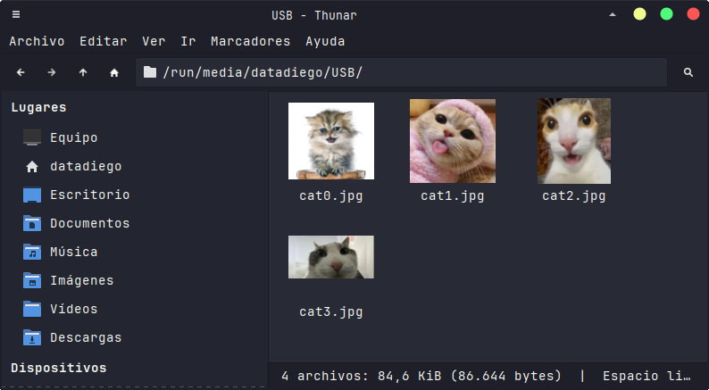
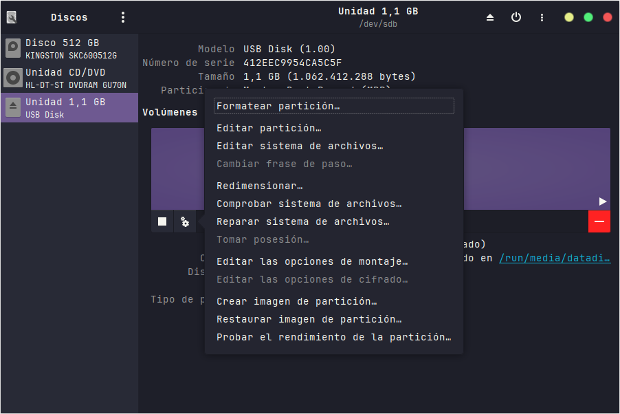
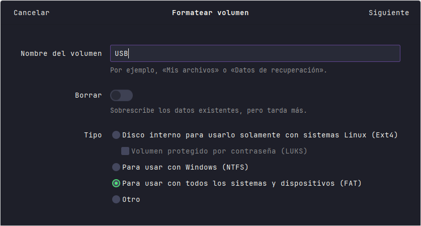
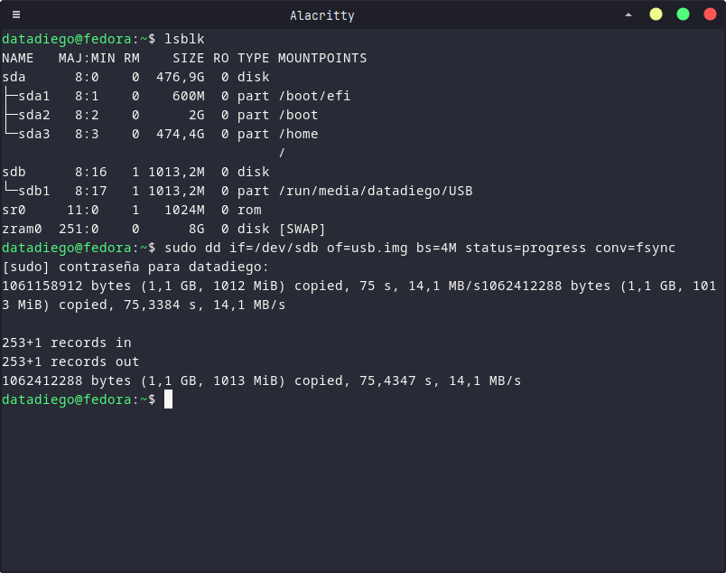
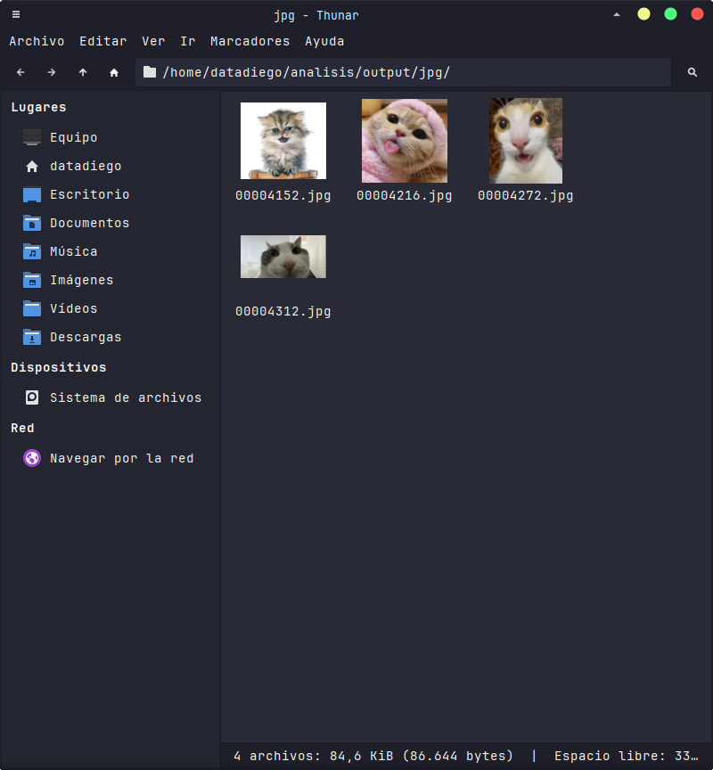

En análisis forénsico es común tener que recuperar datos de discos duros y USBs.

Poder recuperar archivos de este tipo de dispositivos es además relativamente fácil, aunque dependiendo del tipo de investigación que queramos hacer debemos de tener en cuenta algunas cosas antes de proceder a la recuperación.

## Respetando la cadena de custodia

Si simplemente necesitas recuperar los archivos para un compañero que perdió unos documentos, no necesitas hacer nada de esto, pero si estás intentando recuperar información de un dispositivo para una **investigación penal**, un **procedimiento civil o laboral**, o en un **peritaje informático**, tendrás que respetar la cadena de custodia del mismo para asegurar que esta prueba digital es **la misma** desde que obtuviste la primera muestra hasta el momento en que se analiza.

El objetivo de la misma es garantizar que **no ha sido alterada, manipulada o sustituida** durante el procedimiento.

Para ello, debemos:

- Documentar cuando, dónde y quien recogió el dispositivo.
- Registrar cada persona que ha tenido acceso a la evidencia.
- Crear una imágen forense bit a bit del dispositivo, **nunca trabajar sobre el original directamente**.
- Calcular un hash tanto del original como de la copia para demostrar que estos son idénticos.
- Conservar el original intacto.

Esto **no asegura el fraude de una evidencia**, pero lo dificulta.

En investigaciones más sensibles, podemos encontrar más mecanismos:

- Grabar todo el proceso de adquisición.
- Realizar el proceso frente a varias personas.
- Hacer que dos equipos verifiquen la imágen.
- Es común que quien incauta el dispositivo, ya haya realizado una imagen previa, si el investigador altera o manipula el mismo, esta puede usarse para probar que hubo algún fraude durante la adquisición de datos.

## Nuestro laboratorio

Partimos de un USB nuevo de 1GB o uno **completamente formateado con los datos borrados**.

Vamos a meter varios archivos en el mismo:



Luego, vamos a proceder a formatear el USB, en mi caso usare `gnome-disks`:



Es importante que **no marques la opción de borrar el contenido**:



Cuando formateamos así es mucho más rápido, pero **los archivos en realidad no se borran**, solo se borran las referencias al archivo, **los datos permanecen**, esperando a ser sobreescritos por datos nuevos.

Si entras a tu USB, no verás ningún archivo.

## Recuperando los datos eliminados

### Creando la imagen del USB

Vamos a crear una imagen de nuestro dispositivo, esto es una **copia bit a bit** de todo nuestro dispositivo. Es importante que trabajes siempre sobre una imagen, hacerlo sobre el dispositivo puede alterar la información del mismo.

Utilizaremos `dd` para esto:



Con `lsblk` podemos listar los dispositivos de memoria que tenemos conectados, en mi caso, el usb está en `sdb`, asi que haremos:

```
sudo dd if=/dev/sdb of=usb.img bs=4M status=progress conv=fsync
```

Para generar un archivo `imagen.img` del mismo.

Crea la imagen en una carpeta aislada o muevela tras crearla. En este caso, trabajaremos en `~/analisis/`.

### Creando el hash del dispositivo original

Vamos a crear un hash a partir de nuestro dispositivo usb:

```bash
sudo sha256sum /dev/sdb > sha256
```

En mi caso, obtengo:

```bash
datadiego@fedora:~/analisis$ cat sha256
ad8781f41cb349699ecedd1a93283242824f0e0d876fab49d89c0e597d7dc4bf  /dev/sdb
```

Si realizamos el hash sobre nuestra imagen **deberiamos obtener el mismo valor**:

```bash
datadiego@fedora:~/analisis$ cat sha256
ad8781f41cb349699ecedd1a93283242824f0e0d876fab49d89c0e597d7dc4bf  /dev/sdb
datadiego@fedora:~/analisis$ sha256sum usb.img
ad8781f41cb349699ecedd1a93283242824f0e0d876fab49d89c0e597d7dc4bf  usb.img
```

Podemos compararlo más fácilmente con:

```bash
cut -d' ' -f1 sha256 | awk '{print $1"  usb.img"}' | sha256sum -c
```

Que nos devuelve:

```
usb.img: La suma coincide
```

Ahora tenemos una imagen **exactamente igual** a nivel de bit de nuestro usb, en una imagen que podemos montar para explorar como si fuera el mismo.

### Extraer datos borrados

Evidentemente, aunque montemos la imagen, no vamos a obtener nada, el usb está borrado:

```bash
datadiego@fedora:~/analisis$ sudo mount -o loop,offset=32768 usb.img /run/media/datadiego/
datadiego@fedora:~/analisis$ ls /run/media/datadiego/
datadiego@fedora:~/analisis$ sudo umount /run/media/datadiego
datadiego@fedora:~/analisis$
```

Pero podemos usar **foremost**, una herramienta de análisis forense para obtener datos que aunque no aparezcan, no se boraron. Usarla es bastante fácil:

```bash
foremost -i usb.img
```

Podemos especificar el directorio en el que queremos que deje los resultados, si no lo especificamos, aparecerán en una carpeta llamada `output`:

```bash
datadiego@fedora:~/analisis$ foremost -i usb.img
Processing: usb.img
|***********|
datadiego@fedora:~/analisis$ ls output/
.rw-r--r--@ 811 datadiego  4 ago 01:22 audit.txt
drwxr-xr--@   - datadiego  4 ago 01:22 jpg
datadiego@fedora:~/analisis$ ls output/jpg/
.rw-r--r--@ 30k datadiego  4 ago 01:22 00004152.jpg
.rw-r--r--@ 27k datadiego  4 ago 01:22 00004216.jpg
.rw-r--r--@ 17k datadiego  4 ago 01:22 00004272.jpg
.rw-r--r--@ 13k datadiego  4 ago 01:22 00004312.jpg
```

Hemos podido recuperar todas las imágenes borradas:



## Formateando un usb

Si recuperar archivos *borrados* de un usb es tan fácil, ¿como borramos completamente los archivos? Si no queremos que nadie pueda realizar esto sobre nuestros datos, tenemos varias opciones.

La primera, y más simple, cuando formateas el dispositivo, asegúrate de marcar que se borren los datos, un formateo rápido siempre dejará los datos en el mismo y hasta que no sean sobreescritos por nuevos, estos no se irán eliminando.

Otra opción es **rellenar con ceros** o **valores aleatorios**:

```bash
sudo dd if=/dev/zero of=/dev/sdb bs=1M status=progress conv=fsync
sudo dd if=/dev/random of=/dev/sdb bs=1M status=progress conv=fsync
```

Esto es rápido pero **no elimina 100%** los datos.

En discos magnéticos aun se puede recuperar con *microscopios magneticos* leyendo datos fantasma que aun quedan. En HDD y USB hay celdas con datos viejos que pueden no escribirse.

Para eliminar completamente datos, podemos usar `ATA Secure Erase`, pero no todos los dispositivos lo permiten, por ejemplo:

```bash
datadiego@fedora:~/analisis/output/jpg$ sudo hdparm -I /dev/sdb

/dev/sdb:

ATA device, with removable media
Standards:
	Likely used: 1
Configuration:
	hard sectored
	soft sectored
	not MFM encoded
	removable drive
	Logical		max	current
	cylinders	0	0
	heads		0	0
	sectors/track	0	0
	--
	Logical/Physical Sector size:           512 bytes
	device size with M = 1024*1024:           0 MBytes
	device size with M = 1000*1000:           0 MBytes
	cache/buffer size  = unknown
Capabilities:
	IORDY not likely
	Cannot perform double-word IO
	R/W multiple sector transfer: not supported
	DMA: not supported
	PIO: pio0
```

El dispositivo no permite hacerlo, no tiene `Security Mode feature set`, esto es común en USBs.

Mi SSD del sistema sin embargo muestra esta parte:

```bash
Enabled	Supported:
  *	SMART feature set
	  Security Mode feature set
```

En este si que podríamos usar esta herramienta con:

```bash
sudo hdparm --user-master u --security-set-pass p /dev/sda
sudo hdparm --user-master u --security-erase p /dev/sda
sudo hdparm --user-master u --security-erase-enhanced p /dev/sda
```

Primero fijaremos una contraseña, y luego borraremos todo.

Para el usb podemos usar `badblocks`:

```bash
sudo badblocks -wsv -b 4096 /dev/sdb
```

Aun asi, hay laboratorios, agencias de inteligencia y empresas forenses especializadas que serían capaces de recuperar datos con técnicas avanzadas. Si realmente **no quieres que nadie obtenga nada**, lo único que queda es la **destrucción física** del dispositivo, mediante triturado, incineración o disolución con químicos. Es la **unica forma fiable** de que nadie obtenga nada.
