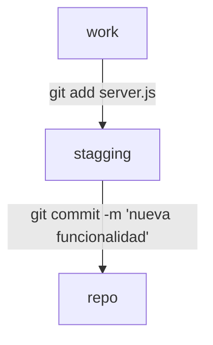

Git es la herramienta **más importante** que deberías estar usando para desarrollar. Sin ella, no podrás colaborar en proyectos grandes, y te arriesgas a perder tu trabajo o romperlo tu mismo.

## ¿Qué es Git?

Git soluciona un problema básico en el desarrollo de software: la gestión de versiones. Cuando trabajas en un proyecto, es probable que hagas cambios en el código pero luego no quedes satisfecho con los resultados. ¿Que haces entonces? Si fuiste precavido y guardaste una copia de seguridad, puedes volver a esa versión anterior. Pero si no lo hiciste, tendrás que editar manualmente el código hasta su estado anterior, esto es tedioso, y en ocasiones, imposible.

Git te evita este problema, puedes guardar diferentes versiones de tu código y volver a ellas cuando necesitas. Te permite crear copias de seguridad de tu trabajo y colaborar con otras personas en el mismo proyecto sin miedo a perder tu trabajo o romperlo con cambios de otros.



## Instalación

Para instalar Git, puedes usar uno de los siguientes comandos, dependiendo de tu distro:

```bash
sudo apt install git
sudo dnf install git
```

## Configuración

Una vez instalado, es importante configurarlo con tu nombre y correo electrónico. Esto es importante porque Git utiliza esta información para identificar quién hizo qué cambios en el código.

```bash
git config --global user.name "Tu Nombre"
git config --global user.email "Tu Correo"
```

Puedes comprobar que la configuración se ha guardado correctamente con el siguiente comando:

```bash
git config --list
```

## Crear repositorio local

Para crear un repositorio en la carpeta actual, puedes usar el siguiente comando:

```bash
git init
```

Esto creará una carpeta oculta llamada `.git` en la carpeta actual. Esta carpeta contiene toda la información necesaria para gestionar el repositorio, incluyendo el historial de cambios y las versiones del código.

No tendrás que preocuparte por esta carpeta, Git la gestionará por ti.

## Áreas de trabajo

Git tiene tres áreas de trabajo:

- **Working Directory**: Es la carpeta donde tienes tu código. Aquí es donde haces los cambios en el código.
- **Staging Area**: Es una zona intermedia donde puedes preparar los cambios que quieres guardar en el repositorio. Aquí es donde decides qué cambios quieres incluir en el próximo commit.
- **Repository**: Es la carpeta oculta `.git` donde Git guarda toda la información sobre el repositorio, incluyendo el historial de cambios y las versiones del código.



Puedes comprobar el estado de tu repositorio con el siguiente comando:

```bash
git status
```

Esto te mostrará qué archivos han sido modificados, cuáles están en la Staging Area y cuáles no están siendo rastreados por Git.

## Añadir archivos

Para añadir archivos al repositorio, puedes usar el siguiente comando:

```bash
git add <nombre_archivo>
```

Esto añadirá el archivo a la Staging Area. Si quieres añadir todos los archivos, puedes usar el siguiente comando:

```bash
git add .
```

## Confirmar cambios

Para confirmar los cambios y guardarlos en el repositorio, puedes usar el siguiente comando:

```bash
git commit -m "Mensaje de confirmación"
```

Es **muy** importante que escribas un mensaje de confirmación claro y conciso con el cambio que has realizado. En especial si estas trabajando en un proyecto con otras personas. Esto ayudará a los demás a entender qué cambios has realizado y por qué.

No hacer esto puede llevar a confusiones o incluso cancelar tus cambios en el repositorio.

## Ver el historial de cambios

Para ver el historial de cambios en el repositorio, puedes usar el siguiente comando:

```bash
git log
```

## Deshacer commit

Si quieres deshacer el último commit para arreglar algo, puedes usar el siguiente comando:

```bash
git amend <nombre_archivo>
```

Esto deshará el último commit y te permitirá hacer cambios en el código antes de volver a confirmarlo. Esto es útil si te das cuenta de que has cometido un error en el último commit o si quieres añadir más cambios antes de confirmar.

## Ejemplo de uso

Vamos a ver un flujo de trabajo típico y minimo de `git` funcionando localmente.

### Crear el repo

Crearemos un directorio, iniciamos con `git init`

```bash
/tmp
❯ mkdir web

/tmp
❯ cd web/

/tmp/web
❯ git init
Inicializado repositorio Git vacío en /tmp/web/.git/
```

Si acabas de instalar git puedes recibir un mensaje de aviso en el que te dice que tu rama principal se llama `master`, y como puedes cambiarla si prefieres usar `main` u otro nombre para la misma.

Para comprobar que el repositorio se ha iniciado correctamente:

```bash
web on  master
❯ ls -la
drwxr-xr-x@ - datadiego 29 ago 12:37 .git

web on  master
❯ git status
En la rama master

No hay commits todavía

no hay nada para confirmar (crea/copia archivos y usa "git add" para hacerles seguimiento)
```

Vemos que existe `.git` y que no hay commits ni archivos que añadir al `staging area` con `git add`

### Provocando cambios en el repositorio

Creamos dos archivos simples:

```bash

web on  master
❯ echo "hola mundo" > index.html

web on  master [?]
❯ echo "# Proyecto de website" > README.md
```

Ahora veremos que con `git status` se han detectado cambios en el repositorio:

```bash
web on  master [?]
❯ git status
En la rama master

No hay commits todavía

Archivos sin seguimiento:
  (usa "git add <archivo>..." para incluirlo a lo que será confirmado)
	README.md
	index.html

no hay nada agregado al commit pero hay archivos sin seguimiento presentes (usa "git add" para hacerles seguimiento)
```

Tenemos dos archivos sin seguimiento, vamos a añadir los cambios del `README.md`:

```bash
web on  master [?]
❯ git add README.md

web on  master [+?]
❯ git status
En la rama master

No hay commits todavía

Cambios a ser confirmados:
  (usa "git rm --cached <archivo>..." para sacar del área de stage)
	nuevos archivos: README.md

Archivos sin seguimiento:
  (usa "git add <archivo>..." para incluirlo a lo que será confirmado)
	index.html
```

Y a confirmarlos con `git commit -m "descripcion de los cambios"`:

```bash
web on  master [+?]
❯ git commit -m "iniciamos readme para describir el proyecto"
[master (commit-raíz) a36508d] iniciamos readme para describir el proyecto
 1 file changed, 1 insertion(+)
 create mode 100644 README.md
```

Ahora podemos comprobar que solo hay un cambio por añadir:

```bash
web on  master [?]
❯ git status
En la rama master
Archivos sin seguimiento:
  (usa "git add <archivo>..." para incluirlo a lo que será confirmado)
	index.html

no hay nada agregado al commit pero hay archivos sin seguimiento presentes (usa "git add" para hacerles seguimiento)
```

Y que en nuestro log tenemos un commit realizado:

```bash
web on  master [?]
❯ git log
commit a36508df1e50e97da9406c333d360e10f4d29fdb (HEAD -> master)
Author: Juan Diego <juandiegomariscal@gmail.com>
Date:   Sat Aug 29 12:45:54 2026 +0200

    iniciamos readme para describir el proyecto
```

Vamos a realizar lo mismo con `index.html`:

```bash
web on  master [?]
❯ git add index.html

web on  master [+]
❯ git commit -m "hola mundo"
[master 585707a] hola mundo
 1 file changed, 1 insertion(+)
 create mode 100644 index.html

web on  master
❯ git status
En la rama master
nada para hacer commit, el árbol de trabajo está limpio

web on  master
❯ git log
commit 585707a2b306b913d1b8042197b2e6c10c337a0a (HEAD -> master)
Author: Juan Diego <juandiegomariscal@gmail.com>
Date:   Sat Aug 29 12:47:37 2026 +0200

    hola mundo

commit a36508df1e50e97da9406c333d360e10f4d29fdb
Author: Juan Diego <juandiegomariscal@gmail.com>
Date:   Sat Aug 29 12:45:54 2026 +0200

    iniciamos readme para describir el proyecto
```

### Arreglando commits con amend

Nos podemos equivocar al hacer un commit:

```bash
web on  master
❯ echo "<h1>hola mundo<h1>" > index.html

web on  master [!]
❯ git add .

web on  master [+]
❯ git commit -m "usamos tags h1 en hola mundo"
[master a5dbb2a] usamos tags h1 en hola mundo
 1 file changed, 1 insertion(+), 1 deletion(-)
```

Nuestro log ahora tiene un commit más:

```bash
web on  master
❯ git log --oneline
a5dbb2a (HEAD -> master) usamos tags h1 en hola mundo
585707a hola mundo
a36508d iniciamos readme para describir el proyecto
```

Pero conforme lo hiciste te das cuenta que pusiste `<h1>hola mundo<h1>` en lugar de `<h1>hola mundo</h1>`.

Puedes simplemente hacer un commit nuevo con el arreglo, pero usar `amend` es mejor:

```bash
web on  master
❯ echo "<h1>hola mundo</h1>" > index.html

web on  master [!]
❯ git add .

web on  master [+]
❯ git commit --amend
[master 46f95e7] usamos tags h1 en hola mundo
 Date: Sat Aug 29 12:51:02 2026 +0200
 1 file changed, 1 insertion(+), 1 deletion(-)
```

Ahora nuestro log es mucho mas limpio:

```bash
web on  master
❯ git log --oneline
46f95e7 (HEAD -> master) usamos tags h1 en hola mundo
585707a hola mundo
a36508d iniciamos readme para describir el proyecto
```

Y el archivo es correcto:

```bash
web on  master
❯ cat index.html
<h1>hola mundo</h1>
```

Tambien puedes usarlo para cambiar el mensaje del ultimo commit, sin cambios en el stage:

```bash
web on  master
❯ git commit -m "cambiamos el mensaje" --amend
[master 1252486] cambiamos el mensaje
 Date: Sat Aug 29 12:51:02 2026 +0200
 1 file changed, 1 insertion(+), 1 deletion(-)
```

> Amend solo afecta al último commit

### Otro ejemplo de amend

Es muy común que cuando tenemos que añadir multiples archivos a un commit, nos olvidemos de alguno:

```bash
web on  master [!?] via  v22.23.1
❯ git status
En la rama master
Cambios no rastreados para el commit:
  (usa "git add <archivo>..." para actualizar lo que será confirmado)
  (usa "git restore <archivo>..." para descartar los cambios en el directorio de trabajo)
	modificados:     index.html

Archivos sin seguimiento:
  (usa "git add <archivo>..." para incluirlo a lo que será confirmado)
	index.js

sin cambios agregados al commit (usa "git add" y/o "git commit -a")
```

En este estado tenemos:

- `index.html`, lo hemos modificado con respecto al ultimo commit.
- `index.js`, un script que acabamos de crear.

Al hacer commit solo añadimos el `.js`:

```bash
web on  master [!?] via  v22.23.1
❯ git add index.js

web on  master [!+] via  v22.23.1
❯ git commit -m "hola mundo desde javascript en index.html"
[master 2ef419a] hola mundo desde javascript en index.html
 1 file changed, 1 insertion(+)
 create mode 100644 index.js
```

Pero necesita el `html` para funcionar! Podemos hacer:

```bash
web on  master [!] via  v22.23.1
❯ git add index.html

web on  master [+] via  v22.23.1
❯ git commit -m "hola mundo desde javascript en index.html" --amend
[master 62688f0] hola mundo desde javascript en index.html
 Date: Sat Aug 29 13:11:20 2026 +0200
 2 files changed, 2 insertions(+), 1 deletion(-)
 create mode 100644 index.js
```

También puede pasar lo contrario, ¿y si hemos metido un archivo que no tiene nada que ver en un commit? Si por ejemplo quisieramos quitar el `.js` de este último commit:

```bash
web on  master via  v22.23.1
❯ git rm --cached index.js
rm 'index.js'

web on  master [✘?] via  v22.23.1
❯ git commit --amend -m "creamos tag <script> para importar js"
[master 690c9a1] creamos tag <script> para importar js
 Date: Sat Aug 29 13:11:20 2026 +0200
 1 file changed, 1 insertion(+), 1 deletion(-)

web on  master [?] via  v22.23.1
❯ git add index.js

web on  master [+] via  v22.23.1
❯ git commit -m "creamos hola mundo en js"
[master ee07e4a] creamos hola mundo en js
 1 file changed, 1 insertion(+)
 create mode 100644 index.js
```

### Retrocediendo en el tiempo

Imagina esta situación, en un repositorio tenemos un archivo de python que funciona y al que ya hemos hecho commit:

```bash
test-reset on  master via 🐍 v3.14.7
❯ python3 main.py
hola mundo

test-reset on  master via 🐍 v3.14.7
❯ git log --oneline
bc578d9 (HEAD -> master) hola mundo en python
```

Comenzamos a editar nuestro `main.py`, pero tenemos errores:

```bash
test-reset on  master [!] via 🐍 v3.14.7 took 43s
❯ cat main.py
saludo("hola nombre")

test-reset on  master [!] via 🐍 v3.14.7
❯ python3 main.py
Traceback (most recent call last):
  File "/tmp/test-reset/main.py", line 1, in <module>
    saludo("hola nombre")
    ^^^^^^
NameError: name 'saludo' is not defined
```

Si simplemente quieres borrar **todo** lo que hiciste y volver a tu ultimo commit funcional, puedes hacer `git reset --hard`:

```bash
test-reset on  master [!] via 🐍 v3.14.7
❯ cat main.py
saludo("hola nombre")

test-reset on  master [!] via 🐍 v3.14.7
❯ git reset --hard
HEAD está ahora en bc578d9 hola mundo en python

test-reset on  master via 🐍 v3.14.7
❯ cat main.py
print('hola mundo')
```

Esto nos permite iterar y cambiar código y volver rápidamente al ultimo punto en el que sabiamos que funcionaba.

Otro ejemplo, ahora tenemos esto:

```bash
❯ git log --oneline
330095f (HEAD -> master) llamamos a funcion
b8f4cb6 creamos funcion saludo
f59a83b imprimimos saludo con nombre
f516fc1 creamos una variable
e1e456c cambiamos el mensaje
bc578d9 hola mundo en python

test-reset on  master via 🐍 v3.14.7
❯ cat main.py
print("otro mensaje")

def saludo(nombre):
    nombre = "diego"
    print(f"hola {nombre}")

saludo("diego")
```

En este caso hemos hecho multiples commits, el código funciona, pero estaría mejor si tuvieramos un solo commit en el que indicamos que creamos la funcion y la llamamos, tendriamos que echar para atrás 4 commits, asi que podemos hacer:

```bash
test-reset on  master via 🐍 v3.14.7
❯ git reset --mixed e1e456c
Cambios fuera del área de stage tras el reset:
M	main.py

test-reset on  master [!] via 🐍 v3.14.7
❯ git log --oneline
e1e456c (HEAD -> master) cambiamos el mensaje
bc578d9 hola mundo en python

test-reset on  master [!] via 🐍 v3.14.7
❯ cat main.py
print("otro mensaje")

def saludo(nombre):
    nombre = "diego"
    print(f"hola {nombre}")

saludo("diego")

test-reset on  master [!] via 🐍 v3.14.7
❯ git add main.py

test-reset on  master [+] via 🐍 v3.14.7
❯ git commit -m "creamos funcion saludo y la llamamos"
[master 17ddc63] creamos funcion saludo y la llamamos
 1 file changed, 6 insertions(+)

test-reset on  master via 🐍 v3.14.7
❯ git log --oneline
17ddc63 (HEAD -> master) creamos funcion saludo y la llamamos
e1e456c cambiamos el mensaje
bc578d9 hola mundo en python
```

En este caso, `git reset --mixed <commit-hash>` devuelve el repositorio justo al estado que tenia en el hash, pero conserva todos los cambios que hicimos y los deja en el *working area*, si quieres que se queden en el *staging area*, listos para hacer commit, usa `--soft` en lugar de `--mixed`.

### Finalizando

Git es un software **muy extenso**, en tu día a día puede que uses pocos comandos y funciones bien, pero conviene que sepas **de que es capaz** para poder solucionar problemas cuando pasen.

Es normal no acordarte de todos los comandos, apúntalos en ejemplos como los que has visto aquí, o mira documentación online cuando no recuerdes como hacer algo concreto. Usar un agente para solucionarlos también es buena idea, pero cuidado con sus soluciones y **revisa bien que está haciendo**.
