Siempre que hablo de `glitch art` me doy cuenta rápidamente de los pocos recursos que hay escritos en castellano acerca del tema.

Corromper imagenes, audio y video fue de las primeras cosas que me acercaron a aprender a programar y entender más acerca de formatos que usaba en el dia a dia.

Vamos a hablar sobre teoría acerca del glitch. Hay varias publicaciones interesantes sobre el tema como [Evolving glitch](https://www.researchgate.net/publication/253650085_Evolving_Glitch_Art) de Eelco den Heijer o [Glitch](https://direct.mit.edu/books/edited-volume/1924/chapter-abstract/52852/Glitch?redirectedFrom=fulltext) de Olga Goriunova y Alexei Shulgin, aqui vamos a hacer una aproximación más corta y práctica para quien quiere empezar a crear estas imagenes que le servirá para entrar con un *mindset* correcto.

## Que es el glitch art

El `glitch art` son un conjunto de técnicas en las que buscamos de manera intencional provocar errores digitales para crear arte.

Convertir errores en recursos es algo que cuando sucede de forma natural suele considerarse una molestia, sin embargo, cuando empiezas a entender cómo estos se provocan, este tipo de fallos que surgen sin nuestra intervención son de los que más nos pueden llamar la atención.

Ten en cuenta, que prácticamente todas las técnicas pueden aplicarse a *imágenes*, *sonido* y *video* de manera similar, aunque algunas son mas eficaces con unas u otras.

Rosa Menkman, en su publicación [Glitch moment(um)](https://networkcultures.org/_uploads/NN%234_RosaMenkman.pdf) da una definición maravillosa sobre qué define un glitch:

> A glitch reveals itself to perception as accident, chaos or laceration and gives a glimpse into normally obfuscated machine language. Rather than creating the illusion of a transparent, well-working interface to information, the glitch captures the machine revealing itself. 

Y según Eelco den Heijer:

>Glitch art is process art; one does not create a glitch, one triggers a glitch.

## Que no es el glitch art (del todo)

No podemos tener un gran control sobre el resultado de un error. No sabemos de antemano que sucederá cuando aplicamos estas técnicas. Con experiencia puedes *intuir* el tipo de efecto, pero nunca una certeza.

Utilizar programas de manera destructiva **no es glitch**. Por mucho que puedas usar *Photoshop* para destruir una imagen a base de efectos, no sucede un error en ningún momento, de la misma forma, añadir distorsión a un audio tampoco lo es. La máquina no revela ningun aspecto de su funcionamiento interno que nosotros no controlamos. El flujo en el que una fuente (imagen, sonido o video) estaba pensado para editarse no ha sido alterado y su estructura interna sigue siendo válida.

Es común ver el efecto de aberración cromática cuando buscas como hacer glitch:

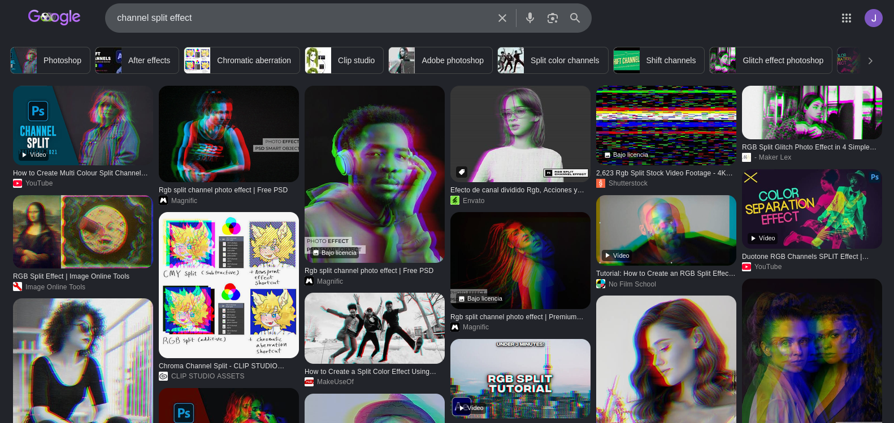

El efecto siempre se logra desplazando nosotros manualmente los canales RGB de nuestra imagen.

Siguiendo la definición de Menkman, un glitch no consiste únicamente en producir una imagen "rota", sino en permitir que la máquina revele algo de su propio lenguaje interno. Un desplazamiento manual de canales puede parecer un glitch, pero no nos está mostrando nada sobre cómo se almacenan o interpretan los datos; simplemente estamos utilizando una herramienta diseñada para conseguir ese efecto.


Todo esto es pura teoría, los efectos que puedas lograr en un programa de edición tradicional inspirados por la estética glitch no tienen menos valor artístico. La diferencia es puramente conceptual.

Aún así, los procesos de glitch donde realmente se provocan errores son casi imposibles de reproducir de manera tradicional en software, y resulta evidente cuando algo realmente está *inspirado en la estética glitch*, y cuando algo *tiene errores reales* una vez conoces algunas de las técnicas.

## Formas de corromper archivos

No hay una clasificación demasiado estricta a la que podamos recurrir para las técnicas que se usan, pero esta puede servir para quien quiere conocer las mas comunes.

### Glitch nativo

Estos suceden de forma espontánea, sin intencionalidad por parte del artista, son dificiles o imposibles de replicar si ya han sucedido:

- Corrupción de un archivo, por interacción con un software, durante su almacenamiento o transmisión
- Fallo en la memoria
- Errores en GPU/Drivers

### Glitch intencional

Es el que más nos interesa, en el que buscamos provocar un fallo real.

- **Databending**: Abrir un archivo con un programa diseñado para otro tipo de datos diferente
- **Datos binarios**: Editar los datos en bruto, bien sea interpretados como texto o en hexadecimal.
- **Corrupción**: Eliminar o añadir datos deliberadamente.
- **Circuit Bending**: En muchas ocasiones podemos manipular circuitos y provocar cortocircuitos para provocar diferentes errores.
- **Algoritmos de compresión y codecs**: Los algoritmos de compresión suelen estar creados y testeados de forma que no se aprecien, pero podemos usarlos para provocar artefactos.
- **Feedback**: Los efectos al editar suelen usarse pocas veces, usarlos en bucle, aplicar efectos contrarios (desenfoque + enfoque), o comprimir continuamente la misma imagen/audio/video suelen crear artefactos y efectos que no podemos apreciar durante una edición más estandar.

> Hay muchos más! Crear glitches consiste en *romper el flujo* tradicional que un formato espera tener, es fácil encontrar nuevas formas de provocarlos una vez has experimentado con varios.

## Preparandote para tu primer glitch

Hoy vas a crear tu primer glitch, y más importante aún, empezarás a entender el flujo de trabajo y mentalidad que se suele utilizar en estos procesos.

Puedes utilizar cualquier sistema operativo, aunque en mi caso usaré uno basado en Linux, todo esto se puede hacer en Windows/Mac sin problema.

Lo que si necesitarás es algo de software:

- Un programa para convertir entre formatos, bien sea Paint, Photoshop, [Photopea](https://www.photopea.com/) o en mi caso, [ImageMagick](https://imagemagick.org)
- Un programa para **editar texto plano**, puede ser el propio *Bloc de notas* de Windows, aunque [Notepad++](https://notepad-plus-plus.org/) será más versátil. En mi caso, utilizaré [Neovim](https://neovim.io/).
- Una imagen cualquiera, empezaremos con una en formato *.jpg*

Nuestro primer glitch va a ser simple, utilizaremos una técnica de *databending* en la que editaremos una imagen en un editor de texto.

## Flujo de trabajo

La única regla que debemos respetar cuando hacemos glitch es **no editar nunca la imagen original**, ten en cuenta que estamos provocando errores, en muchas ocasiones va a ser **imposible** devolvera a su estado original. Trabaja siempre sobre una copia de la imagen que quieres editar.

Antes de empezar, asegúrate de tener la imagen en **jpg**, conviertela con el software que prefieras.

En mi caso, utilizaré esta imagen:

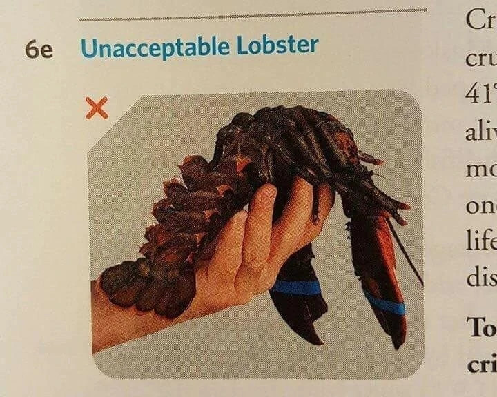

Luego, crea una carpeta donde copies esa imagen ahi, y crea una copia de la misma, en mi caso, se llamará `0.jpg`.

```bash
~/Downloads ❯ magick Unacceptablelobster.webp lobster.jpg

~/Downloads ❯ mkdir /tmp/glitch-text

~/Downloads ❯ cp lobster.jpg /tmp/glitch-text/

~/Downloads ❯ cd /tmp/glitch-text/

/tmp/glitch-text ❯ cp lobster.jpg 0.jpg

/tmp/glitch-text ❯ ls
Permissions Size User      Date Modified Name
.rw-r--r--  136k datadiego 15 Jul 12:28   0.jpg
.rw-r--r--  136k datadiego 15 Jul 12:28   lobster.jpg
```

Prefiero trabajar siempre en la carpeta `/tmp`, de forma que todo acabe borrado cuando apago mi sistema, cuando haces glitch es normal crear **muchas imagenes y variantes**, luego podemos seleccionar las que mejor resultado tengan, y no acabamos llenando nuestro sistema de imágenes corruptas o que no son interesantes.

## Editando imágenes como texto

Dependiendo del editor de texto que hayas elegido, esto puede ser *más o menos fácil*, en **Bloc de notas** en Windows tendrás que:

- Hacer clic en *Archivos > Abrir*
- Ir a tu carpeta
- Muy posiblemente no veas ningún archivo para abrir
- Donde te deja elegir los formatos, selecciona *Todos los archivos*
- Seleccionar `0.jpg` o la copia que hayas creado de la imagen original

En otros editores pueden aparecer directamente, o incluso funcionar arrastrando el archivo dentro del propio programa.

Cuando la abras, encontrarás algo similar a esto:

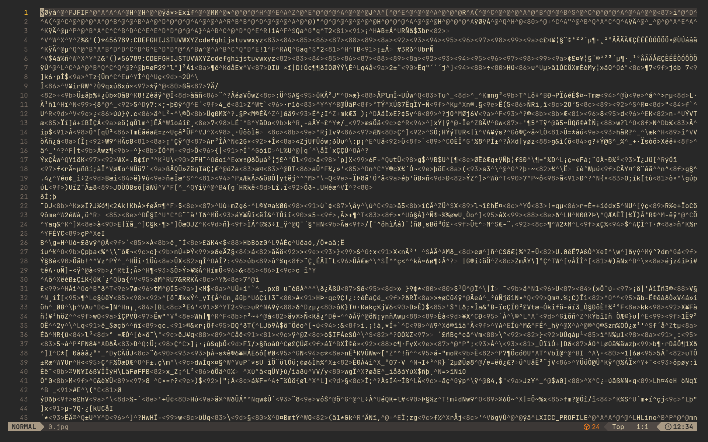

Ahora mismo estás viendo los datos binarios de la imagen, todo el conjunto de bytes que lo forman, en texto.

Evidentemente, nada tiene sentido, este formato **no está pensado para leerse asi**.

### Entorno para editar

Suelo organizar el escritorio de la siguiente forma:

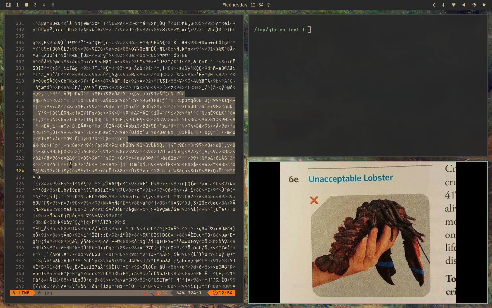

Por un lado mantengo la imagen que estoy editando abierta en una ventana, el editor en otra, y una terminal para poder crear copias de las imagenes más rapidamente. Esto me permite ver los cambios en tiempo real y poder acumular efectos de forma controlada copiando la imagen que ya ha conseguido un efecto que me interesa.

## Entendiendo como funcionan los formatos de imagen

Hay una parte que nos va a llamar la atención justo al principio de nuestro archivo si sabemos un poco sobre imagenes:

```
ÿØÿàJFIFHHÿá*>Exif
```

Esta parte corresponde al `header`, y vemos que si muestra datos que podemos leer claramente, si sabes algo sobre formatos de imagen, podemos leer:

- `JFIF`: Es el formato de archivo que utiliza en realidad la imagen, `jpeg` es el tipo de compresión aplicada.
- `Exif`: Son **metadatos** de la imagen, como su fecha de creación, con que cámara o software se ha editado, ubicación GPS, etc.

Los datos del header **no deberían ser modificados**, de lo contrario, es posible que corrompamos totalmente la imagen y no se pueda abrir, vamos a demostrarlo cambiando parte del inicio de la imagen:

```
ÿØÿàJFIFHHÿá*>Exifesto romperá la imagen
```

Al intentar abrirla, obtengo una imagen en negro:

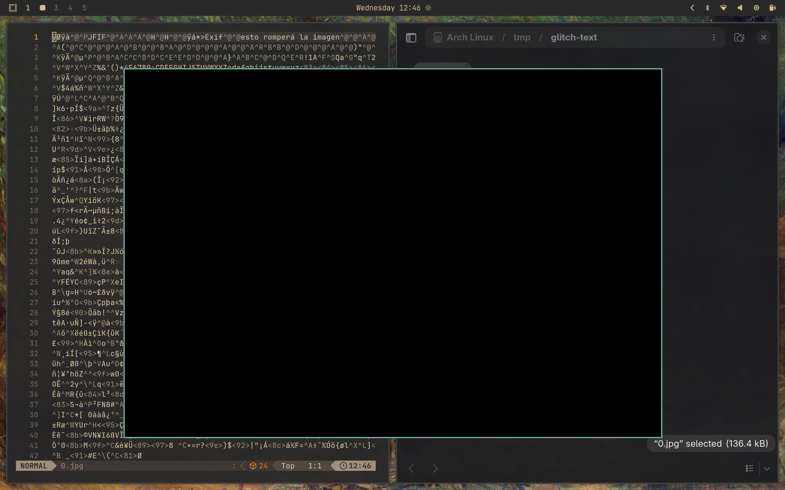

Otros visores pueden simplemente negarse a abrirla.

El header tiene una *longitud variable*, y desde un editor de texto básico **no sabemos realmente donde acaba**, asi que debemos ir probando, una manera más o menos segura sería ir a *la mitad del archivo*, aunque dependiendo de tu imagen, puede estar más abajo incluso.


## Editando nuestra imagen

Vamos a ver varias cosas que podemos probar con nuestra imagen en texto.

### Eliminando datos

Si eliminamos una o varias lineas de texto cerca de la mitad del archivo:

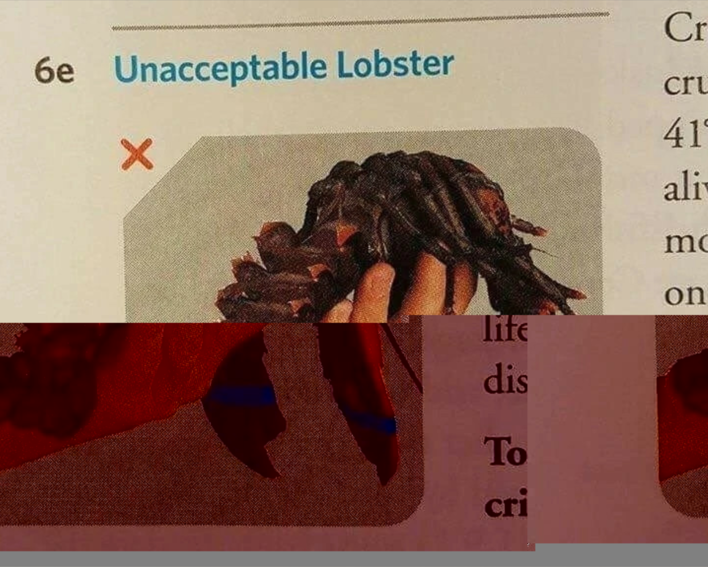

Vemos que gran parte de algunos canales se han perdido. Además muchos datos quedan desplazados, haciendo que la imagen se traslade horizontalmente.

Si intentamos eliminar datos más cercanos al final, entre las lineas `378` y `400`:

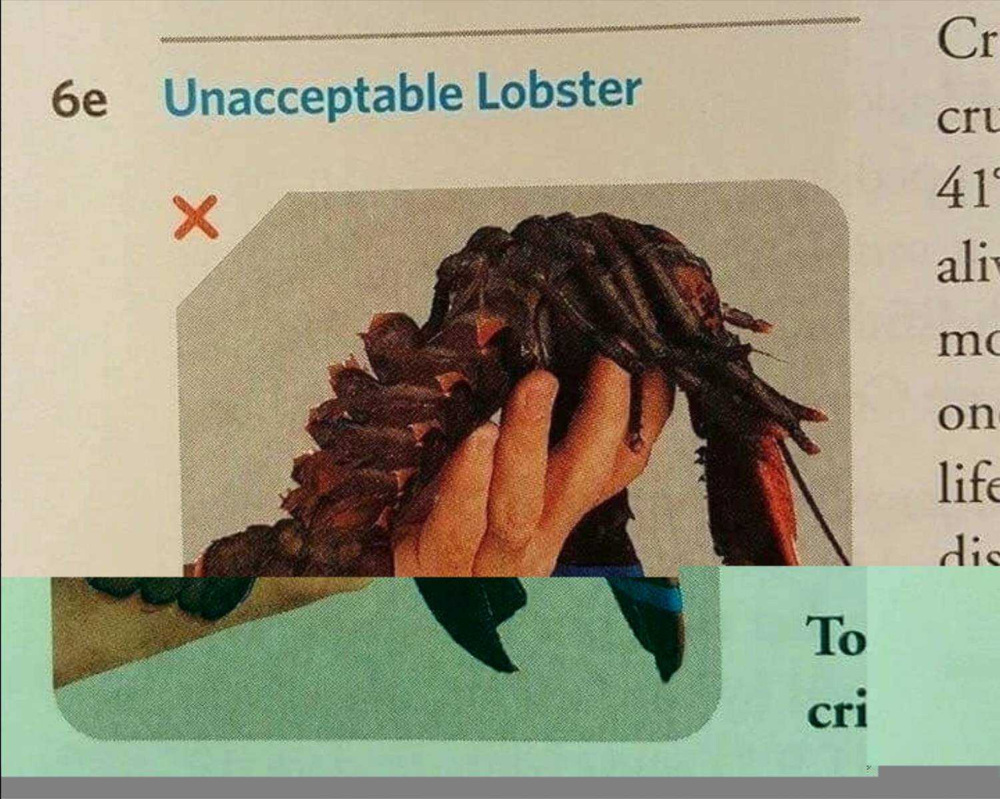

El resultado es similar, los datos quedan desplazados, y hemos eliminado completamente partes de algunos canales `RGB` por completo. Además, comprobamos que el efecto sucede **mas abajo** de la imagen. Esto nos puede ayudar a encontrar donde termina nuestro header a base de ensayo y error.

### Añadiendo datos externos

Podemos añadir un texto relativamente largo, vamos a pegar un `lorem ipsum` en la linea 200 y ver el resultado:

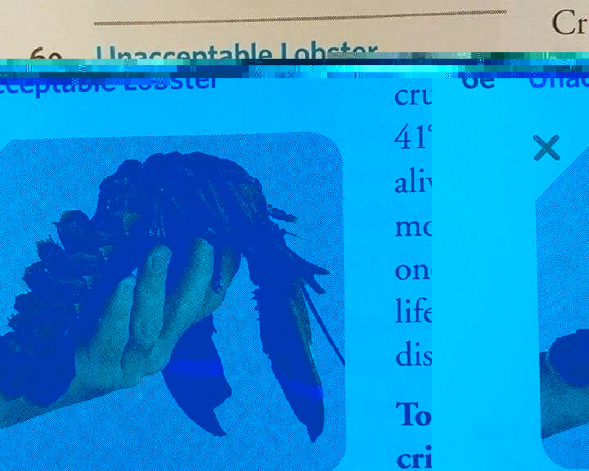

Una parte queda desplazada, lo cual es normal, como tal, parte de la información se ha movido mas adelante, pero ademas **surgen ciertos patrones al principio**, que corresponde al texto que hemos añadido.

Si en lugar de pegarlo una vez, lo pegamos múltiples veces:

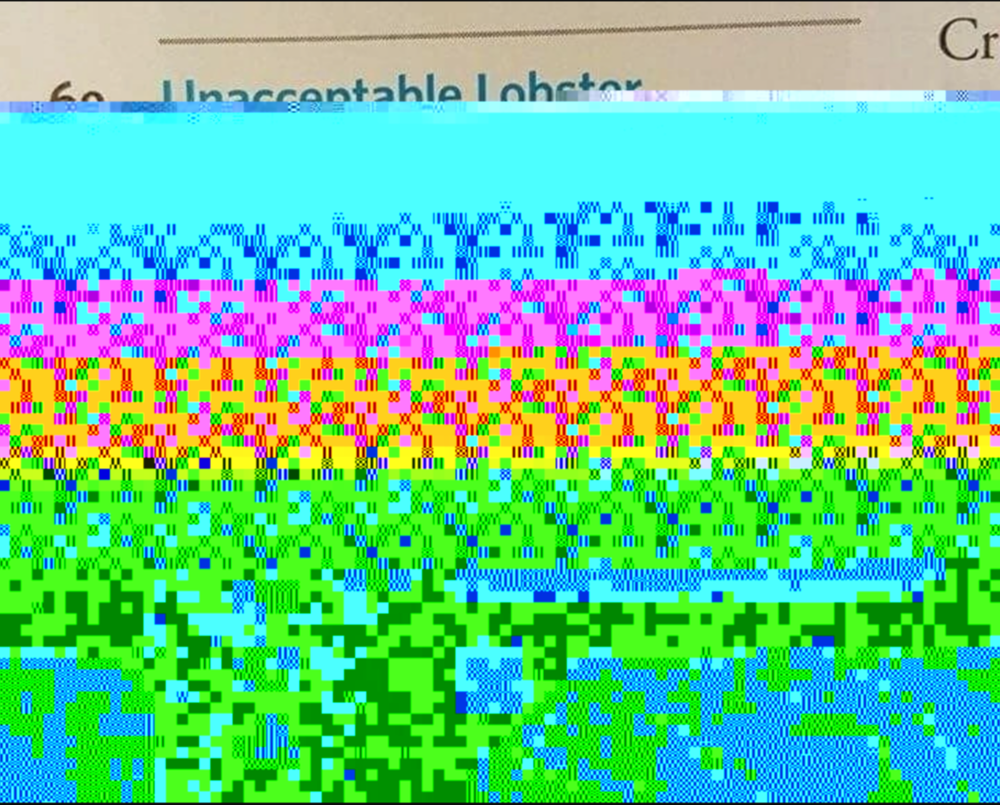

Ahora esos patrones cobran mucho mas protagonismo. Podemos probar con un texto mas largo, una forma rápida de probar diferentes cosas es utilizar [wordlists](https://github.com/kkrypt0nn/wordlists/blob/main/wordlists/stressing/unicode.txt) usadas en hacking para ataques de fuerza bruta, en github hay multiples y nos permiten copiarlas directamente desde el repositorio y pegarlas en nuestras imágenes:

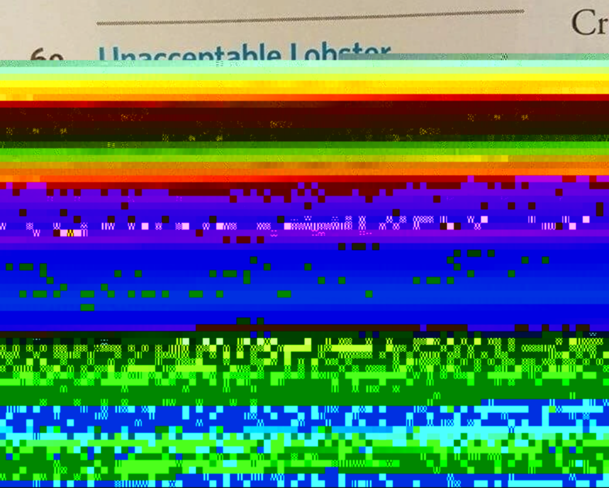

### Copiar y pegar

Copiar y pegar partes de la misma imagen produce lo esperado:

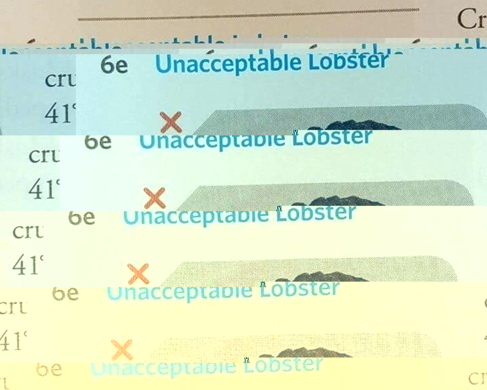

### Sustitución

Una técnica muy efectiva es **sustituir** todas las coincidencias de un caracter o conjunto de estos por otro, en neovim, podemos hacerlo con expresiones como:

```
:%s/a/hola/g
```

Esta expresión sustituye cualquier `a` por el texto `hola`

En este ejemplo, hemos eliminado todas las lineas nuevas con `:%s/\n//g`:

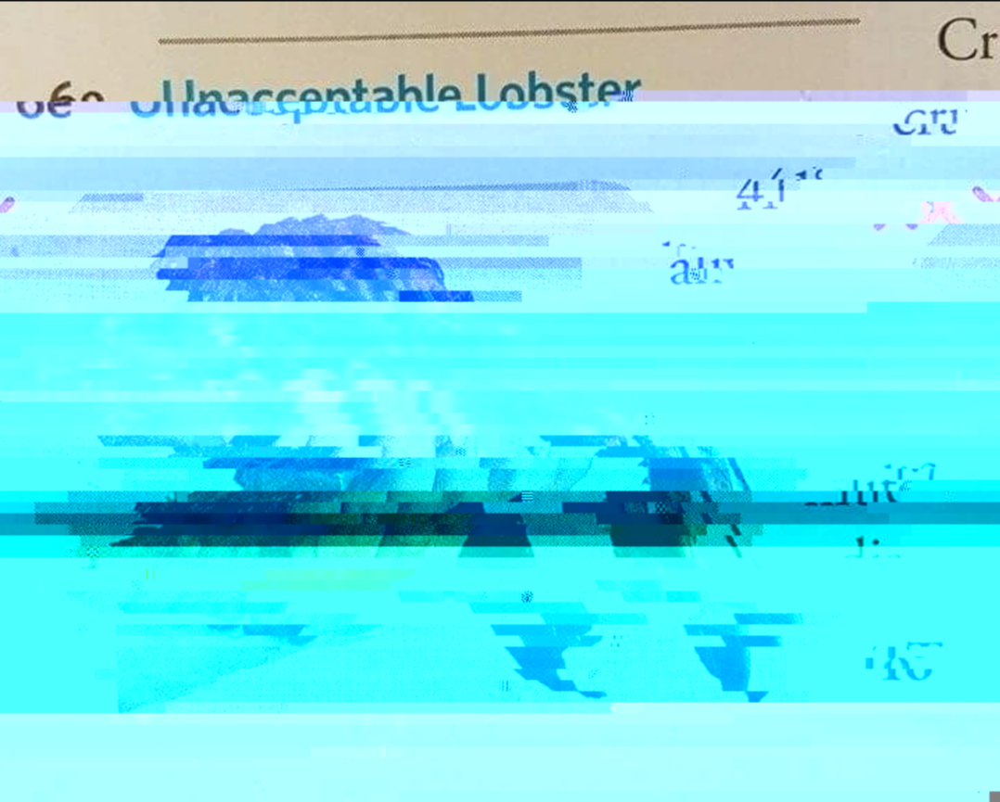

En esta, hemos cambiado cualquier `B` por `A`:

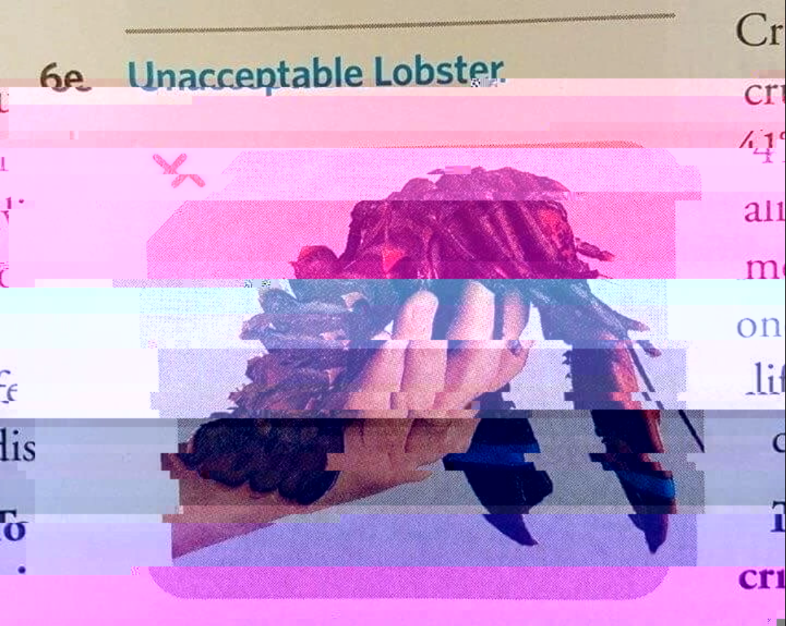

### Un efecto secundario de corromper imágenes

Si vas a postprocesar estas imágenes con otro software, rápidamente te darás cuenta de un efecto curioso, la imagen puede renderizarse diferente en tu visor y en un programa de edición.

Por ejemplo, la misma imagen que hemos generado antes se ve diferente en mi visor de imágenes y en mi navegador:

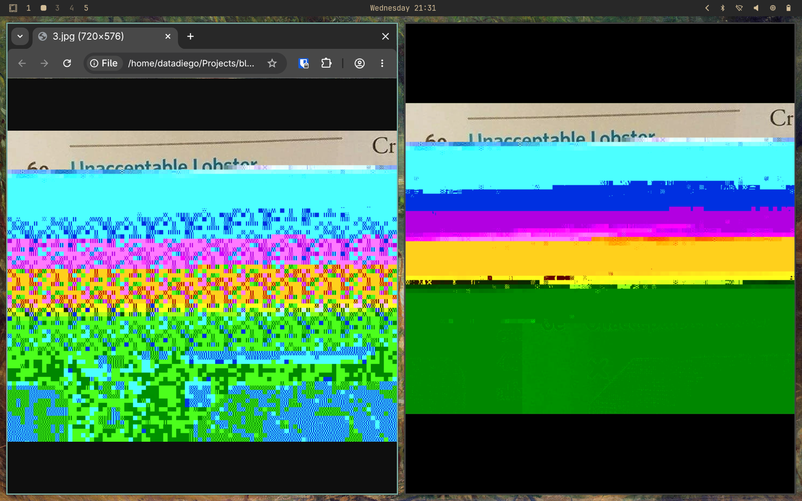

Esto es normal, en realidad, esta técnica es bastante destructiva, la representación de texto que vemos corresponde a los bytes de la imagen, al borrar, o sustituir estos caracteres podemos dejar la imagen con menos bytes de los que espera, o más, o incluso dejar partes enteras que quedan a la interpretación del software que renderiza la imagen.

Tendrás que **rasterizar** la imagen de nuevo desde el visor que de el efecto que prefieras con un *screenshot* o de lo contrario no podrá renderizarse como esperas realmente.

## Otros formatos

Hasta ahora hemos probado solo con el formato `jpg`, pero tenemos muchos con los que experimentar.

Vamos a probar a hacer la misma acción en estos formatos:

```
lobster.bmp
lobster.gif
lobster.pdf
lobster.png
```

### png

Se corrompe totalmente. El formato `png` suele no dar buenos resultados cuando lo editamos de manera tan bruta. Aunque en ocasiones puede funcionar, requiere bastante prueba. Es posible que dependiendo de como conviertas tu imagen puedas tener más éxito.

### bmp

Aqui hemos añadido el texto `hola mundo` en la linea 100:

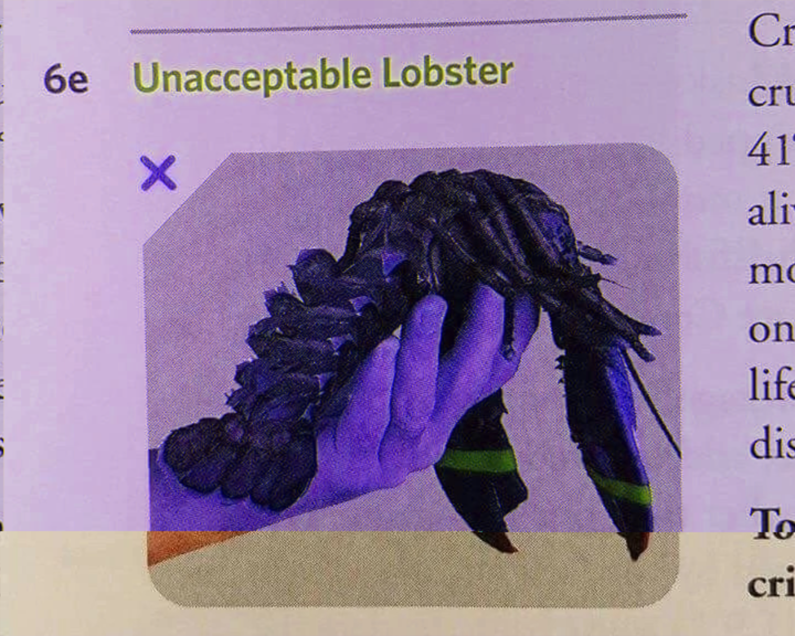

Encontramos resultados similares, con degradaciones de color muy diferentes a `jpg`

Eliminando un par de lineas:

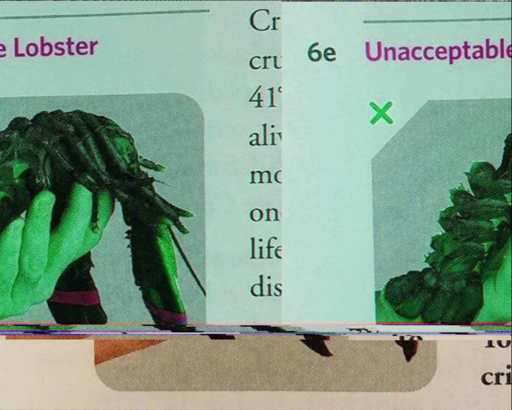

Aqui, hemos borrado **todos** los `intros` o lineas nuevas que hay a partir de la linea 100:

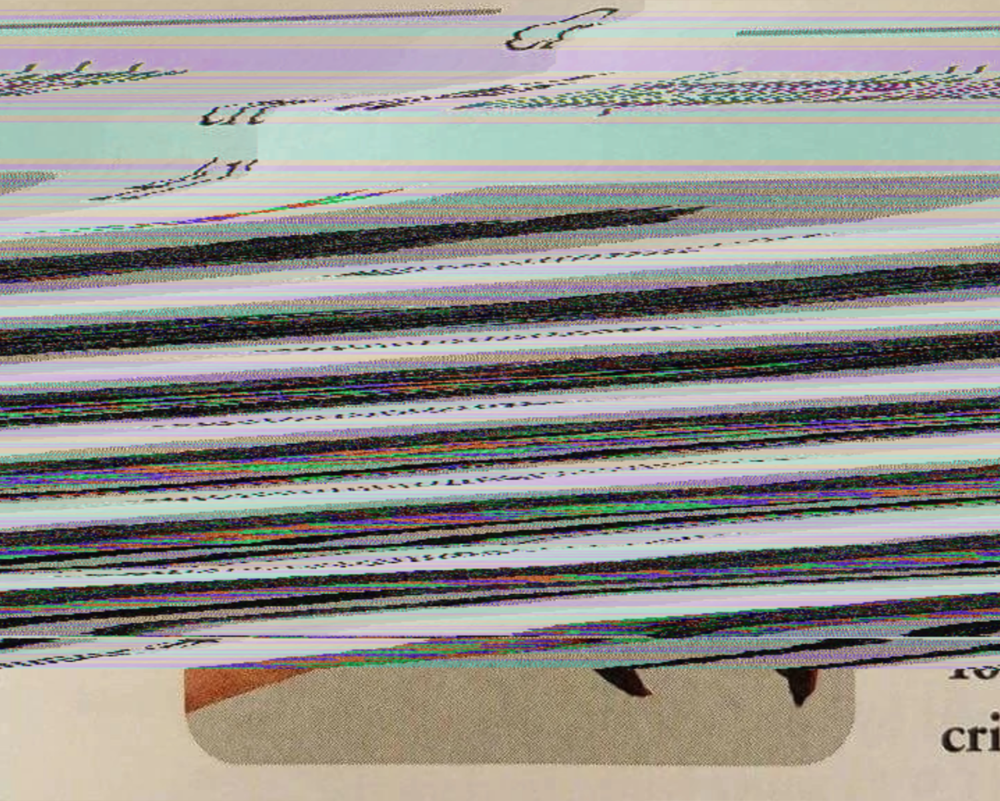

### gif

Suele corromperse por completo, es otro formato difícil de manipular en este contexto.

### pdf

Este formato es interesante, si lo abrimos, encontraremos algo como esto:

```
%PDF-1.7
1 0 obj
<<
/Pages 2 0 R
/Type /Catalog
>>
endobj
2 0 obj
<<
/Type /Pages
/Kids [ 3 0 R ]
/Count 1
>>
endobj
3 0 obj
<<
/Type /Page
/Parent 2 0 R
/Resources <<
/XObject << /Im0 8 0 R >>
/ProcSet 6 0 R >>
/MediaBox [0 0 720 576]
/CropBox [0 0 720 576]
/Contents 4 0 R
/Thumb 13 0 R
>>
endobj
4 0 obj
<<
/Length 5 0 R
>>
stream
q
720 0 0 576 0 0 cm
/Im0 Do
Q

endstream
endobj
5 0 obj
31
endobj
6 0 obj
[ /PDF /Text /ImageC ]
endobj
7 0 obj
<<
>>
endobj
8 0 obj
<<
/Type /XObject
/Subtype /Image
/Name /Im0
/Filter [ /DCTDecode ]
/Width 720
/Height 576
/ColorSpace 10 0 R
/BitsPerComponent 8
/Length 9 0 R
>>
stream
ÿØÿàJFIFHHÿá*>ExifMM*JR(‡iZ´HH0221‘ 0100  Р@¤

```

Como ves, ahora tenemos dos headers, el primero representa la información del PDF, el segundo corresponde a la imagen en jpg de la que hemos partido originalmente. El pdf simplemente lo incrusta una vez define varios parametros necesarios.

Si modificamos la información del jpg vamos a obtener los mismos tipos de efectos que vimos anteriormente, ¿y si manipulamos los del pdf en si?

Por ejemplo, podemos cambiar esta linea:

```
/BitsPerComponent 8
```

Por:

```
/BitsPerComponent 2
```

Donde obtenemos:

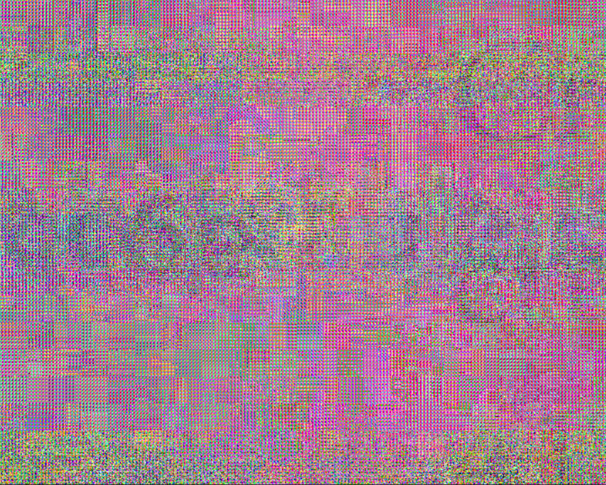

Con el valor `4`:

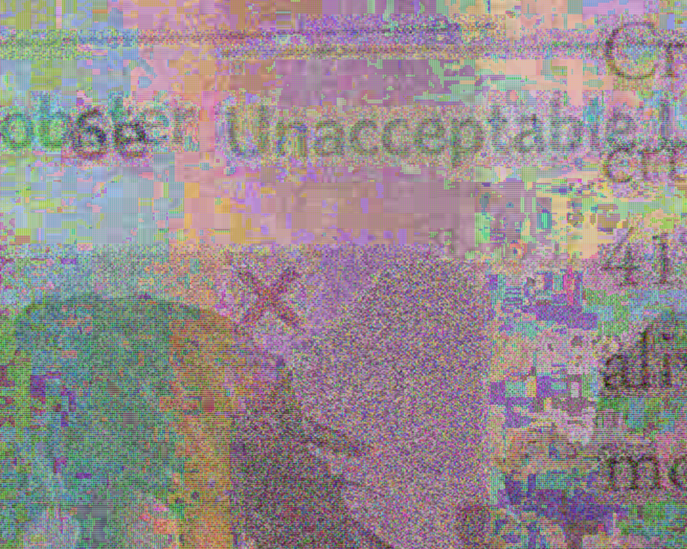

Podemos jugar con los valores de *alto* y *ancho* relativos a la imagen junto a *BitsPerComponent*:

```
/Width 1440
/Height 1152
/ColorSpace 10 0 R
/BitsPerComponent 2
```

Esto resulta en:

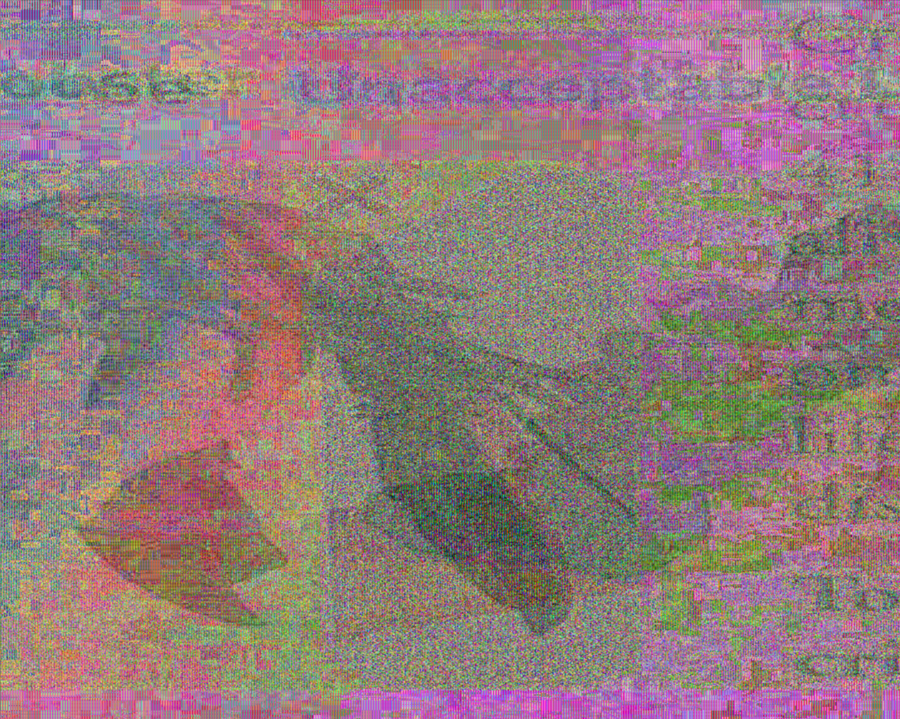

Hay varios elementos más donde podemos experimentar, pero es fácil destruir el PDF por completo.

## Cerrando

Como ves, no hay que ser un genio ni entender demasiado lo que estás haciendo para empezar a experimentar con glitches reales en imágenes. Solo tienes que probar y deshacer cambios siempre que destroces del todo tu archivo, mantener tu copia de seguridad y documentar minimamente que hiciste en cada caso si quieres tener un mínimo de reproducibilidad de efectos a largo plazo.

Experimenta con más formatos y prueba a hacer otras cosas en tu editor de texto, en realidad, una vez empiezas, es fácil que comiencen a surgir ideas sobre que puedes intentar :)
