Hasta ahora, todo lo que hemos hecho acerca de glitch es provocando nosotros errores en imágenes que originalmente estaban bien.

En este post vamos a saltarnos todo el procesamiento de la imagen y veremos como podemos alterar el funcionamiento original de una cámara digital para que las imágenes que toma tengan diferentes artefactos y errores digitales.

## Circuit bending

El `circuit bending` es una técnica muy interesante, es muy usada en **audio** para crear sintetizadores e instrumentos a partir de juguetes baratos, pero también en **video e imagen** para modificar hardware que toma o procesa estas fuentes de datos.

La teoría es simple, alterar y modificar los circuitos de un dispositivo para provocar cortocircuitos que produzcan efectos inesperados e interesantes.

Si sabes un mínimo sobre componentes de circuitos, puede ayudarte a entender donde puedes provocar estas uniones, aún asi, no necesitas saber realmente gran cosa sobre electrónica, gran parte de esta técnica consiste (como siempre en todo lo que conlleva producir errores) en ensayo y error hasta obtener algo interesante.

De hecho, incluso aunque sepas de electrónica, muchas veces al abrir un dispositivo encontraras un `black blob`, o *COB (Circuit on Board)*:

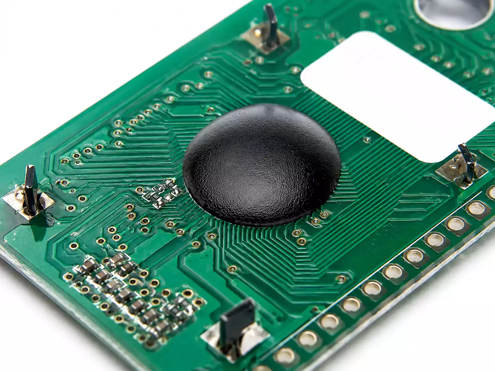

Esa gota negra es resina epoxy que contiene el chip de silicio y otros componentes que nos darían **mucha** información acerca de cómo funciona el dispositivo.

Eso no significa que si encuentras esto no puedas aplicar *circuit bending*, ten en cuenta que ese *blob* sigue conectado mediante pistas de cobre que puedes puentear entre sí.

## Algunos consejos

- **Empieza por juguetes baratos**, las PCB y componentes baratos toleran mejor los errores, el precio bajo asegura que los circuitos serán simples de modificar, y si por lo que sea, acabas destruyéndolo, no hay casi perdida de dinero.
- **Usa pilas/bateria**: Evita de primeras cualquier dispositivo que vaya conectado directamente a la red eléctrica. Trabajar en voltajes de los que dan pilas es mucho más seguro.
- **Explora con un cable y una resistencia**: Añade una resistencia a un cable y empieza a conectar puntos de la placa, la resistencia evitará cortocircuitos que puedan freir completamente el resto de componentes.
- **Identifica masa (GND) y alimentación (VCC)**: Te servirá para saber como se alimenta el dispositivo, evita tocar estos puntos directamente durante una exploración con tu cable.

## Nuestro objetivo

Todo esto puede sonar **bastante difícil**, pero dependiendo del dispositivo, podemos ser bastante brutos a la hora de explorar inicialmente.

Nuestro dispositivo a modificar va a ser este:

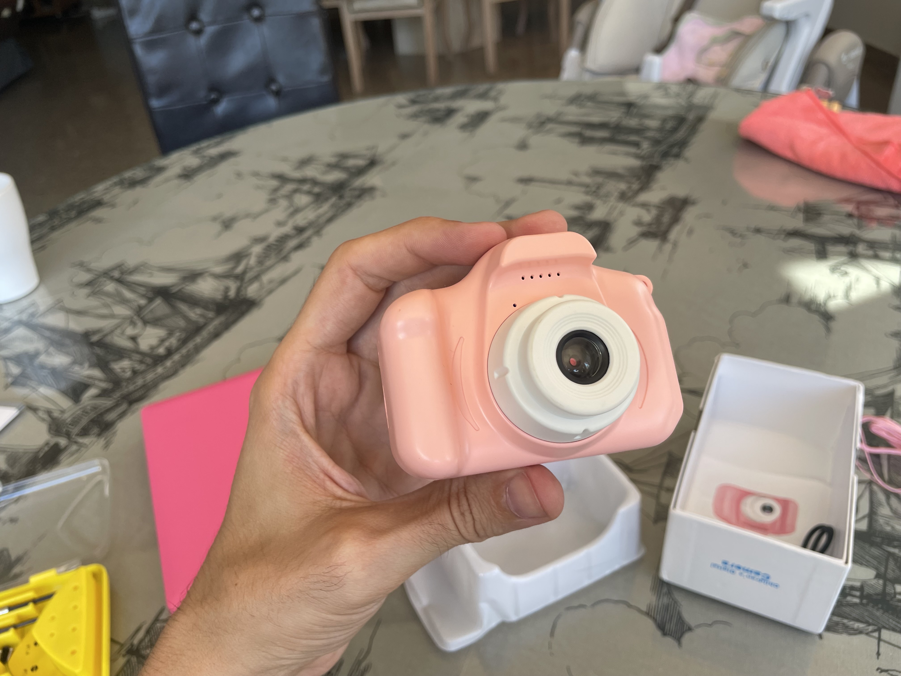

Es una cámara barata muy fácil de encontrar en tiendas como Aliexpress. Hay otras mucho mas pequeñas, pero poder tener espacio nos hará más fácil manipularla, y en caso de que añadamos más componentes, también nos ayudará.

El primer paso es abrirla, quitamos los cuatro tornillos que sujetan la parte trasera de la pantalla y encontramos esto en la parte del objetivo:

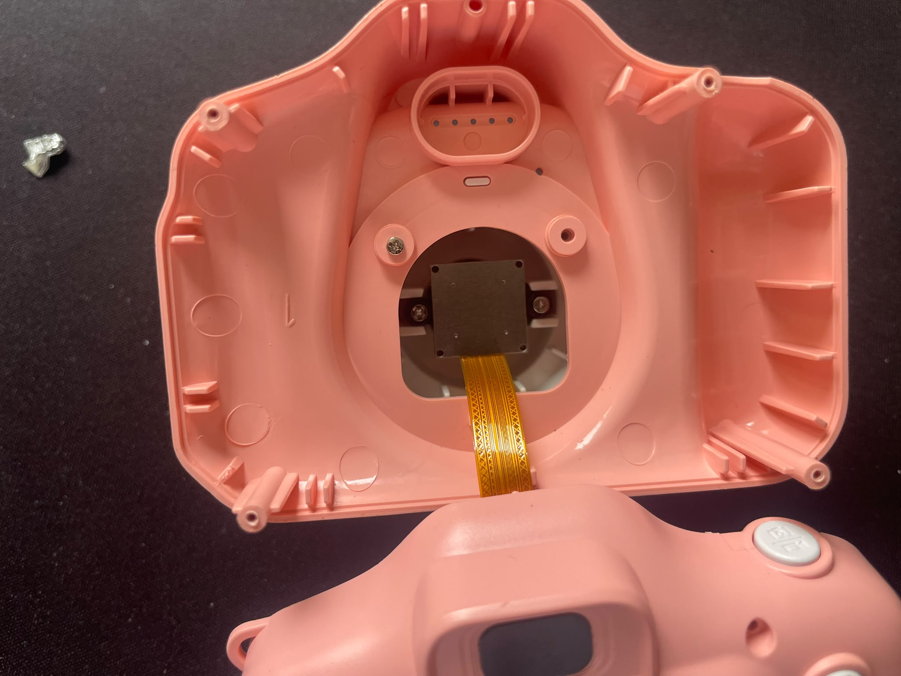

El sensor y su conector estan aislados en esa cámara oscura, en el resto de la carcasa da igual que entre la luz.

El sensor conecta mediante un **FFC** a la placa:

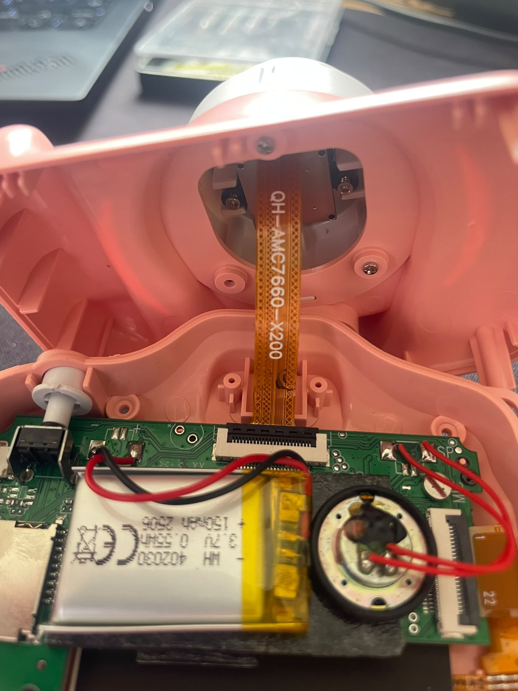

Y en la placa encontramos el resto de componentes:

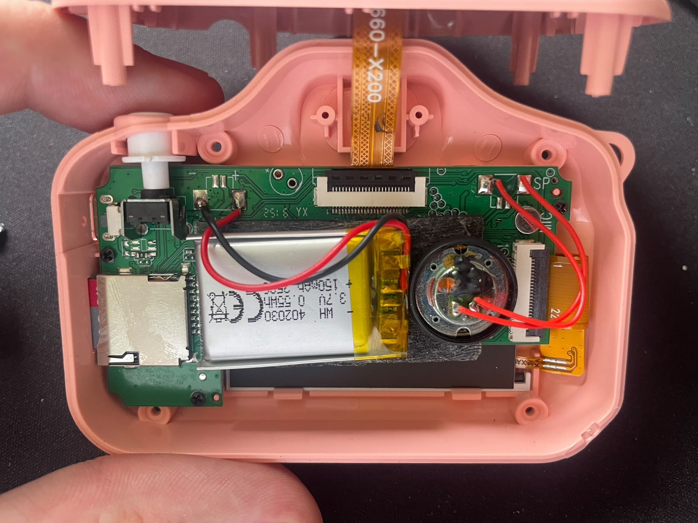

Podemos ver como conectan algunos componentes rápidamente como la tarjeta SD, algunos botones, la pantalla y el altavoz. 

En este caso el componente que más nos interesa es **el conector del sensor** de la cámara, el bloque blanco y negro al que va el **FFC**.

Justo debajo de ese conector podemos ver que tiene las pistas que llevan la información del sensor al resto de la cámara, además, están expuestos, por lo que podemos manipularlos directamente ahí.

## Manipulando la señal del sensor

No vamos a ser delicados, nuestra idea es simple:

- Poner **papel de plata** en los puntos plateados que hay en la parte inferior del conector del sensor
- Intentar alterar la señal con cortocircuitos entre estas pistas
- Encender la cámara
- Comprobar el efecto
- Si el resultado no es el esperado, apagamos la cámara y volvemos a empezar

Por suerte, por cómo está situado el conector podemos simplemente poner papel albal ahi y se sujetará relativamente fácil:

Como la cámara ofrece vista en directo cuando activamos la cámara, es fácil saber si esta produciendo efecto o no.

Los primeros pines y los que hay de la mitad hasta la derecha suelen dar problemas:

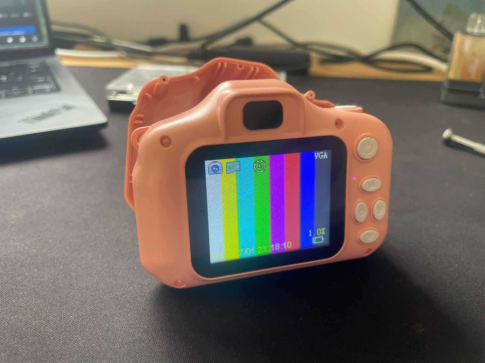

O bien la señal se pierde, o la cámara queda en un estado de reset continuo.

Tras intentarlo un poco:

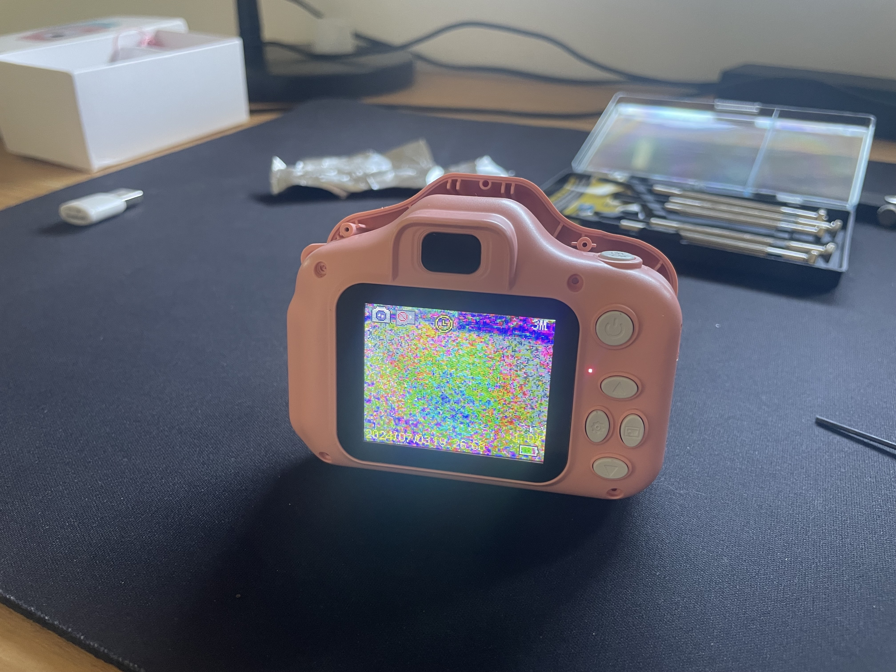

Tenemos la imágen del sensor alterada, cerramos la cámara y probamos a hacer unas cuantas fotografías:

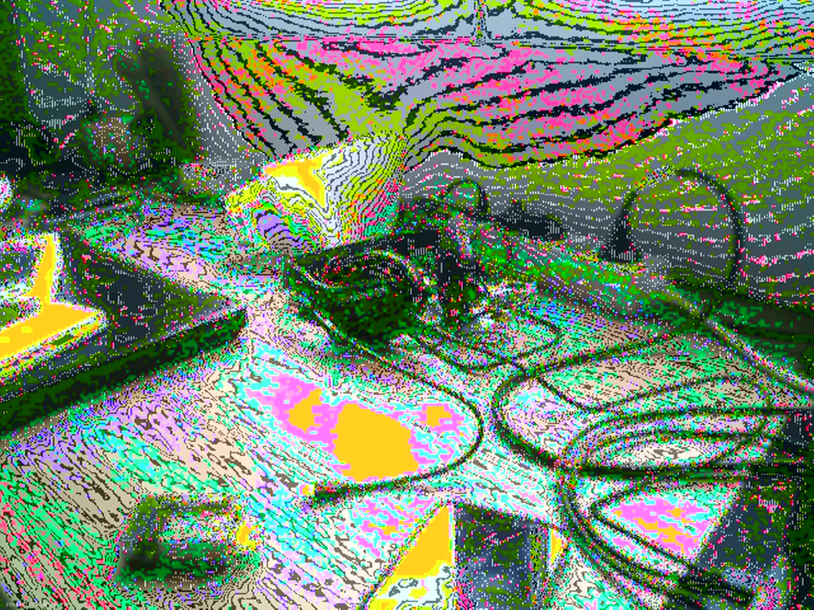
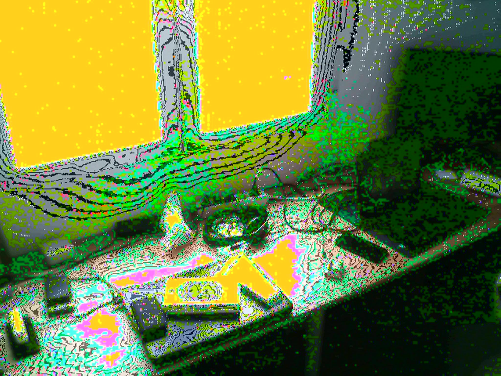

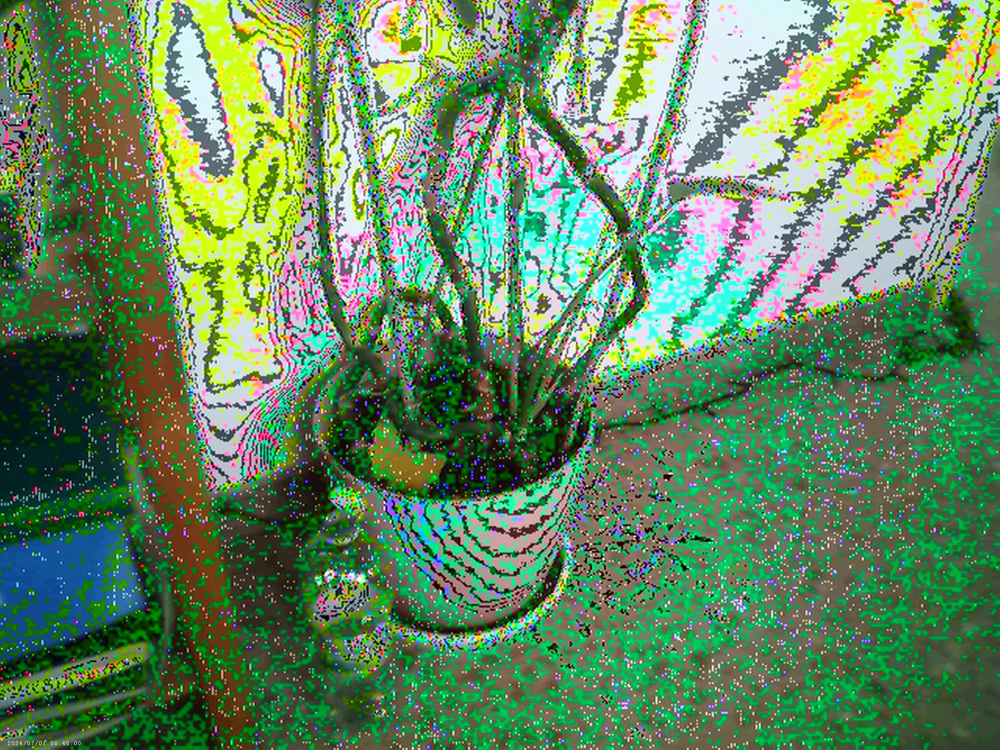
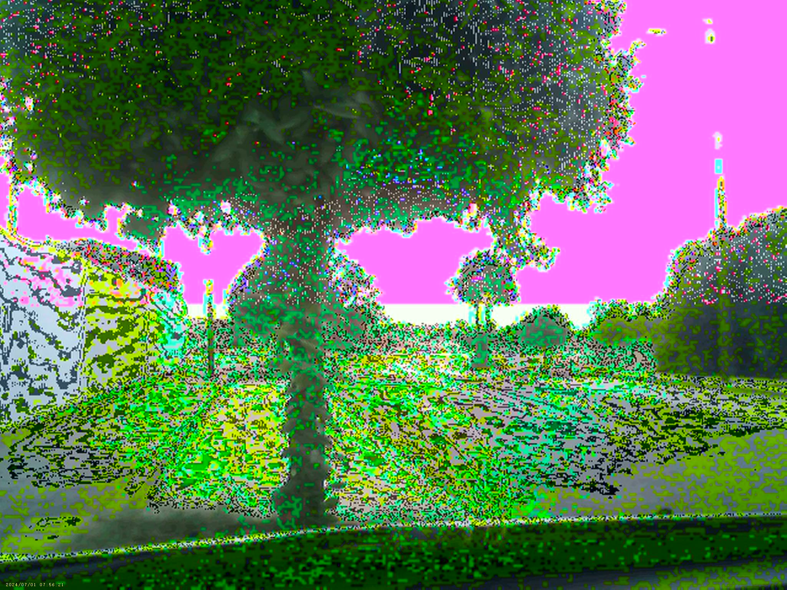

Las imagenes con demasiada luz suelen dar problemas, pero en ambientes de luz media y baja funciona :)

## Llevandolo más allá

Esto funciona, sin embargo, si queremos poder experimentar mas con las pistas que estamos conectando entre si tendremos que trabajar un poco en el circuito y comprar un par de elementos más.

Mi idea ahora es comprar, por un lado el cable FFC que utiliza la cámara:

Por otro un adaptador que me permita extender el cable original con el nuevo:

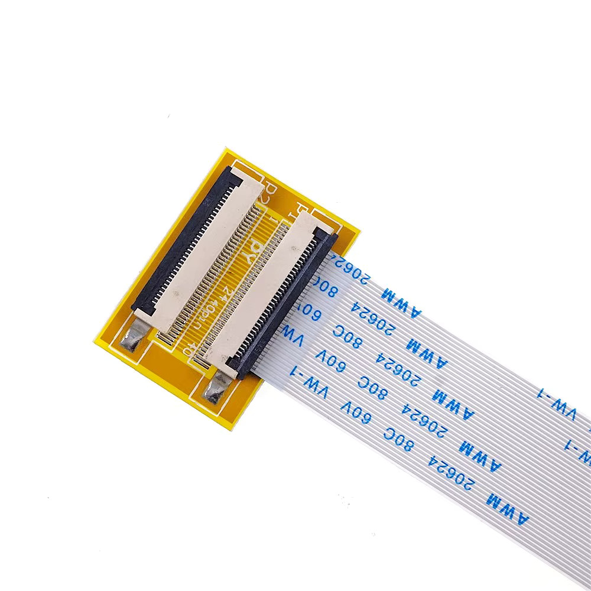

Esto nos va a permitir conectar entre si puntos del cable sin tocar el conector original, y junto a un `dip switch`:

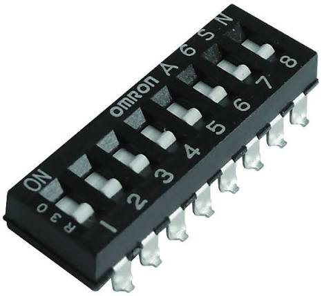

Conectar y desconectar estas uniones.

No se si habrá suficiente espacio en la carcasa original como para tenerlo todo dentro, quizá necesitaremos crear una caja nueva.

Si funciona seguramente haré otro post con algo de guia y los resultados obtenidos :)

Por ahora, con una tarde y unos minutos, ya puedes tener una fuente de glitches portatil :)

