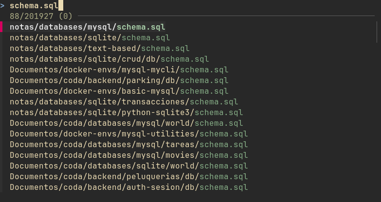
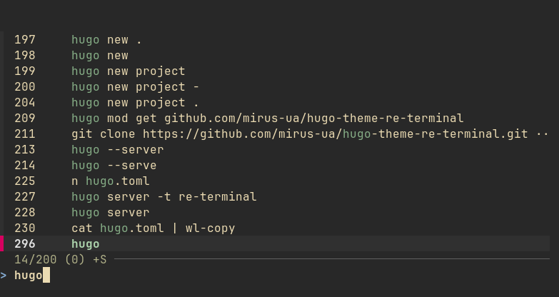
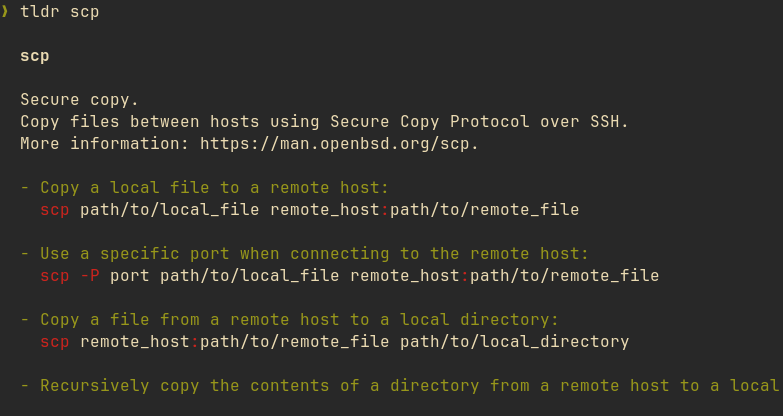
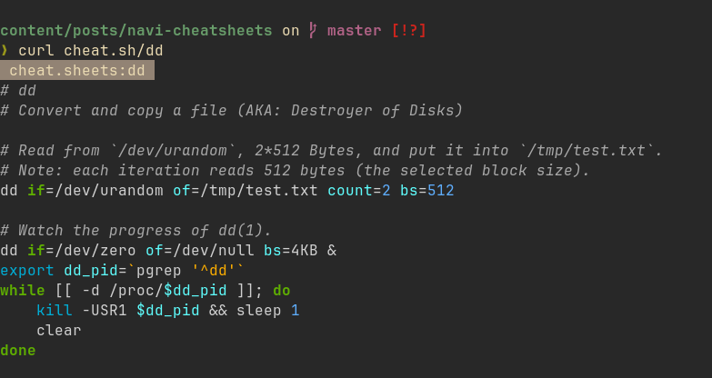
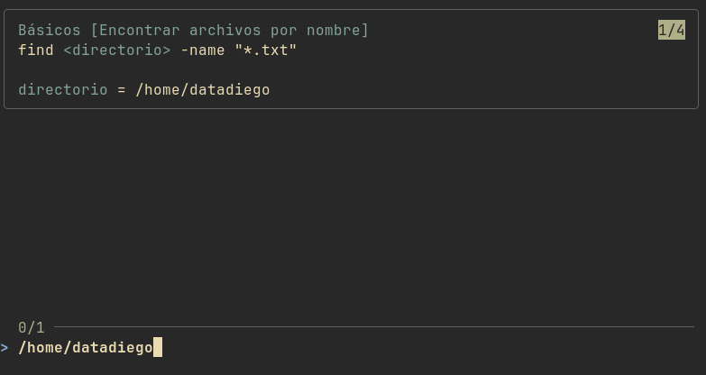

Da igual si eres nuevo en Linux o llevar usándolo años, los comandos se olvidan.

A base de usar a diario el sistema y tirar de terminal vas a saber los más comunes y que siempre usas, con esos no tendrás problema. Pero muchos son **largos**, en ocasiones con varios pipes, y además **no se usan a diario**.

La mayoría de usuarios tenemos algun directorio en nuestro sistema con varios archivos *Markdown* donde escribimos nuestras guias y comandos. Buscar entre ellos no es difícil, pero no es lo mejor.

En este post vamos a tratar como recordar comandos, que herramientas tenemos en linux para aliviar esta tarea, y como usarlas en nuestro dia a dia.

Primero empezaremos por recordar las formas más comunes de informarnos sobre comandos:

## man

La herramienta `man` viene incluida en cualquier distro, su uso es simple `man <comando>`:

```bash
man mkdir
```

Esta nos mostrará el manual completo del comando que necesitamos, junto a una explicación de sus *flags* y opciones disponibles.

No es una opción rápida, pero en muchas ocasiones tendremos muy buena información aqui.

## --help

Esta es una opción disponible en muchos comandos, similar a `man`, nos mostrará que podemos hacer con el comando, y que opciones podemos usar, de manera mucho más resumida que `man`.

```bash
grep --help
```

Aún así, no esperes ejemplos en la mayoría de casos, pero es la opción más rápida si necesitas saber que flags tienes disponibles y que hace cada una.

## history | grep "comando"

Si mandaste un comando hace un tiempo y solo recuerdas una parte del mismo, puedes utilizar el comando previo para buscar en el historial de comandos y filtrar por una palabra clave:

```bash
❯ history | grep netstat
  488  netstat -putan | grep 1234
  496  netstat -putan | grep 1234
  500  netstat -putan | grep 1234
  505  history | grep netstat
```

Durante mucho tiempo, cuando quería *anotar* algún comando que sabia que iba a querer guardar en mis notas más tarde o accederlo de esta forma hacia esto:

```bash
comando #IMPORTANTE
```

De forma que luego podia hacer:

```bash
history | grep "#IMPORTANTE"
```

Esto viene bien en servidores donde preferimos no instalar *demasiadas* cosas, pero en un sistema de diario, donde tengamos más libertad tenemos mejores opciones como las que veremos adelante:

## fzf

[fzf](https://github.com/junegunn/fzf) es un `fuzzy finder` en tu terminal, te sirve para buscar directorios, archivos y comandos.

En muchos casos lo tienes directamente disponible a través de tu gestor de paquetes. Una vez instalado, con una terminal abierta podrás usar dos atajos:

### Ctrl + T

Busca archivos por nombre o formato, simplemente escribe el nombre y navega por los resultados:



### Ctrl + R

Busca comandos **que ya has lanzado previamente**, es muy similar a lo que haciamos con `history`, pero mucho más rápido e interactivo



## tldr

[tldr](https://github.com/tldr-pages/tldr) es similar a `--help`, pero muy orientado a encontrar ejemplos rápidos de como funciona un comando:



Si no sabes como se usa un comando nuevo, o no recuerdas como hacer algo con uno, muy seguramente lo encuentres con `tldr`.

## cheat.sh

[cheat.sh](https://cheat.sh/) es un servicio web de consulta, pensado para llamarlo mediante curl:

```bash

```

## navi

Para mi, la mejor forma de tener un sistema fiable con el que recordarlos.

[navi]() es similar a tldr + fzf, pero te deja **crear** tus propias páginas de cheatsheets con los comandos que prefieras, olvidándote de buscar en tus markdown manualmente.

En mi caso, me gusta almacenar mis cheatsheets en `~/.cheatsheets`, un ejemplo:

```bash
.cheatsheets on  master
❯ ls
.rw-r--r--@ 360 datadiego 10 sep 15:25 basic.cheat
.rw-r--r--@ 221 datadiego 10 sep 15:25 procesos.cheat
.rw-r--r--@ 127 datadiego 10 sep 15:25 red.cheat
```

Por ejemplo, `basic.cheat`:

```
# Básicos

% Directorio actual
pwd

% Listar archivos y directorios
ls

% Listar todos los archivos
ls -la

% Moverse a un directorio
cd <directorio>

% Crear archivo
touch <archivo>

% Leer archivo
cat <archivo>

% Crear directorio
mkdir <nombre>

% Crear ruta de directorios
mkdir -p <ruta>

% Encontrar archivos por nombre
find <directorio> -name "*.txt"
```

Es importante que las partes de cada comando que necesites rellenar tu como usuario las envuelvas en `<>`. Navi te pedirá que las rellenes cuando las selecciones:



Por último, configura navi en `~/.config/navi/config.yaml`:

```
style:
  tag:
    width_percentage: 40
    min_width: 20
  comment:
    width_percentage: 10
    min_width: 0
    max_width: 10
  snippet:
    width_percentage: 50
    min_width: 0

cheats:
  paths:
    - /home/datadiego/.cheatsheets
```

La parte importante en realidad es:

```
cheats:
  paths:
    - /home/datadiego/.cheatsheets
```

Configuralo con la ruta a donde tengas tus archivos de cheatsheets para que al abrir `navi` los encuentre, el resto de configuración ayuda a que se muestre bien en terminales más pequeñas, pero no es necesario.

### Un ultimo detalle

Por defecto `navi` ejecuta el comando, pero en ocasiones necesito usar un pipe junto al mismo, o redirigir la salida a un archivo, en mi `.bashrc` se carga lo siguiente:

```bash
_navi_call() {
   local result="$(navi "$@" </dev/tty)"
   printf "%s" "$result"
}

_navi_widget() {
   local -r input="${READLINE_LINE}"
   local -r last_command="$(echo "${input}" | navi fn widget::last_command)"

   if [ -z "${last_command}" ]; then
      local -r output="$(_navi_call --print)"
   else
      local -r find="${last_command}_NAVIEND"
      local -r replacement="$(_navi_call --print --query "$last_command")"
      local output="$input"
      if [ -n "$replacement" ]; then
         output="${input}_NAVIEND"
         output="${output//$find/$replacement}"
      fi
   fi

   READLINE_LINE="$output"
   READLINE_POINT=${#READLINE_LINE}
}

bind -x '"\C-g": _navi_widget'
```

Con esto tengo un atajo `Ctrl + G` que me abre `navi` directamente, y no se ejecuta el comando, solo se pega en mi terminal para que lo lance, modifique o añada otro comportamiento :)
