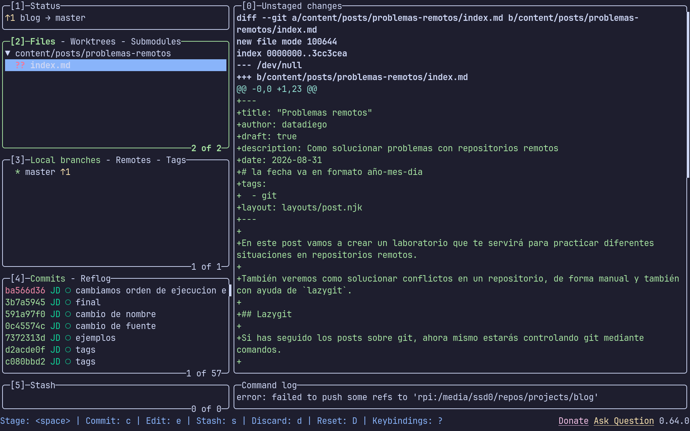
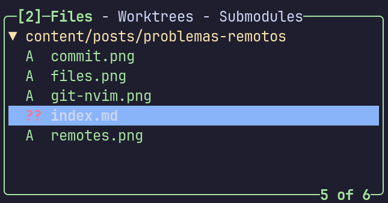
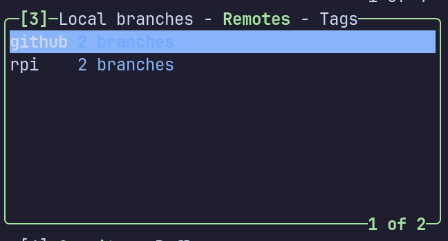
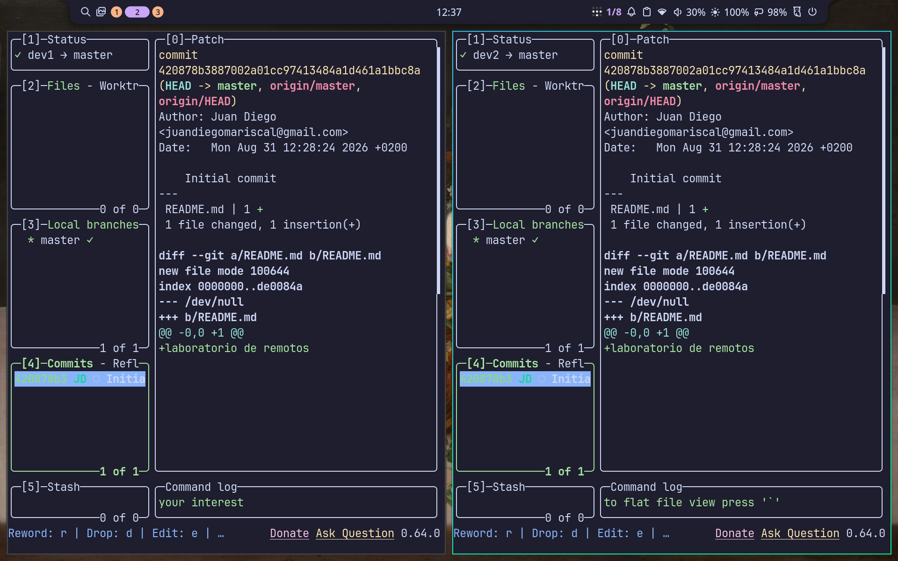
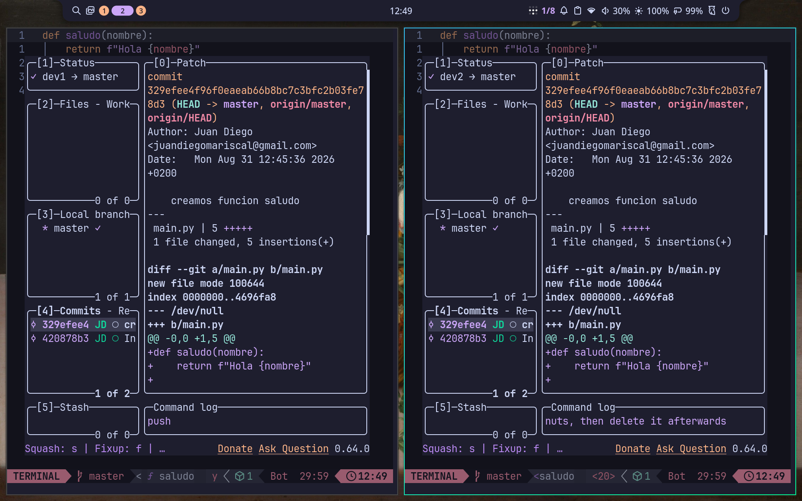
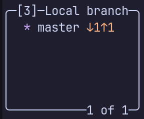
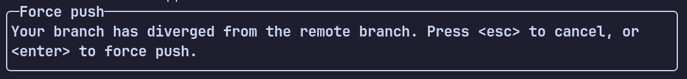
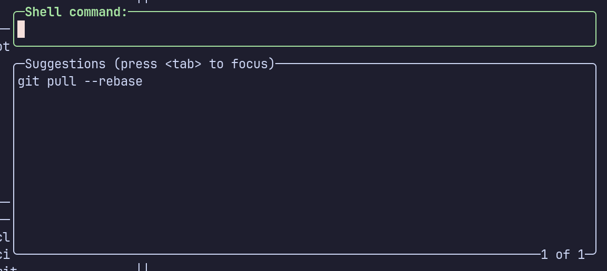
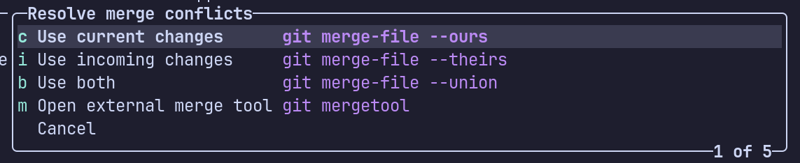

En este post vamos a crear un laboratorio que te servirá para practicar diferentes situaciones en repositorios remotos.

También veremos como solucionar conflictos en un repositorio, de forma manual y también con ayuda de `lazygit`.

## Lazygit

Si has seguido los posts sobre git, ahora mismo estarás controlando git mediante comandos.

Hay multiples **GUIs** que puedes usar para interactuar con git y tus repositorios remotos como [Github Desktop](https://desktop.github.com/download/) o [GitKraken](https://gitkraken.com/).

En mi caso, uso [LazyGit](https://github.com/jesseduffield/lazygit) prácticamente a diario. Es una herramienta TUI, asi que toda la interfaz está renderizada en terminal, funciona mediante comandos y es **muy rápido** de usar, además es muy completo, no le faltará nada que hagan el resto de herramientas.



La interfaz con la que interactuamos queda a la izquierda, donde tenemos 5 paneles identificados por numeros. Puedes usar el teclado para moverte entre ellos pulsando 1-5.

### 1. Status

Nos da información general del repositorio, en la imagen nos muestra en que rama estamos trabajando (master) y que hay un cambio al que podemos hacer *push* al repositorio remoto.

### 2. Files - Worktrees - Submodules



Es la sección que más usarás, en concreto la sección Files, que es donde podemos añadir archivos al area de stage.

En la imagen ves como en el repositorio hay 5 cambios, se añadieron 4 imagenes al area de stage, mientras que `index.md` sigue solo en el area de trabajo.

Para añadir un archivo o directorio al area de *stage* situate encima y pulsa *Espacio*, tambien puedes pulsar `a` para añadir **todos** los cambios actuales. El equivalente a `git add .`

Con `c` puedes hacer commit:


Para hacer *push* pulsas `P`, y *pull* con `p`.

Para descartar cambios puedes pulsar `d`.

> Una vez te acosumbras, se vuelve **muy rapido** subir cambios a un repositorio, pero si olvidas los comandos, con ? tienes una ayuda.
> Ademas, en la parte inferior aparecen los comandos más usados en la sección que estás situado.

### 3. Branches - Remotes



Nos da informacion de nuestras ramas y diferentes remotos.

Para el blog trabajo normalmente en *master* para escribir posts. Asi que no veremos nada especial.

En remotos sin embargo, tengo dos, el repositorio de github, y otro en una raspberry pi como backup y *hidden service* de tor.

*Lazygit* te permite crear, borrar y editar remotos y ramas.

### 4. Commits

Aqui puedes ver el log de commits actual, realizar `amends`, editar commits y checkout a un punto concreto de la historia del repositorio.

## Laboratorio con remotos

Para crear el laboratorio, ejecuta:

```bash
cd /tmp
git init test
cd test
echo "laboratorio de remotos" > README.md
git add README.md && git commit -m "Initial commit" && gh repo create test --public --source=. --remote=origin --push
cd /tmp
mkdir lab
cd lab
gh repo clone test dev1
gh repo clone test dev2
```

Esto creará un repositorio remoto con un `README.md` en tu cuenta de github, luego, creará una carpeta en `/tmp` donde acabarás con dos directorios:

```bash
/tmp/lab
❯ ls
drwxr-xr-x@ - datadiego 31 ago 12:28 dev1
drwxr-xr-x@ - datadiego 31 ago 12:28 dev2
```

Para este laboratorio, lo ideal es tener dos terminales, una den `dev1` y otra en `dev2`:



Esto te permite simular dos desarrolladores trabajando juntos en el mismo proyecto. Ahora mismo, con `lazygit` puedes ver que ambos están sincronizados y en el mismo commit.

### Comprobando push/pull

`dev1` crea el archivo `main.py` con el siguiente contenido:

```bash
def saludo(nombre):
    return f"Hola {nombre}"


print(saludo("Elvira"))
```

Abre su lazygit y pulsa `ac` para hacer commit, luego `P` para hacer *push* al repositorio de Github.

Ahora `dev1` tiene un commit que `dev2` aun no ha incorporado a su repositorio local, aunque lazygit ya le avisa tanto en el *status* como en *local branches* que hay cambios a los que hacer *pull*.

`dev2` pulsa `p` para traer esos cambios y ahora ambos están sincronizados:



### Provocando un conflicto

`dev2` cree que se debería devolver el resultado de `saludo` en inglés, y cambia el contenido a:

```python
def saludo(nombre):
    return f"Hello {nombre}"


print(saludo("Elvira"))
```

Hace un *commit* con este cambio y un *push* al remoto.

`dev1` mientras tanto, cree que deberiamos añadir exclamaciones al resultado de `saludo`, y hace esto:

```python
def saludo(nombre):
    return f"¡Hola {nombre}!"


print(saludo("Elvira"))
```

`dev1` no se ha dado cuenta de que lazygit le está avisando que tiene cambios por traer y cambios para enviar:



Y cuando intenta hacer *push*, obtiene un error:



Nos da dos opciones, o *cancelar* o *forzar el push*, si elegimos la segunda opción, vamos a **machacar** cualquier cambio que viniese, como `dev1` no sabe aun que cambios han llegado al repositorio, cancela.

Si hacemos `git push` desde una terminal, obtenemos un error mas detallado:

```bash
dev1 on  master [⇕] via 🐍 v3.14.7 
❯ git push
To https://github.com/datadiego/test.git
 ! [rejected]        master -> master (non-fast-forward)
error: falló el empuje de algunas referencias a 'https://github.com/datadiego/test.git'
hint: Updates were rejected because the tip of your current branch is behind
hint: its remote counterpart. If you want to integrate the remote changes,
hint: use 'git pull' before pushing again.
hint: See the 'Note about fast-forwards' in 'git push --help' for details.
```

En los `hints` nos dicen que nuestra rama está por detrás de los commits que hay en el repositorio, y que debemos hacer *pull* para incorporar estos commits antes de mandar uno nuevo.

El problema es que si intentamos hacer `git pull`:

```bash
dev1 on  master [⇕] via 🐍 v3.14.7
❯ git pull
hint: Las ramas se han divergido y hay que especificar cómo reconciliarlas.
hint: Se puede hacerlo ejecutando uno de los comandos siguiente antes del
hint: próximo pull:
hint:
hint:   git config pull.rebase false  # fusionar
hint:   git config pull.rebase true   # rebasar
hint:   git config pull.ff only       # solo avance rápido
hint:
hint: Se puede reemplazar "git config" con "git config --global" para aplicar
hint: la preferencia en todos los repositorios. También se puede pasar
hint: --rebase, --no-rebase o --ff-only en el comando para sobrescribir la
hint: configuración por defecto en cada invocación.
fatal: Necesita especificar cómo reconciliar las ramas divergentes.
```

Necesitamos hacer `git pull --rebase` o `git pull --no-rebase`, ahora mismo nos da igual uno que el otro, solo afecta a como se crearán los commits en los que arreglamos el conflicto.

Podemos usar la terminal, o si estamos en lazygit pulsar `:` para ejecutar un comando igual que si estuvieramos en una:



Vamos a ejecutar `git pull --rebase`:

```bash
dev1 on  master [⇕] via 🐍 v3.14.7
❯ lazygit

+ /bin/bash -c git pull --rebase

Auto-fusionando main.py
CONFLICTO (contenido): Conflicto de fusión en main.py
error: no se pudo aplicar 9b7fc3b... añadimos exclamaciones
hint: Resolve all conflicts manually, mark them as resolved with
hint: "git add/rm <conflicted_files>", then run "git rebase --continue".
hint: You can instead skip this commit: run "git rebase --skip".
hint: To abort and get back to the state before "git rebase", run "git rebase --abort".
hint: Disable this message with "git config set advice.mergeConflict false"
No se pudo aplicar 9b7fc3b... # añadimos exclamaciones
```

Y ahora es cuando salta el conflicto del contenido, en nuestro commit estamos sobreescribiendo lo que `dev2` ha hecho, y `git` es incapaz de saber con cual de los dos hay que quedarse, nos pide que resolvamos esto y hagamos:

```bash
git add main.py
git rebase --continue
```

Cuando abrimos el archivo en el editor, encontramos esto:

```python
def saludo(nombre):
<<<<<<< HEAD
    return f"Hello {nombre}"
=======
    return f"¡Hola {nombre}!"
>>>>>>> 9b7fc3b (añadimos exclamaciones)


print(saludo("Elvira"))
```

Lo que hay entre `<<<<<<< HEAD` y `=======` es lo que hay en el ultimo commit, el `HEAD` del repositorio remoto. Lo que hay entre `=======` y `>>>>>>> 9b7fc3b (añadimos exclamaciones)` son los cambios que hemos hecho nosotros.

Los conflictos pueden ser complicados cuando afectan a multiples partes del código, pero normalmente solo tenemos tres posibles salidas:

- **Mi cambio es el bueno**, sobreescribiendo lo que hayan hecho.
- **El cambio del remoto es el bueno**, sobreescribiendo lo que acabo de hacer.
- **Una mezcla de ambos**, lo que requerirá adaptar el código para que ambos puedan convivir.

En lazygit podemos pulsar `M` para ver las opciones que tenemos:



Si quisieramos quedarnos con nuestros cambios, podemos pulsar `c`, si queremos los que habia en el repositorio usaremos `i`, y si queremos ambos `b`.

En este caso, no usaremos ninguna de estas opciones, ya que si usamos `b` acabaremos con dos `returns`, y eso no tiene sentido en una funcion, y consideramos que ambos tenemos parte de razón y lo ideal es que la funcion devuelva el string en ingles y con exclamaciones, en nuestro editor, dejamos el código asi:

```bash
def saludo(nombre):
    return f"Hello {nombre}!"


print(saludo("Elvira"))
```

Y tras hacer:

```bash
dev1 on  HEAD (4e554b7) (REBASING 1/1) [=] via 🐍 v3.14.7
❯ git add main.py

dev1 on  HEAD (4e554b7) (REBASING 1/1) [+] via 🐍 v3.14.7
❯ git rebase --continue
[HEAD desacoplado 9d939c0] añadimos exclamaciones
 1 file changed, 1 insertion(+), 1 deletion(-)
Rebase aplicado satisfactoriamente y actualizado refs/heads/master.
```

Nos pedirá un mensaje para añadir al rebase, igual que cuando hacemos un commit.

Ya podemos hacer push sin problema:

```bash
dev1 on  master [⇡] via 🐍 v3.14.7 took 25s
❯ git push
Enumerando objetos: 5, listo.
Contando objetos: 100% (5/5), listo.
Compresión delta usando hasta 14 hilos
Comprimiendo objetos: 100% (3/3), listo.
Escribiendo objetos: 100% (3/3), 368 byte | 368.00 KiB/s, listo.
Total 3 (delta 0), reused 0 (delta 0), pack-reused 0 (from 0)
To https://github.com/datadiego/test.git
   4e554b7..9d939c0  master -> master

dev1 on  master via 🐍 v3.14.7
❯ git log --oneline
9d939c0 (HEAD -> master, origin/master, origin/HEAD) añadimos exclamaciones
4e554b7 devolvemos saludo en ingles
329efee creamos funcion saludo
420878b Initial commit
```


