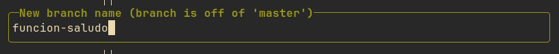
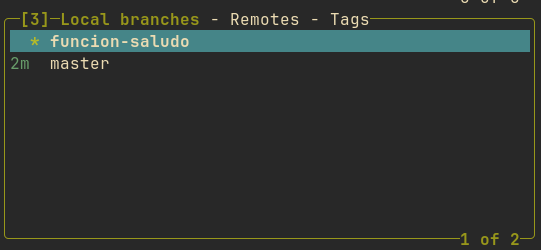
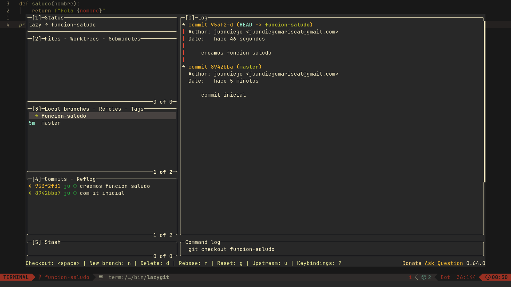
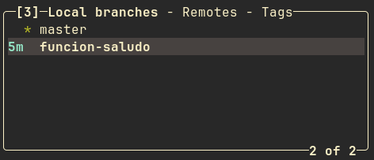
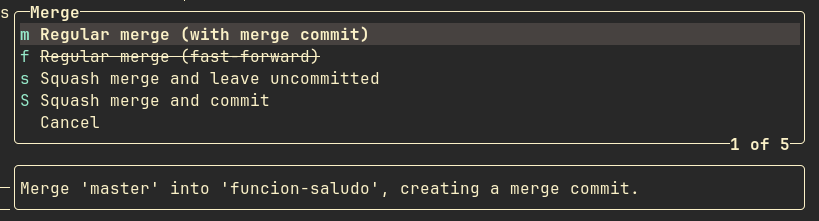
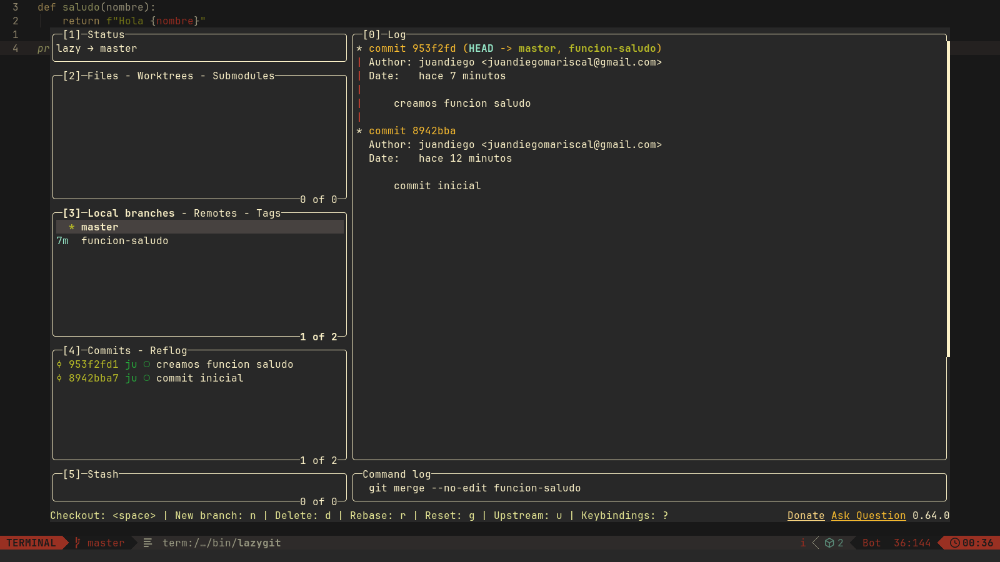

Si ya sabes manejar repositorios locales y remotos el siguiente paso lógico a aprender en git es gestionar ramas.

Hasta ahora hemos trabajado en `master` o `main`, la rama principal en la que queda el código final que queremos distribuir, podemos crear ramas diferentes en las que crear una *copia* del estado actual del código para desarrollar una nueva funcionalidad, y luego mezclarla con el resto del código.

De nuevo, si somos los únicos que estamos desarrollando, esto quizá no tiene demasiado sentido, aunque nos va a permitir trabajar de manera más ordenada y separando claramente partes en las que desarrollamos. Pero es especialmente potente cuando trabajamos en equipo con otros. Evitará algunos problemas que ya hemos visto en posts anteriores en los que otro desarrollador puede pushear cambios que nos impiden subir nuestro código porque cada uno puede trabajar en su rama personal.

Vamos a ver como trabajar primero con ramas directamente en la linea de comandos, luego, aprenderemos a usar `lazygit` para poder trabajar de forma más cómoda.

## Creando ramas

Vamos a iniciar un repositorio y a crear un commit inicial:

```bash
cd /tmp
git init test
cd test
echo "Probando branches en git" > README.md
git add . && git commit -m "commit inicial"
git log --oneline
```

Ahora mismo tenemos un commit en `master`:

```
1d756ec (HEAD -> master) commit inicial
```

Vamos a crear una funcion `saludo()` en python. Pero en lugar de usar la rama principal, lo desarrollaremos en una branch separada.

Primero creamos la rama y nos movemos a ella:

```bash
test on  master
❯ git branch funcion-saludo

test on  master
❯ git checkout funcion-saludo
Cambiado a rama 'funcion-saludo'
```

Si miramos el log y el contenido actual de la rama:

```bash
test on  funcion-saludo
❯ git log --oneline
15eec89 (HEAD -> funcion-saludo, master) commit inicial

test on  funcion-saludo
❯ cat README.md
Probando branches en git
```

Es exactamente el mismo que había en la rama `master`, ya que hemos creado la rama estando en ella.

> Puedes comprobar en que rama te encuentras con `git branch` en todo momento.

## Modificando nuestra rama

Vamos a crear la función en `main.py`:

```python
def saludo(nombre):
    return f"Hola {nombre}"


print(saludo("Pepe"))
```

Y a hacer *commit* de estos cambios:

```bash
test on  funcion-saludo [?] via 🐍 v3.14.7
❯ git add main.py && git commit -m "creamos funcion de saludo"
[funcion-saludo a7ed237] creamos funcion de saludo
 1 file changed, 5 insertions(+)
 create mode 100644 main.py

test on  funcion-saludo via 🐍 v3.14.7
❯ git log --oneline
a7ed237 (HEAD -> funcion-saludo) creamos funcion de saludo
15eec89 (master) commit inicial
```

En el log podemos comprobar que ahora hay un *commit* en la rama *master*, y otra en la rama que estamos ahora mismo trabajando, *funcion-saludo*.

Si nos movemos a *master* de nuevo y comprobamos que hay en esa rama:

```bash
test on  funcion-saludo via 🐍 v3.14.7
❯ git checkout master
Cambiado a rama 'master'

test on  master
❯ ls
.rw-r--r--@ 25 datadiego 31 ago 23:13 README.md
```

Nuestro archivo `main.py` ha desaparecido! Esta en otra rama y no la hemos incorporado aún a nuestra rama *master. Para hacerlo:

```bash
test on  master
❯ git merge funcion-saludo
Actualizando 15eec89..a7ed237
Fast-forward
 main.py | 5 +++++
 1 file changed, 5 insertions(+)
 create mode 100644 main.py

test on  master via 🐍 v3.14.7
❯ ls
.rw-r--r--@ 72 datadiego 31 ago 23:20 main.py
.rw-r--r--@ 25 datadiego 31 ago 23:13 README.md
```

El comando `git merge` trae los cambios de una rama a otra, ejecutala situandote primero en la rama que quieras traer los cambios, y luego indica que rama quieres traer.

## Creando otra rama

Vamos a crear otra rama llamada `funcion-despedida`:

```bash
copppp on  master via 🐍 v3.14.7
❯ git branch funcion-despedida

copppp on  master via 🐍 v3.14.7
❯ git checkout funcion-despedida
Cambiado a rama 'funcion-despedida'
```

De nuevo, esta es una copia de `master`, donde ya tenemos el commit de la rama `funcion-saludo`:

```bash
copppp on  funcion-despedida [!] via 🐍 v3.14.7 took 53s
❯ git log --oneline
a7ed237 (HEAD -> funcion-despedida, master, funcion-saludo) creamos funcion de saludo
15eec89 commit inicial
```

Y creamos la siguiente función en `main.py`:

```python
def saludo(nombre):
    return f"Hola {nombre}"


def despedida(nombre):
    return f"Adios {nombre}"


print(saludo("Pepe"))
print(despedida("Pepe"))
```

Y repetimos lo mismo que antes para incorporarlo a `master`:

```bash
copppp on  funcion-despedida [!] via 🐍 v3.14.7
❯ git add main.py && git commit -m "creamos la funcion despedida"
[funcion-despedida f1c7271] creamos la funcion despedida
 1 file changed, 5 insertions(+)

copppp on  funcion-despedida via 🐍 v3.14.7
❯ git checkout master
Cambiado a rama 'master'

copppp on  master via 🐍 v3.14.7
❯ git log --oneline
a7ed237 (HEAD -> master, funcion-saludo) creamos funcion de saludo
15eec89 commit inicial

copppp on  master via 🐍 v3.14.7
❯ git merge funcion-despedida
Actualizando a7ed237..f1c7271
Fast-forward
 main.py | 5 +++++
 1 file changed, 5 insertions(+)

copppp on  master via 🐍 v3.14.7
❯ git log --oneline
f1c7271 (HEAD -> master, funcion-despedida) creamos la funcion despedida
a7ed237 (funcion-saludo) creamos funcion de saludo
15eec89 commit inicial
```

## Actualizando ramas

Si ahora nos movemos a la primera rama que creamos:

```bash
copppp on  master via 🐍 v3.14.7
❯ git checkout funcion-saludo
Cambiado a rama 'funcion-saludo'

copppp on  funcion-saludo via 🐍 v3.14.7
❯ git log --oneline
a7ed237 (HEAD -> funcion-saludo) creamos funcion de saludo
15eec89 commit inicial

copppp on  funcion-saludo via 🐍 v3.14.7
❯ cat main.py
def saludo(nombre):
    return f"Hola {nombre}"


print(saludo("Pepe"))
```

Esta rama esta ya *obsoleta* y le falta el commit que tenemos en `master`.

Imagina que cada rama la mantiene un desarrollador diferente, si se les encarga que modifiquen las funciones y las pongan enteras en ingles, ahora cada uno puede mantener su propia rama, sin pisar el trabajo del otro.

El desarrollador de la función de saludo puede traer los cambios a su rama:

```bash
copppp on  funcion-saludo via 🐍 v3.14.7
❯ git merge master
Actualizando a7ed237..f1c7271
Fast-forward
 main.py | 5 +++++
 1 file changed, 5 insertions(+)

copppp on  funcion-saludo via 🐍 v3.14.7
❯ cat main.py
def saludo(nombre):
    return f"Hola {nombre}"


def despedida(nombre):
    return f"Adios {nombre}"


print(saludo("Pepe"))
print(despedida("Pepe"))
```

Y modificar su parte del código:

```python
def hello(name):
    return f"Hola {name}"


def despedida(nombre):
    return f"Adios {nombre}"


print(hello("Pepe"))
print(despedida("Pepe"))
```

Luego, se podrá hacer `merge` desde `master`:

```bash
copppp on  funcion-saludo [!] via 🐍 v3.14.7 took 1m9s
❯ git add main.py && git commit -m "funcion saludo en ingles"
[funcion-saludo a88d42e] funcion saludo en ingles
 1 file changed, 3 insertions(+), 3 deletions(-)

copppp on  funcion-saludo via 🐍 v3.14.7
❯ git checkout master
Cambiado a rama 'master'

copppp on  master via 🐍 v3.14.7
❯ git merge funcion-saludo
Actualizando f1c7271..a88d42e
Fast-forward
 main.py | 6 +++---
 1 file changed, 3 insertions(+), 3 deletions(-)

copppp on  master via 🐍 v3.14.7
❯ git log --oneline
a88d42e (HEAD -> master, funcion-saludo) funcion saludo en ingles
f1c7271 (funcion-despedida) creamos la funcion despedida
a7ed237 creamos funcion de saludo
15eec89 commit inicial
```

## Provocando errores

¿Que pasa si el desarrollador de `funcion-despedida` no actualiza su rama? 

Primero se mueve a su rama:

```bash
copppp on  master via 🐍 v3.14.7
❯ git checkout funcion-despedida
Cambiado a rama 'funcion-despedida'
```

Y actualiza su código asi:

```bash
def saludo(nombre):
    return f"Hola {nombre}"


def bye(name):
    return f"Adios {name}"


print(saludo("Pepe"))
print(bye("Pepe"))
```

Hace *commit* con sus cambios e intentamos un *merge* desde `master`:

```bash
copppp on  funcion-despedida [!] via 🐍 v3.14.7
❯ git add main.py && git commit -m "traduccion funcion despedida"
[funcion-despedida 9634dc7] traduccion funcion despedida
 1 file changed, 3 insertions(+), 3 deletions(-)

copppp on  funcion-despedida via 🐍 v3.14.7
❯ git checkout master
Cambiado a rama 'master'

copppp on  master via 🐍 v3.14.7
❯ git merge funcion-despedida
Auto-fusionando main.py
CONFLICTO (contenido): Conflicto de fusión en main.py
Fusión automática falló; arregle los conflictos y luego realice un commit con el resultado.
```

Tenemos un conflicto! Igual que podiamos provocarlos cuando no haciamos *pull* en un repositorio remoto en posts anteriores.

La solución es la misma que ya vimos, solucionar el conficto y hacer commit, en este caso:

```python
def hello(name):
    return f"Hola {name}"


def bye(name):
    return f"Adios {name}"


<<<<<<< HEAD
print(hello("Pepe"))
print(despedida("Pepe"))
=======
print(saludo("Pepe"))
print(bye("Pepe"))
>>>>>>> funcion-despedida
```

Git ha podido determinar los cambios de las funciones, pero necesita que decidamos que hacer en la parte de los prints, la arreglamos para incorporar las llamadas actualizadas:

```python
def hello(name):
    return f"Hola {name}"


def bye(name):
    return f"Adios {name}"


print(hello("Pepe"))
print(bye("Pepe"))
```

Y hacemos *commit* de los cambios:

```bash
copppp on  master (MERGING) [=] via 🐍 v3.14.7
❯ git add main.py

copppp on  master (MERGING) [+] via 🐍 v3.14.7
❯ git log --oneline
a88d42e (HEAD -> master, funcion-saludo) funcion saludo en ingles
f1c7271 creamos la funcion despedida
a7ed237 creamos funcion de saludo
15eec89 commit inicial

copppp on  master (MERGING) [+] via 🐍 v3.14.7
❯ git commit -m "funcion despedida en ingles"
[master c8c68bb] funcion despedida en ingles

copppp on  master via 🐍 v3.14.7
❯ git log --oneline
c8c68bb (HEAD -> master) funcion despedida en ingles
9634dc7 (funcion-despedida) traduccion funcion despedida
a88d42e (funcion-saludo) funcion saludo en ingles
f1c7271 creamos la funcion despedida
a7ed237 creamos funcion de saludo
15eec89 commit inicial
```

Podemos ver un gráfico con la evolución de los merge que hemos hecho:

```bash
copppp on  master via 🐍 v3.14.7
❯ git log --oneline --graph --all --decorate
*   c8c68bb (HEAD -> master) funcion despedida en ingles
|\
| * 9634dc7 (funcion-despedida) traduccion funcion despedida
* | a88d42e (funcion-saludo) funcion saludo en ingles
|/
* f1c7271 creamos la funcion despedida
* a7ed237 creamos funcion de saludo
* 15eec89 commit inicial
```

## Flujo con lazygit

El proceso es similar, vamos a hacer una prueba rápida en otro repositorio:

```bash
cd /tmp
git init lazy
cd lazy
echo "Hola mundo" > README.md
git add . && git commit -m "commit inicial"
```

Lanzamos lazygit y con `3n` podemos crear una rama introduciendo su nombre:



Ahora podemos usar las flechas arriba y abajo para movernos entre ramas y *espacio* para seleccionar en cual trabajamos:



Manteniendo seleccionada la rama `funcion-saludo`, recreamos la misma funcion de antes:



Si te mueves con las flechas entre ramas podrás ver como el log de commits cambia.

Nos movemos a master con *Espacio* y dejamos seleccionada la rama que queremos traernos con las flechas de dirección:



Y ahora al pulsar `M` obtenermos las siguientes opciones:



Seleccionamos la opción `m` para traer el commit de la rama, y ya tendriamos nuestro `master` actualizado:


