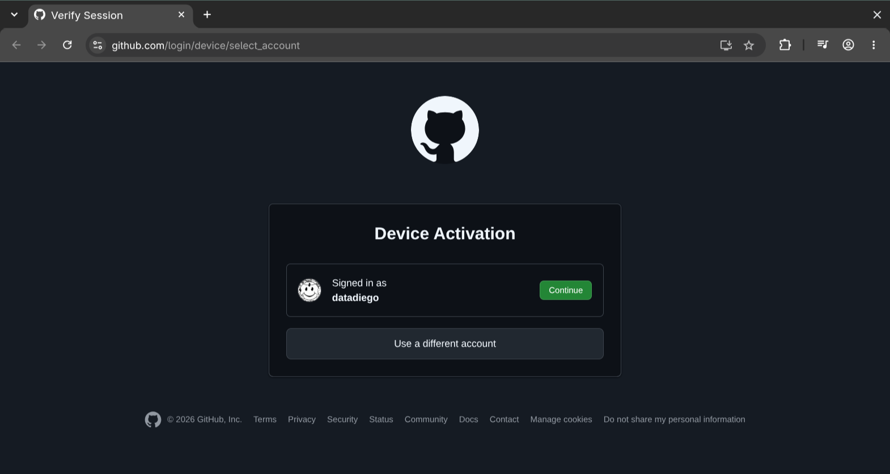
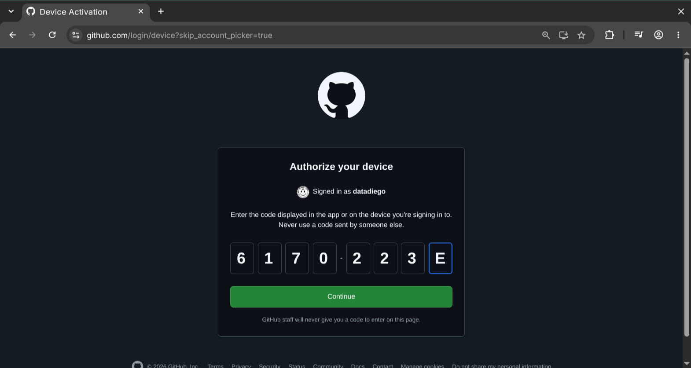
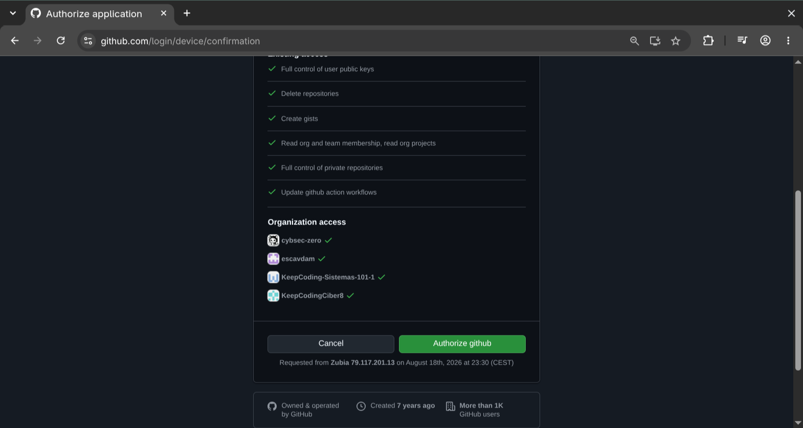

Si ya sabes manejar repositorios locales, es el momento de aprender a como compartir tu código con otros.

Si bien puedes crear tu propio servidor en casa o un VPS, vamos a empezar por plataformas conocidas que nos permitirán subirlas sin tener que hostear nuestro propio servicio.

## Github

Plataforma de Microsoft, te permite subir tu código y hacer despliegue del mismo, generando binarios para distribuirlo o actualizando una web.

Necesitarás crearte una cuenta en [Github](https://github.com/) para subir tu código.

Además, instala [gh cli](https://github.com/cli/cli/blob/trunk/docs/install_linux.md), nos simplificará mucho el interactuar con el servicio.

### Logeando en gh cli

Una vez tengas tu cuenta en Github y hayas iniciado sesión en la web, lanza `gh auth login` en tu terminal:

```bash
~ ❯ gh auth login
? Where do you use GitHub? GitHub.com
? What is your preferred protocol for Git operations on this host? HTTPS
? How would you like to authenticate GitHub CLI? Login with a web browser

! First copy your one-time code: 6170-223E
Press Enter to open https://github.com/login/device in your browser...
```

Iniciaremos sesión mediante **HTTPS**, haciendo **Login mediante el navegador web**, nos darán un código de un solo uso que debemos copiar, y una vez lo tengamos, pulsaremos **Enter** para que se nos redirija a la página donde iniciaremos sesión.

Tendremos que elegir con que cuenta entrar:



Pegar el código que nos han dado:



Y dar permiso a la aplicación de *gh cli*:



Adicionalmente, deberás pasar el F2A mediante la aplicación de github o el método que tengas configurado como medida de seguridad.

Cuando termines, deberás ver:

```bash
✓ Authentication complete.
- gh config set -h github.com git_protocol https
✓ Configured git protocol
✓ Logged in as datadiego
! You were already logged in to this account
```

Con esto ya estas logeado y puedes crear repositorios remotos, actualizarlos y borrarlos.

### Crear un repositorio remoto

Vamos a crear un repositorio local, añadir un archivo y commitearlo:

```bash
/tmp ❯ git init prueba
Initialized empty Git repository in /tmp/prueba/.git/

/tmp ❯ cd prueba/

prueba master ❯ echo "hola github" > README.md

prueba master ? ❯ git add README.md 

prueba master ❯ git commit -m "creamos archivo readme"
[master (root-commit) 291e78b] creamos archivo readme
 1 file changed, 1 insertion(+)
 create mode 100644 README.md
```

Hasta aqui, nada nuevo. Si queremos crear un repositorio en github, es muy sencillo con *gh*:

```bash
prueba master ❯ gh repo create
? What would you like to do? Push an existing local repository to github.com
? Path to local repository .
? Repository name prueba
? Repository owner datadiego
? Description un repo de prueba
? Visibility Private
✓ Created repository datadiego/prueba on github.com
  https://github.com/datadiego/prueba
? Add a remote? Yes
? What should the new remote be called? origin
✓ Added remote https://github.com/datadiego/prueba.git
? Would you like to push commits from the current branch to "origin"? Yes
Enumerating objects: 3, done.
Counting objects: 100% (3/3), done.
Writing objects: 100% (3/3), 243 bytes | 243.00 KiB/s, done.
Total 3 (delta 0), reused 0 (delta 0), pack-reused 0 (from 0)
To https://github.com/datadiego/prueba.git
 * [new branch]      HEAD -> master
branch 'master' set up to track 'origin/master'.
✓ Pushed commits to https://github.com/datadiego/prueba.git
```

Puedes ver que opciones son las que hemos usado para subir nuestro contenido, ahora tenemos un repositorio llamado "prueba" que podrás ver en tu perfil con el archivo `README.md`.

Vamos a modificar el archivo y mandar los cambios:

```bash
prueba master ❯ echo "otra linea mas" >> README.md

prueba master  ❯ git add README.md 

prueba master ❯ git commit -m "un cambio al repositorio"
[master 401cb00] un cambio al repositorio
 1 file changed, 1 insertion(+)

prueba master ❯ git push
Enumerating objects: 5, done.
Counting objects: 100% (5/5), done.
Writing objects: 100% (3/3), 288 bytes | 288.00 KiB/s, done.
Total 3 (delta 0), reused 0 (delta 0), pack-reused 0 (from 0)
To https://github.com/datadiego/prueba.git
   291e78b..401cb00  master -> master
```

### Clonando y eliminando el repostorio

Puedes clonar el repositorio de varias maneras, las mas comunes:

```bash
#con git
git clone https://github.com/usuario/repositorio
#con gh
gh repo clone repositorio
```

Si usamos `git` con el repo que acabamos de crear:

```bash
/tmp ❯ git clone https://github.com/datadiego/prueba
Cloning into 'prueba'...
remote: Enumerating objects: 6, done.
remote: Counting objects: 100% (6/6), done.
remote: Compressing objects: 100% (2/2), done.
remote: Total 6 (delta 0), reused 6 (delta 0), pack-reused 0 (from 0)
Receiving objects: 100% (6/6), done.

/tmp ❯ cat prueba/README.md 
hola github
otra linea mas
```

Con `gh`:

```bash
/tmp ❯ gh repo clone prueba
Cloning into 'prueba'...
remote: Enumerating objects: 6, done.
remote: Counting objects: 100% (6/6), done.
remote: Compressing objects: 100% (2/2), done.
remote: Total 6 (delta 0), reused 6 (delta 0), pack-reused 0 (from 0)
Receiving objects: 100% (6/6), done.

/tmp ❯ cat prueba/README.md 
hola github
otra linea mas
```

Ten en cuenta que cuando clonas puedes cambiar el nombre del directorio en el que lo descarga:

```bash
/tmp ❯ git clone https://github.com/datadiego/prueba mi-repositorio
Cloning into 'mi-repositorio'...
remote: Enumerating objects: 6, done.
remote: Counting objects: 100% (6/6), done.
remote: Compressing objects: 100% (2/2), done.
remote: Total 6 (delta 0), reused 6 (delta 0), pack-reused 0 (from 0)
Receiving objects: 100% (6/6), done.

/tmp ❯ cat mi-repositorio/README.md 
hola github
otra linea mas
```

Solo debes indicar como quieres que se llame el directorio al final, igual con `gh`.

## Gitlab

Usar [GitLab](https://gitlab.com) es muy similar, necesitarás una cuenta en el servicio, y para simplificar la tarea, la herramienta `glab`, instalalá siguiendo la opcion que prefieras en tu os siguiendo [esta guia](https://gitlab.com/gitlab-org/cli/-/blob/main/docs/installation_options.md).

Una vez estés registrado y tengas `glab` instalado, manteniendo el navegador abierto vamos a hacer `glab auth login`.

El proceso es similar, nos preguntará si queremos usar *gitlab.com* o una instancia hosteada por nosotros, seleccionaremos *gitlab.com*, le diremos que entraremos usando *Web*, aceptaremos los dominios por defecto y luego nos redirigirá a la página de gitlab para autenticarnos, por ultimo, seleccionaremos *HTTPS* como protocolo y nos confirmará que todo ha ido bien.


