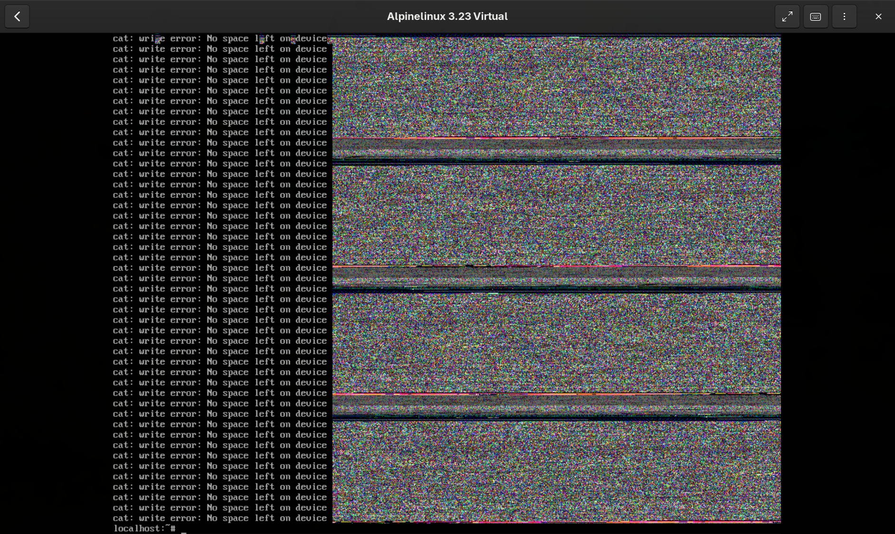
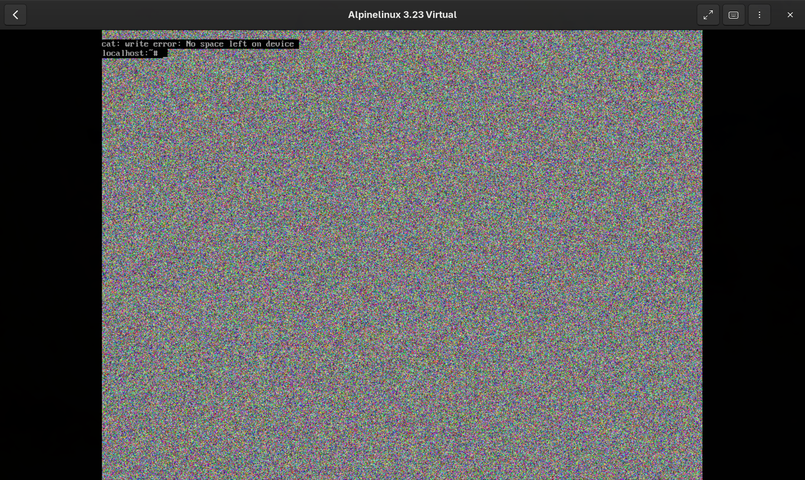

El sistema de archivos en Linux puede ser algo diferente si vienes de Windows, pero su estructura básica es bastante simple.

## En Windows

En Windows tienes diferentes *discos y particiones* como `C:` para el disco principal, y `D:` para las secundarias. Cada disco tiene varios directorios en su interior que siguen una estructura de árbol, donde todos los archivos y directorios descienden de la **raiz** en el disco.

Por ejemplo, un documento podría tener una **ruta** como esta:

```
C:\Users\Diego\Documents\archivo.txt
```

## En Linux

En linux no hay diferentes discos y particiones, parte de una **raiz única** `/`. Todos los archivos y directorios siguen una estructura de árbol que descienden de esta raiz.

Un documento podría tener una **ruta** como esta:

```
/home/diego/documentos/archivo.txt
```

Como ves, en linux usamos `/` en lugar de `\`, además, suele preferirse usar minusculas sobre mayúsculas.

## Tu sistema es texto

En Windows **gran parte de la configuración e información** se almacena en el **Registro de Windows**, podemos interactuar con el mediante *Regedit*, *Powershell* y otras utilidades gráficas.

En Linux **la mayoría de la configuración** del sistema son archivos de texto, que podemos leer y modificar con herramientas estándar. Es un sistema mucho mas simple de acceder y modificar.

## Directorios principales

Ya hemos visto comandos básicos para explorar directorios, vamos a ver que hay en la raíz de nuestro sistema:

```bash
datadiego@fedora:~$ ls /
afs  boot  etc   lib    media  opt   root  sbin  sys  usr
bin  dev   home  lib64  mnt    proc  run   srv   tmp  var
```

Son bastantes, vamos a clasificarlos según que contienen de manera general:

- `/bin`: Binarios de comandos esenciales.
- `/boot`: Archivos estáticos del cargador de arranque.
- `/home`: Directorios de usuario.
- `/dev`: Archivos de dispositivos.
- `/etc`: Configuración del sistema específica del equipo.
- `/lib`: Bibliotecas compartidas esenciales y módulos del kernel.
- `/media`: Punto de montaje para medios extraíbles.
- `/mnt`: Punto de montaje para montar sistemas de archivos temporalmente.
- `/opt`: Paquetes de software adicionales.
- `/root`: Directorio personal del usuario root (administrador del sistema).
- `/sbin`: Binarios esenciales del sistema.
- `/srv`: Datos de los servicios proporcionados por este sistema.
- `/tmp`: Archivos temporales.
- `/usr`: Jerarquía secundaria del sistema.
- `/var`: Datos variables.

No vamos a comentarlos todos, si quieres algo más detallado de cada uno de los directorios te aconsejo consultar [The Linux Documentation Program](https://tldp.org/LDP/Linux-Filesystem-Hierarchy/html/index.html), donde encontrarás más detalladamente cada uno.

Ten en cuenta que **muchos directorios y subdirectorios** de los que verás cuando explores tu sistema **ya no se usan**, en muchos casos, están ahí por compatibilidad.

### /tmp

Carpeta para archivos temporales, muchos programas utilizan este directorio para escribir archivos que usan durante su uso.

Todo lo que esté en este directorio **se elimina al reiniciar el sistema** (o periódicamente según la política de limpieza configurada).

Cuando pruebo comandos nuevos, es el directorio donde suelo trabajar para probarlos, pero también donde suelo empezar proyectos y pruebas antes de decidirme a crear un repositorio.

Trabajar en este directorio hace que mi sistema **esté mas limpio y ordenado**. Lo que merece la pena conservar acaba en un **repositorio en github** propio, o en una carpeta de *notas, ejemplos y proyectos* donde conservo de manera más general el trabajo.

### /run

Sistema de archivos temporal (tmpfs) que almacena datos de ejecución como archivos PID, sockets y estado de servicios.

En sistemas modernos, también es donde se montan automáticamente los dispositivos extraíbles (USBs, discos externos) en `/run/media/<usuario>/`. Antes se montaban en `/media`, y aún puedes encontrar ese directorio en algunas distros como punto de montaje manual o automático.

### /home

Es donde cada usuario tiene su carpeta donde puede almacenar los archivos y directorios donde trabaja, tenemos un atajo para el `home` de nuestro usuario actual usando `~`:

```bash
/tmp ❯ ls /home/datadiego/
Permissions Size User      Date Modified Name
drwxr-xr-x     - datadiego 11 Jul 10:41  󰲂 Documents
drwxr-xr-x     - datadiego 25 Jul 13:59  󰉍 Downloads
drwxr-xr-x     - datadiego 14 Jun 09:34  󱍙 Music
drwxr-xr-x     - datadiego  2 Jul 21:15   Notes
drwxr-xr-x     - datadiego 21 Jul 14:11  󰉏 Pictures
drwxr-xr-x     - datadiego 22 Jul 19:36   Projects
drwxr-xr-x     - datadiego 18 Jun 23:37   Videos
drwxr-xr-x     - datadiego 22 Jul 09:48   VMs
drwxr-xr-x     - datadiego 23 Jun 12:27   Work

/tmp ❯ ls ~
Permissions Size User      Date Modified Name
drwxr-xr-x     - datadiego 11 Jul 10:41  󰲂 Documents
drwxr-xr-x     - datadiego 25 Jul 13:59  󰉍 Downloads
drwxr-xr-x     - datadiego 14 Jun 09:34  󱍙 Music
drwxr-xr-x     - datadiego  2 Jul 21:15   Notes
drwxr-xr-x     - datadiego 21 Jul 14:11  󰉏 Pictures
drwxr-xr-x     - datadiego 22 Jul 19:36   Projects
drwxr-xr-x     - datadiego 18 Jun 23:37   Videos
drwxr-xr-x     - datadiego 22 Jul 09:48   VMs
drwxr-xr-x     - datadiego 23 Jun 12:27   Work
```

### /root

Es el `home` del administrador, el usuario `root`.

### /mnt

Punto de montaje para montar sistemas de archivos manualmente desde la terminal con el comando `mount`. A diferencia de `/run/media`, aquí no se monta nada automáticamente.

### /bin

Aqui encontrarás todos los *binarios* de comandos que están presentes en cualquier sistema linux.

Dependiendo de tu distro, si haces `ls -l /bin`:

```bash
datadiego@fedora:/home/datadiego$ ls -l /bin
lrwxrwxrwx. 1 root root 7 ene 16  2026 /bin -> usr/bin
```

Verás que todo el directorio es un `symlink` que apunta a `/usr/bin`.

Antiguamente estaban separados, pero en sistemas modernos, se unificaron para simplificar la estructura de archivos de Linux.

Si usas `which` o `whereis` para ver donde está localizado cualquier comando básico te dirá donde se encuentra su binario:

```bash
blog-nekoweb master  ❯ which ls
/usr/bin/ls

blog-nekoweb master  ❯ which mkdir
/usr/bin/mkdir

blog-nekoweb master  ❯ which echo
/usr/bin/echo
```

### /usr

Es el directorio con más datos, y uno de los más importantes.

Contiene todos los binarios, documentación y librerias que usan los usuarios.

Sigue la siguiente jerarquia:

```
/usr
├── bin
├── lib
├── share
├── include
└── sbin
```

Donde:

- `bin`: Ejecutables
- `lib`: Librerias
- `share`: Datos independientes, iconos, documentación...
- `include`: Cabeceras para desarrollo
- `sbin`: Ejecutables de administración

Por ejemplo, el programa `figlet` nos permite crear ascii art usando diferentes fuentes:

```bash
blog-nekoweb master  ❯ figlet "hello" -f slant
    __         ____
   / /_  ___  / / /___
  / __ \/ _ \/ / / __ \
 / / / /  __/ / / /_/ /
/_/ /_/\___/_/_/\____/

blog-nekoweb master  ❯ whereis figlet
figlet: /usr/bin/figlet /usr/share/figlet /usr/share/man/man6/figlet.6.gz
```

Podemos ver que esta localizado en `/usr/bin/figlet`, su documentación en `/usr/share/man/man6/figlet.6.gz` y los archivos que usa como fuentes en `/usr/share/figlet/`

```bash

blog-nekoweb master  ❯ ls /usr/share/figlet/
Permissions Size User      Date Modified Name
drwxr-xr-x     - root      29 Jun 09:21   fonts
.rw-r--r--  1.5k datadiego  9 Jul 13:38   1Row.flf
.rw-r--r--  8.8k datadiego  9 Jul 13:38   3-D.flf
.rw-r--r--   13k datadiego  9 Jul 13:38   3D-ASCII.flf
.rw-r--r--   14k datadiego  9 Jul 13:38   3d.flf
.rw-r--r--   23k datadiego  9 Jul 13:38   3d_diagonal.flf
.rw-r--r--   25k datadiego  9 Jul 13:38   '3D Diagonal.flf'
.rw-r--r--  3.9k datadiego  9 Jul 13:38   3x5.flf
.rw-r--r--  4.4k datadiego  9 Jul 13:38   4Max.flf
.rw-r--r--  8.3k datadiego  9 Jul 13:38   '5 Line Oblique.flf'
.rw-r--r--  8.8k datadiego  9 Jul 13:38   5lineoblique.flf

blog-nekoweb master  ✗ figlet "hello" -f /usr/share/figlet/3-D.flf
 **               **  **
/**              /** /**
/**       *****  /** /**  ******
/******  **///** /** /** **////**
/**///**/******* /** /**/**   /**
/**  /**/**////  /** /**/**   /**
/**  /**//****** *** ***//******
//   //  ////// /// ///  //////
```

En `/usr/sbin` originalmente estaban los binarios para el administrador, fueron unificados, ahora mismo encontrarás los mismos binarios que en `/usr/bin/` en muchas distros.

Pasa igual con `/sbin`, se mantiene por compatibilidad histórica, a dia de hoy, Linux se mueve hacia la unificación de estos directorios por simpleza.

En `/usr/local` encontramos aplicaciones que hemos compilado manualmente, y que siguen esta jerarquia:

```bash
/usr/local/bin
/usr/local/lib
/usr/local/share
```

Es la misma arquitectura que vemos en `/usr`, pero reservada para las aplicaciones que el usuario ha instalado manualmente y no mediante el gestor de paquetes.

### /opt

Software de terceros autoconenido, cada carpeta tendrá su propio `bin`, `lib`, `share`.

### /etc

Es donde tenemos todos los archivos de configuración de nuestros programas y servicios.

Por ejemplo, encontrarás tus archivos para configurar *SSH*:

```bash
~ ❯ ls /etc/ssh/
Permissions Size User Date Modified Name
drwxr-xr-x     - root 16 Jul 17:59   ssh_config.d
drwxr-xr-x     - root 16 Jul 17:59   sshd_config.d
.rw-r--r--  674k root  7 Jul 13:48  󰡯 moduli
.rw-r--r--  1.5k root  7 Jul 13:48  󰡯 ssh_config
.rw-------   505 root 30 Jun 22:34  󰡯 ssh_host_ecdsa_key
.rw-r--r--   174 root 30 Jun 22:34  󰷖 ssh_host_ecdsa_key.pub
.rw-------   399 root 30 Jun 22:34  󰡯 ssh_host_ed25519_key
.rw-r--r--    94 root 30 Jun 22:34  󰷖 ssh_host_ed25519_key.pub
.rw-------  2.6k root 30 Jun 22:34  󰡯 ssh_host_rsa_key
.rw-r--r--   566 root 30 Jun 22:34  󰷖 ssh_host_rsa_key.pub
.rw-r--r--  3.3k root 30 Jun 22:53  󰡯 sshd_config
```

Todos los archivos de configuración son archivos de texto, puedes cambiarlos con cualquier editor.

En `/etc` encontramos archivos importantes como `passwd` y `shadow`, que contienen usuarios y nuestras contraseñas almacenadas con un hash (normalmente yescrypt o SHA-512).

### /dev

Es un directorio muy interesante, contiene *dispositivos* y otros archivos especiales. Es un buen ejemplo de cómo en Linux todo es un archivo de texto.

Podemos hacer:

```bash
cat /dev/input/mice
```

O mejor aún:

```bash
sudo hexdump -C /dev/input/mice
```

Luego, al mover el ratón veremos cómo se escriben datos en el archivo, que pueden ser recogidos por diferentes programas para localizar el movimiento del ratón.

Otro ejemplo interesante es escribir directamente a nuestra pantalla, en una VM con alpine linux:

```bash
# configurar teclado
setup-keymap
# escribir a fb0
cat /bin/* > /dev/fb0
```

Veremos algo como esto:



Lo que hacemos aqui es mandar datos binarios en bruto a la pantalla, estamos viendo los datos de todos los archivos de `/bin` representados como pixeles.

En `/dev/random` se generan continuamente datos aleatorios, usados entre otras cosas para diferentes algoritmos criptográficos que usa nuestros sistema:

```bash
~ ❯ head -c 100 /dev/random
s�nǸot��XPhS��=��_����W.���=�BCk�׾Е�����M�nN�|���ݵn�=���6����
```

Si hacemos:

```bash
cat /dev/random > /dev/fb0
```

Obtendremos ruido aleatorio:



También verás las particiones de tu sistema:

```bash
datadiego@fedora:~$ lsblk
NAME   MAJ:MIN RM  SIZE RO TYPE MOUNTPOINTS
sr0     11:0    1  2,7G  1 rom  /run/media/datadiego/Fedora-WS-Live-44
zram0  251:0    0    8G  0 disk [SWAP]
vda    253:0    0   20G  0 disk 
├─vda1 253:1    0    1M  0 part 
├─vda2 253:2    0    2G  0 part /boot
└─vda3 253:3    0   18G  0 part /home
                                /
datadiego@fedora:~$ ls /dev/vda*
/dev/vda  /dev/vda1  /dev/vda2  /dev/vda3
```

Y, en general, cualquier dispositivo fisico que haya conectado a tu sistema.

## Acerca de esta complejidad

Si bien muchos directorios tienen un uso muy directo y que claramente siguen la filosofia de *unix* de *haz una sola cosa, y hazla bien*, podemos ver que a la hora de gestionar las aplicaciones, esta simpleza no se rompe.

Hay otra idea importante en esta filosofia, y es **separar responsabilidades**, aunque inicialmente manteniamos una estructura simple, con el tiempo surgieron nuevas necesidades, de ahí surgieron directorios como `/opt` o `/usr/local/bin/`.

Ya hemos mencionado que muchos directorios **son el mismo sitio** en distros modernas, como `/bin` y `/usr/bin`, y contribuye a esta sensación de complejidad innecesaria.

Ten en cuenta que son más de 50 años de evolución, en los que cada directorio nació de solucionar un problema concreto de la época. Unificar estos directorios son esfuerzos en simplificarlos, pero se debe mantener la compatibilidad del software para no romper nada.

## Finalizando

Aunque aun te faltan **bastantes directorios** del sistema, esto ya te da una buena base para comprender como Linux organiza sus archivos más importantes.

Recuerda que muchos de estos directorios, como usuario, no tendrás que gestionarlos manualmente, especialmente los que tienen que ver con la instalación de paquetes y binarios, pero es importante saber por qué están ahi cuando algo falla.


