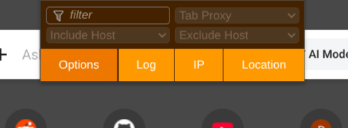
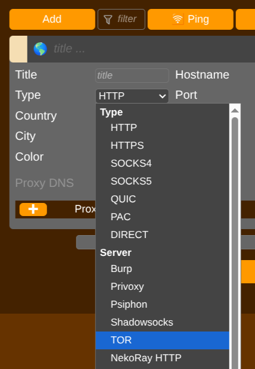
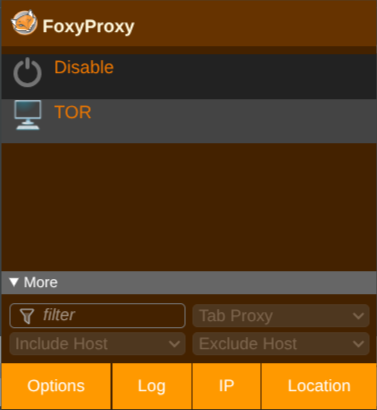
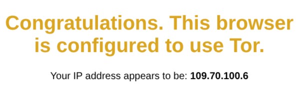

Casi siempre que se habla sobre la red tor y onion, suele asociarse a actividades ilegales y oscuras.

Decir que en la red onion no se producen estas actividades es sencillamente falso, pero a diario se producen ataques, estafas y delitos en la red superficial que todos usamos. Los medios de comunicación lo saben, pero periodísticamente siempre es mas llamativo abrir una noticia hablando de la *dark web*, haciendo que el público acabe reduciendolo a *ese sitio donde se compra droga, se llevan a cabo ransomwares y venden bases de datos robadas*.

Además, los términos *tor*, *onion*, *deep web* y *dark web* se mezclan continuamente, dando la imagen de ser equivalentes.

Vamos a diferenciar estos terminos, comprender como funciona la red *tor*, los servicios *onion* y aprenderemos a como usarlo y por qué puede sernos útil.

## Deep Web

La *Deep Web* es cualquier contenido que **no está indexado** por motores de búsqueda tipicos.

Google no indexa el contenido de tu correo, ni bases de datos que hay en servidores privados, o en páginas de almacenamiento cloud como *Drive*.

La mayoría de la *Deep Web* es legal y común, se usa a diario por parte de cualquier usuario.

## Dark Web

Una parte de la *Deep Web*, accesible pero intencionalmente oculta y que solo se puede acceder mediante una red especializada o software, como Tor, I2P, Freenet o GNUnet.

## Tor

Tor (siglas de *The Onion Router*) es un protocolo de red que permite anominizar comunicaciones.

Si visitas una página, los paquetes siguen esta ruta:

```
Peticion:
PC -> Router/NAT -> ISP -> Servidor Web 

Respuesta:
Servidor Web -> ISP -> Router/NAT -> PC
```

La NAT es nuestra puerta de entrada a internet, nuestro proveedor de internet en todo momento **puede ver que estamos visitando**, aunque esto vaya cifrado por HTTPS y no vea el contenido, sabe a que servidor estamos haciendo la petición en todo momento. Tanto en la petición como en la respuesta del servidor.

Mediante tor hacemos, de manera simplificada:

```
Peticion:
PC -> Router/NAT -> ISP -> Tor -> Servidor Web

Respuesta:
Servidor Web -> Tor -> ISP -> Router/NAT -> PC
```

Aqui el ISP solo puede ver que hacemos una petición a un nodo en la red tor, pero no puede ver en ningun momento a que servidor web acaba realizandose la petición, en la respuesta tampoco puede saber a que servidor se llamó.

### Onion routing

Si analizamos la explicación anterior:

```
Peticion:
PC -> Router/NAT -> ISP -> Tor -> Servidor Web

Respuesta:
Servidor Web -> Tor -> ISP -> Router/NAT -> PC
```

Podemos acabar con la sensación de que simplemente pasamos de dar nuestra información del ISP a un nodo Tor, y este escenario es casi peor, ya que ahora un desconocido tiene acceso a nuestra IP y que servidor vamos a visitar.

La realidad es mas bien asi:

```
Peticion:
PC -> Router/NAT -> ISP -> Nodo entrada Tor -> Nodo intermedio Tor -> Nodo salida Tor -> Servidor Web

Respuesta:
Servidor Web -> Nodo entrada Tor -> Nodo intermedio Tor -> Nodo salida Tor -> ISP -> Router/NAT -> PC
```

Damos **tres saltos** en tres nodos de tor.

Imagina que quieres hacer llegar un mensaje a **Carlos**, vamos a enviarlo a través de tres mensajeros de la siguiente forma:

1. Lo encriptas con una palabra que solo **Carlos** sabe para poder leerlo.
2. Lo metes en un sobre con su dirección.
3. Ese sobre lo meteremos en otro con la nota *Envia esto a la direccion de Mensajero C*.
4. Ese sobre lo meteremos en otro con la nota *Envia esto a la direccion de Mensajero B*.
5. Le daremos el sobre al *Mensajero A*, este lo abrirá, lo enviará a la dirección del *Mensajero B*. *Mensajero A* sabe quien soy y que me he comunicado con *Mensajero B*.
6. *Mensajero B* abre el sobre y lo envia a *Mensajero C*, *Mensajero B* no sabe quien soy yo o quien es Carlos, solo sabe que debe enviarlo a *Mensajero C*.
7. *Mensajero C* recibe un sobre con la dirección de *Carlos*, este solo sabe que *Mensajero B* le ha mandado algo, pero es incapaz de saber que he sido yo el que inicio el envio.

Además, si *Mensajero C* intenta abrir y leer la carta antes de entregarla está cifrada, asi que es incapaz de leer el mensaje.

Los mensajeros son el *Onion Router* que usa el protocolo tor, el cifrado que usamos para que el ultimo nodo no pueda saber que decimos es *HTTPS*.

### HTTPS y Tor

HTTPS y Tor son dos capas de protección diferentes.

Sin HTTPS, tu ISP y el nodo de salida de tor pueden saber que contenido visitaste, ya que HTTPS cifra y protege **el contenido entre cliente y servidor**. Tor protege **la identidad entre el origen y el destino**.

Tor oculta con quien hablas, https oculta que os decis.


### Servicios onion

**Muchos servidores deniegan cualquier petición desde tor** por motivos de seguridad, muchas de las paginas que visitas diariamente pueden no funcionar a través de el, pero muchas ofrecen un servicio `.onion` que puedes visitar.

Son servicios que solo pueden visitarse a través de Tor. Si intentas entrar desde tu navegador no podrás ver nada.

## Por qué es importante Tor

Todo esto está muy bien, ¿pero por qué son importantes proyectos como Tor?

### Privacidad

Dificulta que tu ISP sepa que visitas, o que una web pueda recopilar tu IP en sus servidores y sepa desde donde lo estás visitando.

### Resistencia a la censura

Permite acceder a información donde gobiernos, proveedores de internet u otras organizaciones bloquean determinados sitios.

En paises como China, Irán o Rusia pueden acceder a sitios restringidos por sus gobiernos.

En España podemos acceder a todos los sitios legitimos que tu ISP y LaLiga bloquean sin motivo cuando hay partido de futbol.

### Protección a periodistas y denunciantes

Muchos periodistas e investigadores utilizan Tor para evitar la identidad de una fuente.

Hay sistemas que permiten enviar información a medios y organizaciones preservando tu identidad mediante Tor. En españa tenemos [Xnet](https://xnet-x.net/ejes/anticorrupcion/) para casos de anticorrupción y la [AIPI](https://www.proteccioninformante.gob.es/nuestro-trabajo/investigacion/como-informar1) para actividades laborales con hechos irregulares.

## Cómo empezar a usar Tor

La opción más simple si solo quieres proteger tu navegación de internet es usar [Tor Browser](https://www.torproject.org/download/).

Una opción mejor si vamos a realizar actividades sensibles es usar [TailsOS](https://tails.net/), un sistema operativo que arranca desde USB y que **elimina cualquier rastro de lo que hagas durante esa sesión**, cada vez que lo inicias, estará en blanco, siempre.

En nuestro caso, vamos a instalar Tor como un servicio que podemos arrancar y parar en nuestro PC, y usaremos [FoxyProxy](https://addons.mozilla.org/es-ES/firefox/addon/foxyproxy-standard/) en cualquier navegador común para que nuestra conexión sea anonima.

Instala tor como servicio:

```bash
sudo apt install tor
sudo dnf install tor
sudo pacman -S tor
```

Luego, activalo:

```bash
sudo systemctl start tor
```

Si quieres que se inicie al arrancar tu sistema:

```bash
sudo systemctl enable tor
```

En el navegador, abre el plugin *FoxyProxy* y haz clic en *Options*:



En el menu, haz clic en *Proxies*:


Haz clic en **Add** y selecciona *TOR* en el desplegable de *Type*:



Ya está listo! Puedes cerrar el menú, ahora al volver a hacer clic en *FoxyProxy* tendrás listo una opción para activar la conexión con Tor:



Una vez la actives puedes entrar en [esta pagina](https://check.torproject.org/) para confirmar si estás usando tor:



Si compruebas tu localización en una pagina como [whatismyipaddress](https://whatismyipaddress.com/) verás que tu país ya no es el que corresponde con tu localización.
