Crear tu VM de Linux con VirtualBox es bastante facilito.

## Software

- Necesitarás instalar [VirtualBox](https://www.virtualbox.org/)
- Y descargar la distro que quieras usar, en este post usaremos [Fedora KDE](https://fedoraproject.org/es/kde/download/)

> Ten en cuenta que VirtualBox **no puede** cambiar la arquitectura de tu procesador, descarga la iso de Fedora que tenga tu máquina host.

## Creando la VM

Una vez tengas VirtualBox instalado, abrelo y haz click aqui para crear una VM nueva:

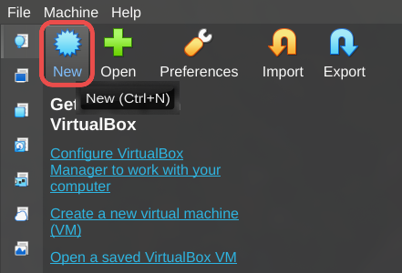

Se abrirá el menu de creación de VM:

### Información básica

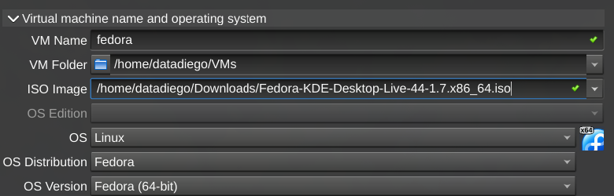

Aqui:

- `VM Name`: El nombre que quieres poner a tu máquina, puedes poner el que quieras
- `VM Folder`: Donde quieres que VirtualBox situe los archivos necesarios para arrancar esta máquina
- `ISO Image`: Aqui tendrás que seleccionar la *imagen iso* que descargaste de Fedora

### Hardware virtual

En la sección de *virtual hardware* configuraremos cuanta RAM y CPUs cedemos a la VM:

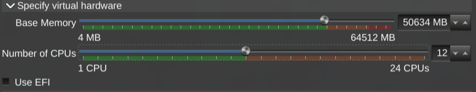

Como regla general, respeta los **límites verdes**, o tu ordenador puede ralentizarse cuando ejecute de VM por quedarse sin recursos.

Dependiendo del uso que vayas a dar a la máquina es posible que quieras reducir sus recursos, por ejemplo, para dejar un servidor web pequeño o si tendrás **múltiples VMs** funcionando a la vez.

Aún así, es recomendable darle más potencia durante el arranque e instalación para que esta sea más rápida, una vez tengas tu máquina funcionando puedes cambiar estos ajustes para que consuma menos recursos.

### Disco duro

En la sección de *virtual hard disk* es donde configuramos cuanta memoria de almacenamiento tendrá la máquina.

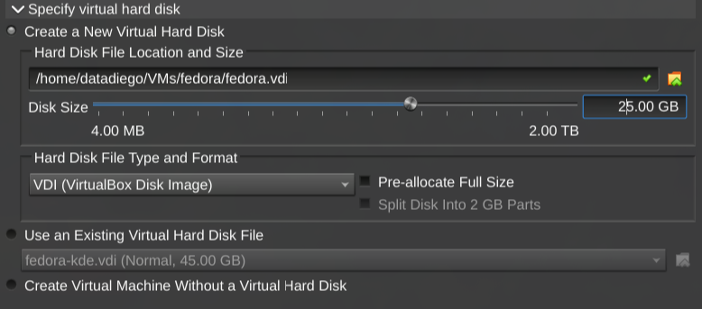

Dependiendo de que vayas a hacer con ella necesitarás más o menos. Para una prueba con 20~25 GB vas sobrado.

### Arrancando la VM

No necesitas configurar nada más, haz click en `Ok` y verás que se ha creado una nueva máquina virtual en el menú principal de VirtualBox. Haz click en ella y arrancará:

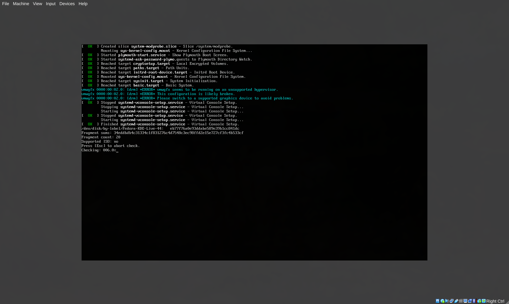

## Instalando Linux

Tras el check inicial, arrancará el escritorio de Linux para su instalación:

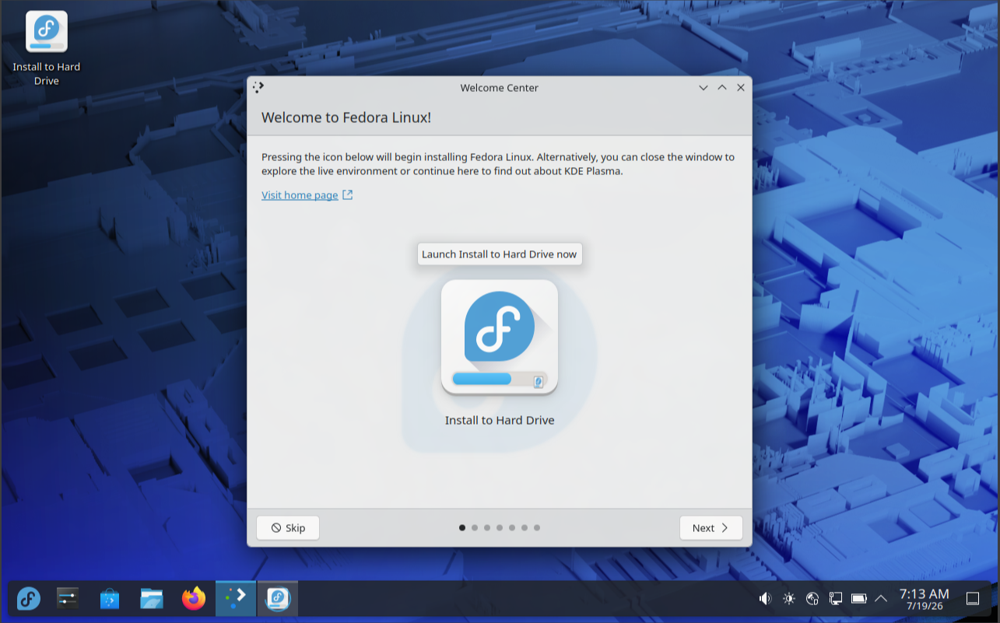

Haz click en `Install to Hard Drive`, esto te abrirá el instalador.

Primero te preguntará el idioma en el que quieres que esté el sistema, y el layout del teclado:

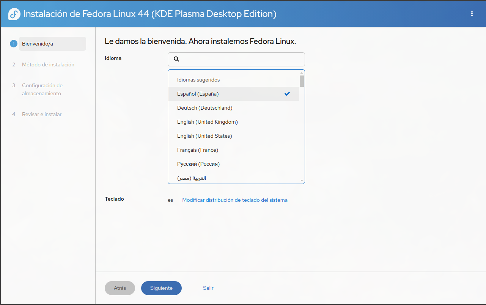

Luego tendrás que elegir en que dispositivo de almacenamiento quieres instalar Fedora, tu VM solo tiene un disco virtual, asi que usamos el que viene por defecto:

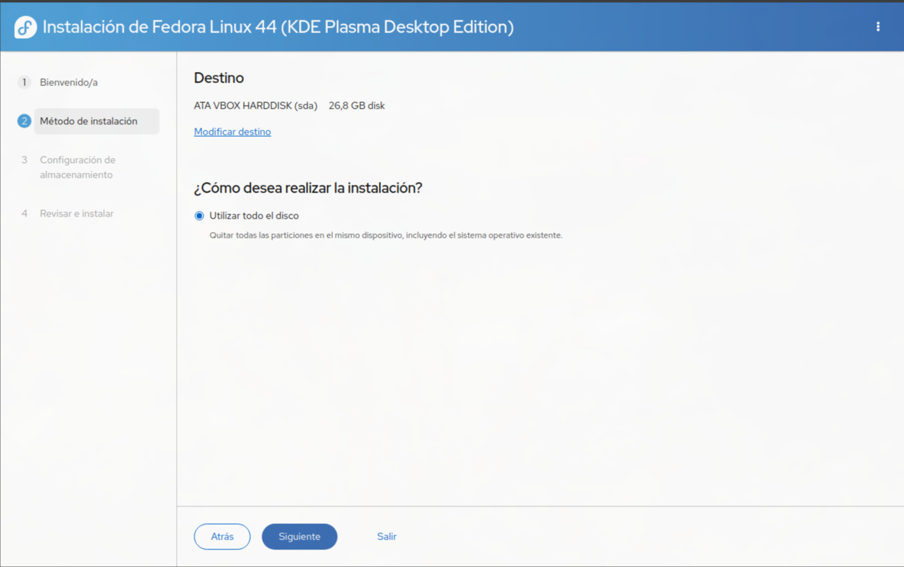

En la configuración de almacenamiento podemos cifrar los datos si queremos, para una VM de este tipo, no es necesario:

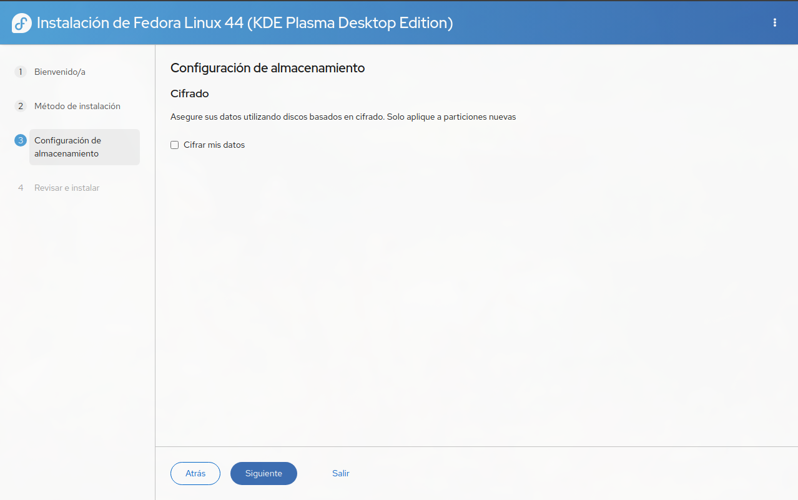

Finalmente, nos piden una confirmación de todos los datos antes de empezar el proceso de instalación:

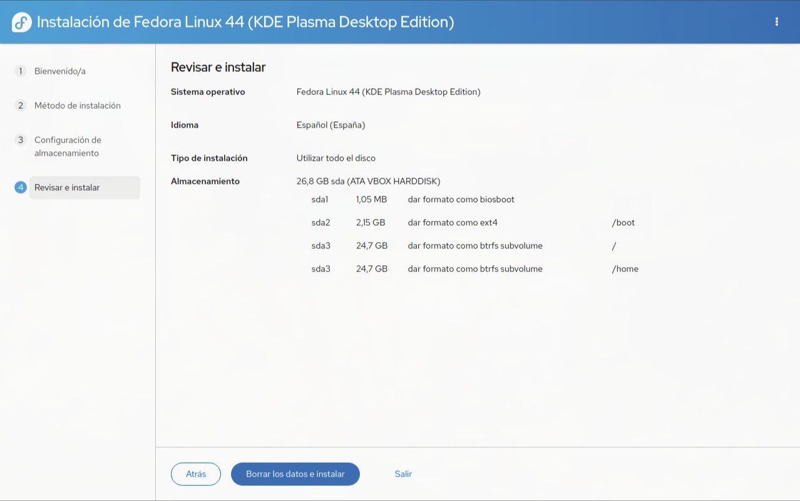

Una vez termine, puedes hacer click en `Salir al escritorio en vivo` y probar algunas de las funcionalidades que tendrá tu sistema. Una vez estés listo para arrancar tu Fedora, apaga la máquina:

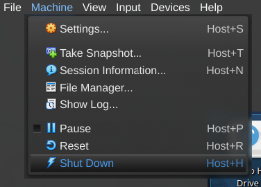

### Sacando el disco de Fedora

En nuestra VM tenemos ahora mismo dos dispositivos de almacenamiento conectados de forma virtual.

- Uno es el disco duro virtual en el cual hemos instalado fedora.
- Otro es un dispositivo en el que tenemos nuestra `iso` para instalar el sistema operativo, lo que acabamos de ver en el primer arranque.

Por defecto, la máquina **siempre arranca** con el dispositivo que tiene la iso, para poder acceder a nuestra instalación ve a la configuración de tu máquina:

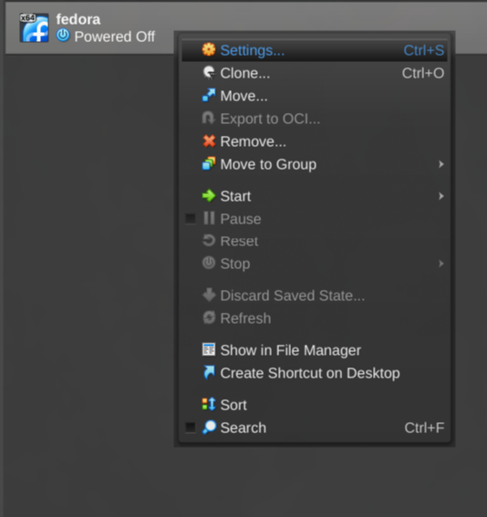

En la sección de *Storage* verás tus dos dispositivos de almacenamiento, haz click en el que tiene la `iso`, y luego haz click en *eliminarlo*:

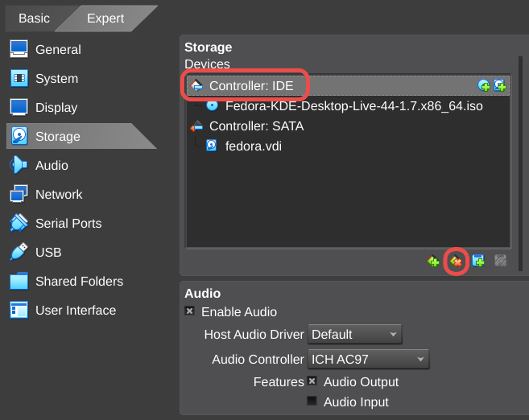

Acabarás con un solo sistema de almacenamiento, tu `.vdi` o *disco virtual*:

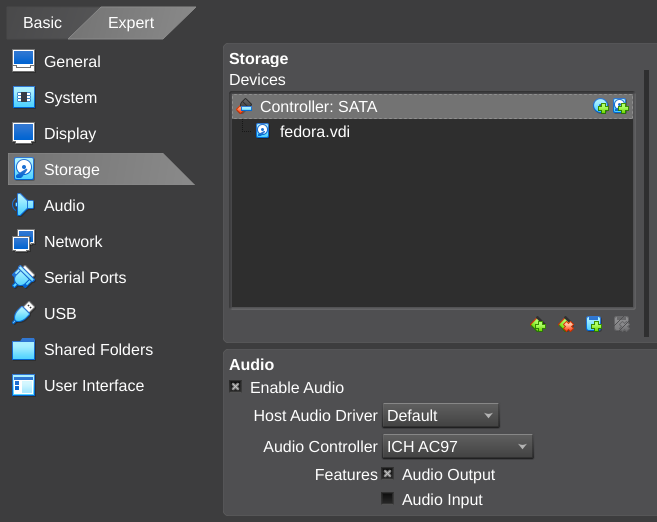

Haz click en `OK` para confirmar los cambios antes de arrancar de nuevo tu VM.

## Iniciando Fedora

Ahora si, cuando arranques tu VM, Fedora te dará la bienvenida:

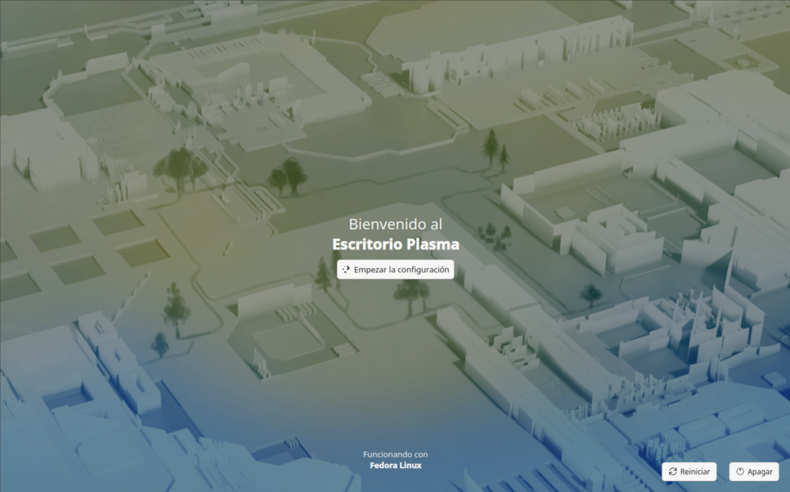

El resto de configuración es bastante sencilla, nos pedirá confirmar lenguaje, elegiremos si queremos modo claro/oscuro, crearemos una cuenta de usuario admin, pondremos un hostname a la vm y elegiremos nuestra zona horaria.

Cuando lo completes podras acceder con tu nombre y usuario que acabas de configurar, y usar tu sistema:

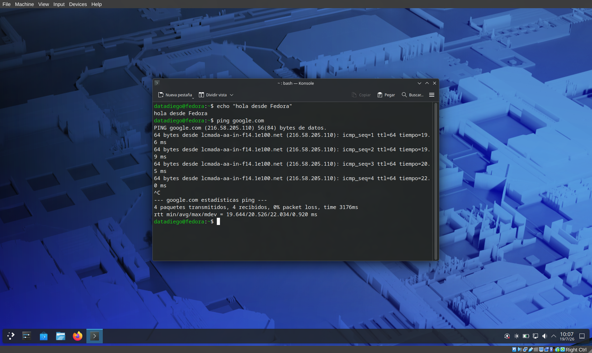

