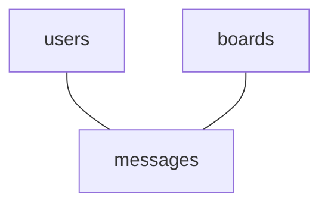
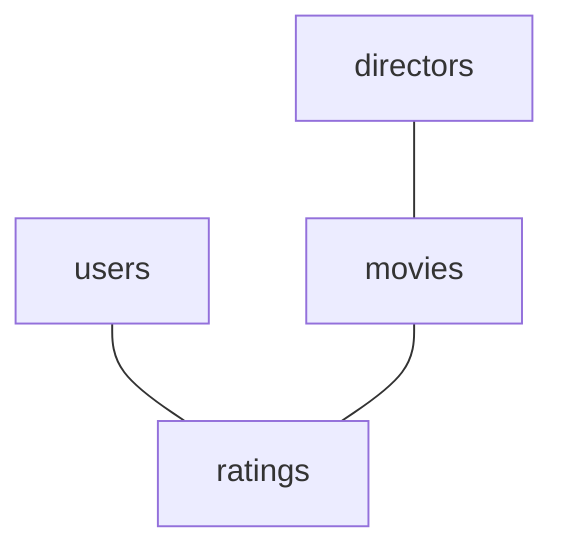

+++
author = "datadiego"
draft = false
title = "Visualizando JOINs en bases de datos"
description = "Guia de ayuda a la hora de hacer JOINs entre tablas"
date = "2026-05-07"
tags = ["bases de datos"]
+++

Generalmente, la asignatura de bases de datos no suele ser dificil para mis alumnos, pero el primer gran muro que suelen encontrar es utilizar `JOIN` para unir diferentes tablas relacionadas entre si.

Cuando solo hay que unir dos tablas entre sí, no suele haber mucho problema al margen de la sintaxis nueva, pero cuando aumentan las tablas, suele empezar a ser un punto dificil.

Es normal, aunque los conceptos como `FOREIGN KEY` y `PRIMARY KEY` pueden sonar algo complicados, en cuanto practicamos un poco con ellos, entendemos la idea detrás de cada uno, y su sintaxis es simple.

`JOIN` suele dar mas problema porque aunque entendemos rápidamente para que se usa, su sintaxis puede parecer algo intimidante, y debemos entender bien que estructura de tablas tenemos delante para poder unir bien los datos que queremos mostrar.

## Recorriendo grafos

Para poder entender bien que hacemos cuando usamos `JOIN`, podemos empezar por comprender que son los grafos:



No necesitas ser un **experto** en grafos, pero entender el concepto te ayudará mucho.

Cuando pienses en unir tablas mediante `JOIN`, no pienses en *unir* tablas, piensa en *recorrer el grafo* que estas forman.

Esto se va a entender mejor con algunos ejemplos. Usaremos *SQLite* para practicar.

### Ejemplo 1: Messageboard

Esta base de datos sirve para un sistema de mensajes simples en boards o canales.

Tenemos las siguientes tablas:

```sql
CREATE TABLE IF NOT EXISTS users (
    id INTEGER PRIMARY KEY AUTOINCREMENT,
    username TEXT NOT NULL UNIQUE,
    password TEXT NOT NULL
);

CREATE TABLE boards (
  id INTEGER PRIMARY KEY AUTOINCREMENT,
  name TEXT NOT NULL UNIQUE,
  description TEXT NOT NULL
);

CREATE TABLE IF NOT EXISTS messages (
    id INTEGER PRIMARY KEY AUTOINCREMENT,
    user_id INTEGER NOT NULL,
    message TEXT NOT NULL,
    board_id INTEGER NOT NULL,
    FOREIGN KEY(board_id) REFERENCES boards(id),
    FOREIGN KEY (user_id) REFERENCES users(id)
);
```

Vamos a introducir algunos datos:

```sql
INSERT INTO users (username, password) VALUES ('admin', 'adminpass');
INSERT INTO users (username, password) VALUES ('user0', 'user0pass');
INSERT INTO users (username, password) VALUES ('user1', 'user1pass');

INSERT INTO boards (name, description) VALUES ('main', 'Habla de cualquier cosa aqui');
INSERT INTO boards (name, description) VALUES ('tech', 'Nuestro sitio para hablar de tecnologia');

INSERT INTO messages (user_id, board_id, message) VALUES 
(
  (SELECT id FROM users WHERE username = 'admin'), 
  (SELECT id FROM boards WHERE name = 'main'), 
  'hola mundo'
),
(
  (SELECT id FROM users WHERE username = 'user0'), 
  (SELECT id FROM boards WHERE name = 'main'), 
  'como estamos?'
),
(
  (SELECT id FROM users WHERE username = 'user1'), 
  (SELECT id FROM boards WHERE name = 'tech'), 
  'que consola es vuestra favorita?'
),
(
  (SELECT id FROM users WHERE username = 'user0'), 
  (SELECT id FROM boards WHERE name = 'tech'), 
  'como aprender typescript sin volverme loco?'
);
```

Vamos primero a pensar en como las tablas se relacionan entre si:



La tabla de *users* está referenciada en *messages*.

La tabla *boards* está referenciada en *messages*.

No hay referencias entre *users* y *boards*, no existe un camino para relacionar ambas si no pasamos por *messages* antes.

Podemos llegar a cualquier tabla, independientemente de donde empecemos, da igual si partimos de *users*, *boards* o *messages*.

Para crear un `JOIN` que muestre el nombre del usuario, el board en el que se dejó, y el mensaje, vamos a comenzar por seleccionar los datos que queremos, sin pensar en como llegaremos aun a ellos:

```sql
SELECT
users.username,
messages.message,
boards.name
```

Sabemos que podemos acceder a cualquiera de las tablas que estamos seleccionando **independientemente de en cual comencemos**.

Vamos a comenzar por hacer un `JOIN` en el que empezamos desde `users`:

```sql
SELECT
users.username,
messages.message,
boards.name
FROM users
```

Si empezamos en `users`, sabemos que tenemos que llegar a `messages` para mostrar el contenido del mensaje:

```sql
SELECT
users.username,
messages.message,
boards.name
FROM users
JOIN messages ON messages.user_id = users.id
```

Sin embargo, estamos también seleccionando `boards.name`, y no hemos juntado la tabla `boards` en ningún momento, por lo que hasta que no hagamos un `JOIN` a esta, no podremos recuperar este dato:

```sql
SELECT
users.username,
messages.message,
boards.name
FROM users
JOIN messages ON messages.user_id = users.id
JOIN boards ON messages.board_id = boards.id;
```

Ahora si hemos recorrido todo el camino del *grafo*, empezando por users, messages y boards:

```
╭──────────┬─────────────────────────────────────────────┬──────╮
│ username │                   message                   │ name │
╞══════════╪═════════════════════════════════════════════╪══════╡
│ admin    │ hola mundo                                  │ main │
│ user0    │ como estamos?                               │ main │
│ user1    │ que consola es vuestra favorita?            │ tech │
│ user0    │ como aprender typescript sin volverme loco? │ tech │
╰──────────┴─────────────────────────────────────────────┴──────╯
```

Vamos a pensar en esta misma sentencia, pero empezando por *boards*, es muy similar a lo que hemos hecho ahora, pero empezamos en otro extremo del grafo, deberiamos ir a *messageboard* y por ultimo a *users*:

```
SELECT
users.username,
messages.message,
boards.name
FROM boards
JOIN messages ON messages.board_id = boards.id
JOIN users ON messages.user_id = users.id;
```

Es muy similar a la anterior, pero primero unimos `messages` con `boards`, y por último, `users`.

El orden de los `JOIN` da igual:

```sql
SELECT
users.username,
messages.message,
boards.name
FROM boards
JOIN users ON messages.user_id = users.id
JOIN messages ON messages.board_id = boards.id;
```

Por último, podemos partir de *messages*:

```sql
SELECT
users.username,
messages.message,
boards.name
FROM messages
JOIN users ON users.id = messages.user_id
JOIN boards ON boards.id = messages.board_id;
```

En este caso, simplemente unimos las tablas *users* y *boards*, porque ya partimos desde la mitad.

### Ejemplo 2: Peliculas y ratings

Esta base de datos serviría para que diferentes usuarios puedan poner notas a peliculas, veamos primero su `schema`:

```sql
CREATE TABLE directors (
  id INTEGER PRIMARY KEY AUTOINCREMENT,
  name TEXT NOT NULL UNIQUE
);

CREATE TABLE movies (
  id INTEGER PRIMARY KEY AUTOINCREMENT,
  title TEXT NOT NULL,
  year INTEGER NOT NULL,
  director_id INTEGER NOT NULL,
  FOREIGN KEY(director_id) REFERENCES directors(id)
);

CREATE TABLE users (
  id INTEGER PRIMARY KEY AUTOINCREMENT,
  username TEXT NOT NULL UNIQUE,
  password TEXT NOT NULL,
  created_at DATETIME DEFAULT CURRENT_TIMESTAMP
);

CREATE TABLE ratings (
  id INTEGER PRIMARY KEY AUTOINCREMENT,
  movie_id INTEGER NOT NULL,
  user_id INTEGER NOT NULL,
  rating INTEGER NOT NULL CHECK ( rating BETWEEN 0 AND 10 ),
  created_at DATETIME DEFAULT CURRENT_TIMESTAMP,
  FOREIGN KEY(movie_id) REFERENCES movies(id),
  FOREIGN KEY(user_id) REFERENCES users(id)
);
```

Insertamos algunos datos de ejemplo:

```sql
INSERT INTO users (username, password)
VALUES 
('user0', 'user0pass'),
('user1', 'user1pass'),
('user2', 'user2pass');

INSERT INTO directors (name)
VALUES ('Tarantino'), ('Hideaki Anno'), ('Bong Joon-ho');

INSERT INTO movies (title, year, director_id)
VALUES
('Parásitos', 2019, (SELECT id FROM directors WHERE name = 'Bong Joon-ho')),
('The end of Evangelion', 1997, (SELECT id FROM directors WHERE name = 'Hideaki Anno')),
('Malditos Bastardos', 2019, (SELECT id FROM directors WHERE name = 'Tarantino'));

INSERT INTO ratings (movie_id, user_id, rating)
VALUES
(
  (SELECT id FROM movies WHERE title = 'Parásitos'),
  (SELECT id FROM users WHERE username = 'user0'),
  10
),
(
  (SELECT id FROM movies WHERE title = 'Parásitos'),
  (SELECT id FROM users WHERE username = 'user1'),
  7
),
(
  (SELECT id FROM movies WHERE title = 'Parásitos'),
  (SELECT id FROM users WHERE username = 'user2'),
  9
),
(
  (SELECT id FROM movies WHERE title = 'The end of Evangelion'),
  (SELECT id FROM users WHERE username = 'user2'),
  8
),
(
  (SELECT id FROM movies WHERE title = 'The end of Evangelion'),
  (SELECT id FROM users WHERE username = 'user0'),
  10
),
(
  (SELECT id FROM movies WHERE title = 'Malditos Bastardos'),
  (SELECT id FROM users WHERE username = 'user0'),
  8
),
(
  (SELECT id FROM movies WHERE title = 'Malditos Bastardos'),
  (SELECT id FROM users WHERE username = 'user1'),
  6
),
(
  (SELECT id FROM movies WHERE title = 'Malditos Bastardos'),
  (SELECT id FROM users WHERE username = 'user2'),
  9
);
```

Vamos a analizar las relaciones entre tablas:



La tabla de *directores* **solo** se relaciona con la tabla de *movies*.

La tabla de *movies* **solo** se relaciona con la tabla de *ratings*.

La tabla de *users* **solo** se relaciona con la tabla de *ratings*.
