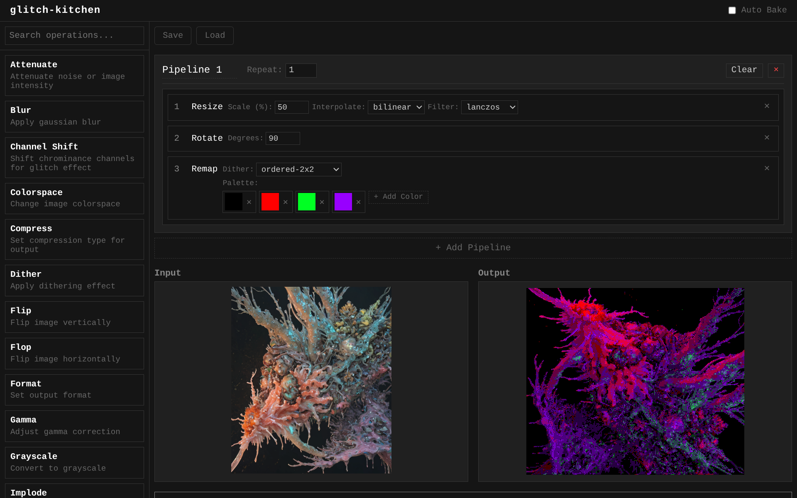

Herramienta de procesamiento de imágenes inspirada en las cadenas de efectos en serie de audio.

Procesa de múltiples imágenes en batch, crea bucles para efectos destructivos, animaciones gif, efectos de feedback enviando el resultado al input, comparte tus cadenas de efectos con otros exportándolos o genera un script standalone para usarlo en tu PC.

## La idea original

El proyecto surgió de experimentar con [Imagemagick](https://imagemagick.org) para crear diferentes efectos de glitch, feedback y dithering en imágenes surgidos de preguntas como:

>¿Que pasa si desenfoco y enfoco 500 veces la misma imagen?

>¿Y si reduzco su tamaño, la comprimo y luego la agrando en un bucle?

La mayor parte de ellos consistían en bucles simples donde el resultado de un efecto volvía a procesarse usando el mismo, con variaciones del mismo.

Aunque era divertido crear scripts y tenía un pipeline bastante útil, veía que podía acelerar el proceso con una interfaz gráfica que me permitiera trabajar con esta idea de encadenar efectos en bucles.

## Las inspiraciones

Llevo usando mucho [cyberchef](https://gchq.github.io/CyberChef/) para enseñar en las clases de ciberseguridad, permite encadenar diferentes módulos y cambiar su orden rápidamente para experimentar durante laboratorios y pruebas de penetración.

La herramienta siempre me recordó a los buses de FX usados en DAWs y herramientas de procesamiento de audio en las que encadenas diferentes efectos, así que la interfaz y el uso de la herramienta es básicamente igual que en esta, simplemente arrastras tu módulo al pipeline, ajustas el parámetro y pulsas *Bake!* para renderizar el resultado.

Puedes reordenar tus efectos, quitarlos, repetirlos *n veces* en el pipeline y usar valores aleatorios para efectos creativos que cambian en cada procesamiento.

## En lo que evolucionó

Al final, además de usarse para destruir imágenes y crear efectos experimentales, ha terminado siendo un buen concepto para el uso diario de personas que necesiten procesar imágenes, imagemagick es **muy rápido** en estas tareas, y muchas aplicaciones online están llenas de publicidad, usan cookies o son demasiado simples.

Si bien **no es una herramienta simple** para el usuario común, quien necesite realizar tareas repetitivas y conozca el flujo de trabajo puede aliviar **mucho** su carga de trabajo.

## Algunas funcionalidades

El proyecto ha crecido **mucho**, a dia de hoy, entre otras funciones, puedes:

- Crear diferentes pipelines que pueden repetirse en bucle antes de pasar al siguiente.
- Utilizar el resultado obtenido como entrada para un nuevo procesamiento.
- Exportar e importar gifs y separar sus frames.
- Importar y procesar múltiples imágenes de golpe para hacer un *batch processing*.
- Utilizar valores aleatorios para parámetros.
- Importar y exportar las cadenas de efectos para reutilizarlas en el futuro y compartirlas con otros usuarios.
- Exportar un script standalone, que puedes usar junto a Imagemagick para recrear tu cadena.
- **Todas las imágenes son borradas del servidor**, no se almacena absolutamente nada, solo durante el procesamiento.
