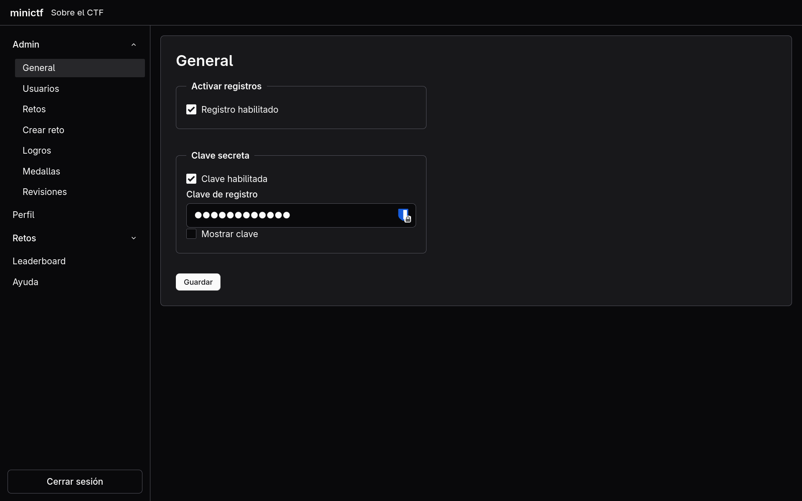
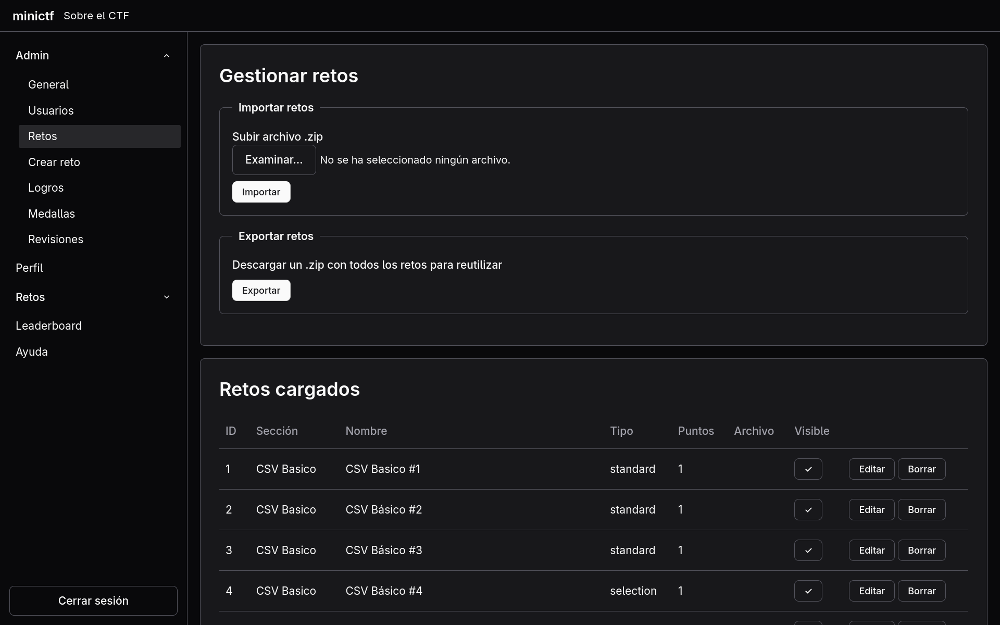
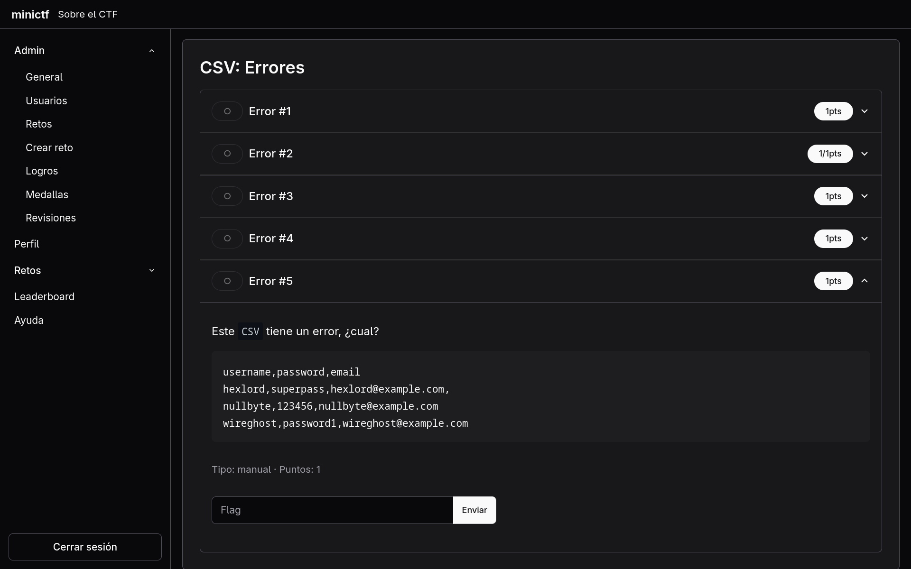
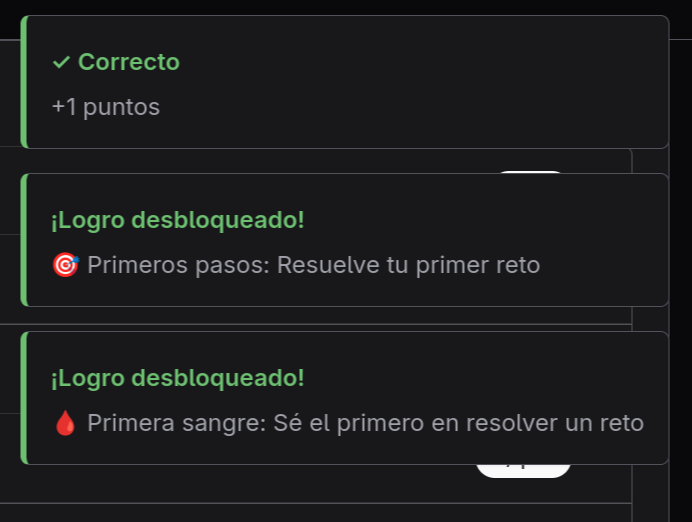
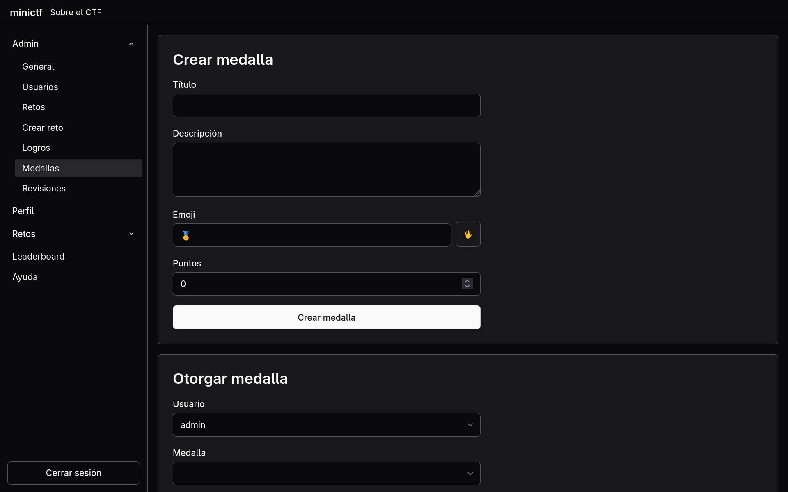

Motor para CTFs y retos gamificados en educación

Motor para la creación de pruebas de Capture The Flag en educación, inicialmente pensada para pruebas orientadas a ciberseguridad, pero expandida para poderse usar en otros ámbitos educativos.

## La idea

Estuve usando [ctfd](https://ctfd.io/) durante un tiempo para mis clases creando retos para los alumnos, es un motor que funciona muy bien, y te deja personalizar mucho el aspecto y las pruebas que presentas al grupo, 

Creo que el uso de este tipo de retos funciona muy bien en alumnos, el hecho de **poder comprobar en el acto** si la respuesta es correcta **funciona muy bien**, ctfd además permitía crear preguntas en las que el propio profesor debe revisar la respuesta manualmente en esos casos que el alumno debe aportar una respuesta que no se pueda hardcodear en una lista, e incluso dar insignias a los alumnos que encuentran respuestas que se han podido escapar y son válidas. También podías adjuntar archivos extra para una prueba concreta, expandiendo que podías presentar como prueba.

Sin embargo echaba en falta más variedad del tipo de preguntas a crear en muchas ocasiones y sobre todo el sistema de exportar e importar mediante csv los retos no es del todo funcional, y me dificultaba reutilizar algunas preguntas en otros años, por otro lado, si pudiera usar markdown para crear los retos todo sería bastante más simple, ctfd me obligaba a formatearlo manualmente.

>ctfd es un **gran proyecto**, he contribuido al mismo reportando bugs y monetariamente durante bastante tiempo, no quiero que esto se sienta como que le falta funcionalidades, cuando he conservado **la mayoria de las que hacen bueno a ctfd** en este.

Al final, durante un verano decidí crear un pequeño motor para crear este tipo de pruebas, conservaría todo lo que me gustaba de ctfd, **que era mucho**, y añadiría las cosas que notaba que yo como usuario quería ver en el, simplificaría tanto el aspecto visual, como la forma de trabajar como administrador en el mismo.

## El desarrollo

Tenia clara la infraestructura que quería del proyecto, y llevaba un tiempo queriendo usar agentes para desarrollar una aplicación y ver hasta donde podía llevarlas.

En este proyecto sólo creé un esqueleto básico para el frontend usando [oat.ui](https://oat.ink/) como libreria de componentes semánticos, de esta forma el agente solo tendría que mantener el uso semántico del html para obtener una interfaz decente. Y fuí creando la estructura del backend como haría yo.

Tuve que definir una pequeño `skill.md` con algunos límites para que el proyecto se mantuviese dentro de esta estructura, pero aparte de eso, teniendo claro como debía organizarse y que stack de tecnologías iba a usar fué relativamente fácil guiar al agente.

## La aplicación

Gracias a la rapidez de usar agentes con [opencode](https://opencode.ai/) y usando [tailscale](https://tailscale.com/) para acceder más comodamente al dispositivo por SSH y añadir funcionalidades sin realmente estar presente en el propio dispositivo.

Todo el diff review y QA testing fue manual, y en poco tiempo pude comenzar a crear los retos para el curso. Todos estos retos si que están creados manualmente, la mayoría de retos que crea un agente son bastante genéricos, y más allá de corregir pequeños detalles de sintaxis y simplificar los enunciados, no se usaron más en el proyecto.

## Funcionalidades

Se implementaron todas las funcionalidades que se necesitaban:

### Registros

El administrador puede dejar los registros abiertos completamente, limitarlos a quienes saben una clave secreta que puede configurar desde la interfaz web, o cerrarlos completamente y crear el manualmente los usuarios que participarán en los retos.

También puede crear otros administradores que pueden crear tanto retos como logros.

Todas las contraseñas van hasheadas usando argon2.

### Retos

Disponemos de varios tipos de retos:

- *Standard*: Preguntas con respuestas hardcodeadas por el creador, puede activar `case_sensitive` si es necesario para la prueba, el usuario debe escribir la respuesta.
- *Selección*: Preguntas con varias respuestas posibles que el usuario selecciona.
- *Manual*: Preguntas más abiertas, el/los administradores deben revisarlas manualmente, y pueden adjuntar una nota junto a la revisión.

Todas pueden ser *dinámicas*, donde los puntos obtenidos disminuyen con cada respuesta fallida, pudiendo controlar cuanto bajan, de forma que puedas hacer preguntas que sólo se puedan intentar una vez, o varias pero con peor resultado en el leaderboard.

Todos los retos pueden exportarse en un *.zip* que luego se puede volver a importar para cursos nuevos, es útil para crear toda una serie de retos en local, y luego importarlos cuando estén listos, el creador puede controlar que retos son visibles a los usuarios.

### Logros

Los logros se desbloquean por los usuarios bajo ciertas condiciones, y pueden dar puntos extra. Incentiva el resolver los retos para alcanzar ciertas metas, incluso con algunas que sólo se puede desbloquear un usuario.

Se incluyen múltiples logros básicos que pueden usarse en cualquier instancia, deberían ser suficientes para un curso.

### Medallas

En ocasiones podemos tener algún error a la hora de crear un reto, puede que un alumno lo detecte, dé con una solución nueva, o aporte algo adicional en clase que merezca la pena recompensar.

Las medallas se crean manualmente y se asignan a un usuario junto a los puntos que deseemos.

Esto soluciona cualquier frustración por parte del alumno ante un error nuestro, y sirve para reforzar nuestros retos de un año a otro gracias a los propios usuarios.

### Feedback del usuario

Usamos los toast de oat para crear feedback de cualquier actividad del usuario, si acierta o falla, si desbloquea logros, o si una pregunta dinámica ha quedado bloqueada.

En la página principal hay una tabla de actividad reciente donde los usuarios pueden ver quienes han ganado puntos recientemente, y si se han añadido preguntas nuevas.

## Uso en mundo real

Cuando les mostré la aplicación a dos conocidos que tienen una academia de inglés les pareció muy buena idea y les pregunté si querrían que les desplegara su propia instancia para que la usaran durante el curso.

Creé varios ejemplos incluidos en el repositorio para enseñarles *qué podían hacer* con la aplicación, y añadí funcionalidades para crear los retos y logros directamente desde la interfaz web para que no estuvieran creando JSON de forma manual.

Actualmente sigue usándose en estas escuelas, su mantenimiento es mínimo, una instancia corre en local en el centro, la otra en un VPS básico.
