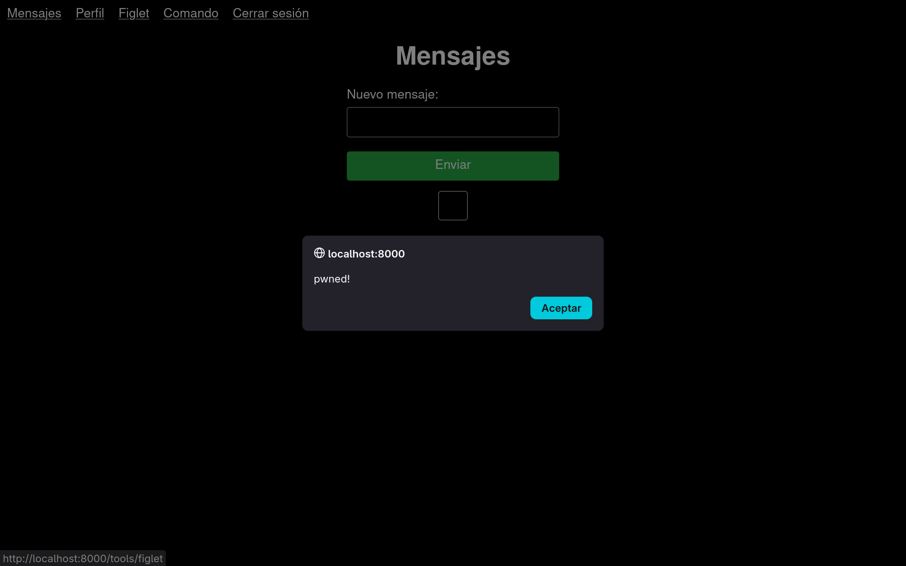
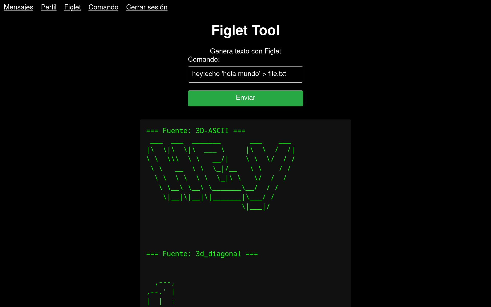

Laboratorio de pentesting XSS

Laboratorio realizado para una demostración sobre ataques XSS en varias charlas.

La aplicación incluye un pequeño formulario de registro, una sección donde los usuarios pueden mandar mensajes y otra en la que pueden recibir texto en ascii art con un formulario.

Todos incluyen la inyección de comandos XSS, en un caso mediante javascript, y en otro directamente en bash en el propio servidor.

